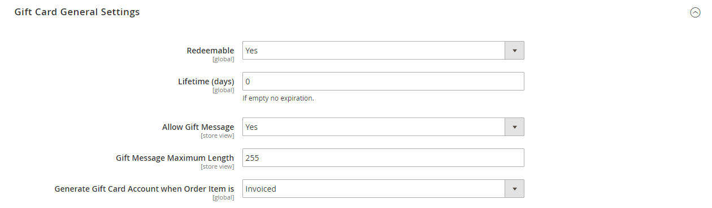

# Cadeaucreditcardrekeningen

Er wordt automatisch een cadeaukaartaccount aangemaakt voor elke cadeaukaart die wordt aangeschaft. De waarde van de cadeaukaart kan vervolgens worden toegepast op de aankoop van een product in uw winkel. U kunt ook cadeaukaartaccounts maken via de beheerfunctie als speciale actie of service voor klanten. Het rekeningnummer van de cadeaukaart komt overeen met de code van de cadeau-kaart.

{width="700" zoomable="yes"}

## Kaartaccounts configureren

De configuratie van de cadeaukaart bepaalt de standaardinstellingen voor alle cadeaukaarten voor de winkelweergave en beheert de codepool. De codepool is een reeks unieke kaartcodes in een specifiek formaat. De codes van de pool worden gebruikt telkens als een geschenkkaartrekening wordt gecreeerd. De beheerder van de winkel moet ervoor zorgen dat er voldoende codes beschikbaar zijn voor de verkoop van cadeaukaarten. Zorg ervoor dat u een codepool genereert voordat u cadeaukaarten te koop aanbiedt. Adobe Commerce genereert standaard 1.000 codes. Er wordt geen nieuwe codepool gegenereerd totdat er geen codes meer beschikbaar zijn in de huidige pool.

### Stap 1: E-mailmeldingen configureren

1. Voor _Admin_ sidebar, ga **[!UICONTROL Stores]** > _[!UICONTROL Settings]_>**[!UICONTROL Configuration]**.

1. Vouw in het linkerdeelvenster **[!UICONTROL Sales]** uit en kies **[!UICONTROL Gift Cards]** .

1. Breid  de _[!UICONTROL Gift Card Email Settings]_sectie uit en doe het volgende:

   - Stel **[!UICONTROL Gift Card Notification Email Sender]** in op de winkelidentiteit die wordt weergegeven als de verzender van kaartmeldingen.

   - Stel **[!UICONTROL Gift Card Notification Email Template]** in op de sjabloon die voor de melding wordt gebruikt.

   {width="600" zoomable="yes"}

1. Breid  de _[!UICONTROL Email Sent from Gift Card Account Management]_sectie uit en doe het volgende:

   - Stel **[!UICONTROL Gift Card Email Sender]** in op de winkelidentiteit zodat deze wordt weergegeven als de afzender van de cadeaukaarten.

   - Stel **[!UICONTROL Gift Card Template]** in op de sjabloon die u voor de cadeaukaart wilt gebruiken.

Zie [ E-mailadressen van de Opslag ](../configuration-reference/general/store-email-addresses.md) voor specifieke configuratiegebieden en opties.

### Stap 2: De algemene instellingen voltooien

1. Breid  de _[!UICONTROL Gift Card General Settings]_sectie uit.

1. Stel **[!UICONTROL Redeemable]** in op `Yes` om de klant in staat te stellen de waarde op de kaart in te wisselen voor contanten.

1. Voer bij **[!UICONTROL Lifetime (days)]** het aantal dagen in voordat de kaart verloopt.

   Laat het veld leeg als er geen vervaldatum is.

   >[!NOTE]
   >
   >Afhankelijk van uw locatie kan het ongeldig zijn om cadeaukaarten te laten verlopen. Controleer uw lokale wetten voordat u een leven instelt voor uw cadeaukaarten.

1. Als u klanten de optie wilt geven om een bericht bij te voegen dat de cadeaukaart moet vergezellen, stelt u **[!UICONTROL Allow Gift Message]** in op `Yes` en voert u het aantal tekens in dat beschikbaar is voor het bericht voor **[!UICONTROL Gift Message Maximum Length]** .

1. Stel **[!UICONTROL Generate Gift Card Account when Orders Item is]** in op een van de volgende opties:

   - `Ordered` - De rekening van de cadeaukaart wordt gecreeerd wanneer de orde wordt geplaatst.
   - `Invoiced` - De rekening van de cadeaukaart wordt gecreeerd nadat de betaling wordt gevangen en de orde wordt gefactureerd.

   {width="600" zoomable="yes"}

### Stap 3: Bepaal de groep van de cadeaukaartcode

1. Breid  de _[!UICONTROL Gift Card Account General Settings]_sectie uit en doe het volgende:

   {width="600" zoomable="yes"}

   - Als u de code wilt aanpassen, voert u het volgende in op basis van uw voorkeur:

      - Lengte code
      - Codeopmaak
      - Codevoorvoegsel
      - Codeachtervoegsel
      - Streep om de X-tekens

   - Voer de **[!UICONTROL New Pool Size]** in om het aantal te genereren codes te bepalen.

   - Voer de **[!UICONTROL Low Code Pool Threshold]** in om op te geven wanneer u een melding ontvangt om de codepool opnieuw in te slaan.

1. Klik op **[!UICONTROL Save Config]** voordat u de codegroep genereert.

1. Klik op **[!UICONTROL Generate]**.

1. Klik op **[!UICONTROL Save Config]** als de bewerking is voltooid.

## Een bestaande cadeaukaartaccount bekijken

1. Ga als volgt te werk om het nummer van het kaartenaccount voor een huidige bestelling te zoeken:

   - Voor _Admin_ sidebar, ga **[!UICONTROL Sales]** > _[!UICONTROL Operations]_>**[!UICONTROL Orders]**.

   - Zoek de volgorde in de lijst en klik op **[!UICONTROL View]** in de kolom _[!UICONTROL Action]_.

   - Schuif omlaag naar de sectie _[!UICONTROL Items Ordered]_.

   Het getal staat in de kolom _[!UICONTROL Product]_onder **[!UICONTROL Gift Card Accounts]**.

1. Voor _Admin_ sidebar, ga **[!UICONTROL Marketing]** > _[!UICONTROL Promotions]_>**[!UICONTROL Gift Card Accounts]**.

1. Zoek het kaartenaccount in het raster en open het in de bewerkingsmodus.

   De code van de giftekaart verschijnt bij de bovenkant van de _sectie van de Informatie_.

   {width="600" zoomable="yes"}

## Een kaartenaccount voor cadeaus maken

1. Voor _Admin_ sidebar, ga **[!UICONTROL Marketing]** > _[!UICONTROL Promotions]_>**[!UICONTROL Gift Card Accounts]**.

1. Klik in de rechterbovenhoek op **[!UICONTROL Add Gift Card Account]** .

1. Stel in de sectie _[!UICONTROL Information]_**[!UICONTROL Active]**in op `Yes` en voer de volgende handelingen uit:

   - Als u het saldo van de kaart bij het uitchecken wilt aflossen of wilt overdragen naar het winkelkrediet van de klant, stelt u **[!UICONTROL Redeemable]** in op `Yes` .

   - Kies de **[!UICONTROL Website]** waar het geschenkkaartaccount kan worden gebruikt.

   - Voer het initiaal **[!UICONTROL Balance]** in op de cadeaukaart.

   - _(Facultatief)_ om een **[!UICONTROL Expiration Date]** voor de geschenkkaart te plaatsen, selecteer de datum van het kalender{](../assets/icon-calendar.png) pictogram 3} van de Kalender.{width="600" zoomable="yes"}

1. Kies **[!UICONTROL Send Gift Card]** in het linkerdeelvenster en voer de volgende handelingen uit:

   - Voer het **[!UICONTROL Recipient Email]** -adres in.

   - Voer de **[!UICONTROL Recipient Name]** in.

   - Stel **[!UICONTROL Send Email from the Following Store View]** in op de winkelweergave die wordt weergegeven als de afzender van het bericht voor de cadeaukaart.

   {width="600" zoomable="yes"}

1. Voer een van de volgende handelingen uit om het nieuwe account op te slaan:

   - Klik op **[!UICONTROL Save]** als u de kaartje nog niet wilt verzenden.

   - Om de veranderingen te bewaren en de geschenkkaart per e-mail naar de ontvanger te verzenden, klik **sparen en E-mail** verzenden.

## Accountgeschiedenis van cadeaukaart weergeven

1. Ga naar **[!UICONTROL Marketing]** > _[!UICONTROL Promotions]_>**[!UICONTROL Gift Card Accounts]**.

1. Open de cadeaukaart in de bewerkingsmodus.

1. De **[!UICONTROL History]** van de cadeaukaart wordt weergegeven.

   {width="600" zoomable="yes"}

| Kolom | Beschrijving |
|--- |--- |
| [!UICONTROL ID] | Een unieke numerieke actie met een cadeaukaart. |
| [!UICONTROL Date] | Datum van actie. |
| [!UICONTROL Action] | Hiermee bepaalt u alle mogelijke handelingen met een cadeaukaart. Opties: `Created` / `Updated` / `Sent` / `Used` / `Redeemed` / `Expired` |
| [!UICONTROL Balance Change] | Hiermee geeft u het bedrag weer waarmee het saldo van de cadeaukaart is gewijzigd. |
| [!UICONTROL Balance] | Geeft de beschikbare balans aan. |
| [!UICONTROL More Information] | Hier wordt informatie weergegeven over wie de balans van de cadeaukaart heeft gewijzigd. |

{style="table-layout:auto"}

## Een kaartenaccount voor cadeaus verwijderen

1. Voor _Admin_ sidebar, ga **[!UICONTROL Marketing]** > _[!UICONTROL Promotions]_>**[!UICONTROL Gift Card Accounts]**.

1. Selecteer het kaartenaccount dat u wilt verwijderen en open het in de bewerkingsmodus.

1. Klik in de menubalk op **[!UICONTROL Delete]** .

1. Klik op **[!UICONTROL OK]** om de handeling te bevestigen.

## Kolombeschrijvingen

| Kolom | Beschrijving |
|--- |--- |
| [!UICONTROL ID] | Een unieke numerieke id die is toegewezen aan een cadeaukaartaccount. |
| [!UICONTROL Code] | De code die moet worden ingevoerd om een cadeaukaart toe te passen. |
| [!UICONTROL Website] | Geeft de websites aan waar het account voor de cadeaukaart beschikbaar is. |
| [!UICONTROL Created] | Aanmaakdatum. |
| [!UICONTROL End] | Vervaldatum van creditcard, indien gepland. |
| [!UICONTROL Active] | Hiermee bepaalt u of de cadeaukaart actief is. |
| [!UICONTROL Status] | Hiermee bepaalt u of de cadeaukaart wordt afgelost in de account van de klant of beschikbaar is. Opties: `Used` / `Redeemed` / `Expired` |
| [!UICONTROL Balance] | Geeft de beschikbare balans aan. |

{style="table-layout:auto"}
