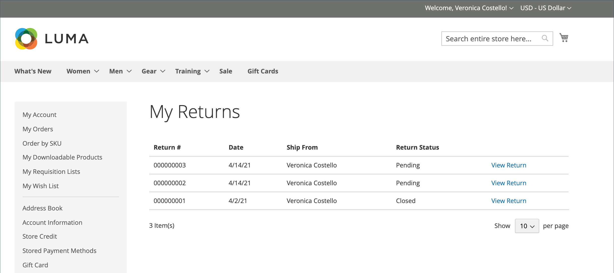

# Retourneert storefront-ervaring

{{ee-feature}}

De klanten kunnen één van beiden van het volgende gebruiken om een RMA van de storefront aan te vragen:

- [ orden en Keert Widget ](../content-design/widget-orders-returns.md) in sidebar terug
- _orden en Keert_ verbinding in footer terug

Als beste praktijken, zorg ervoor om een beschrijving van uw vereisten RMA en proces in het beleid van de Dienst van de Klant te omvatten.

>[!NOTE]
>
>Als u extra informatie met betrekking tot terugkeer wilt verzamelen, kunt u uw eigen douane [ terugkeert attributen ](attributes-returns.md) toevoegen.

Alle RMA-informatie van klanten wordt weergegeven op de **[!UICONTROL My Returns]** -pagina in het dashboard voor de klantenaccount.

{width="700" zoomable="yes"} terug

## Een RMA aanvragen

De klant voltooit de volgende stappen op de winkel om een RMA voor te leggen:

1. Klik in de voettekst op **[!UICONTROL Orders and Returns]** .

1. Voer de bestelgegevens in:

   - Order-id
   - Achternaam facturering
   - E-mail

1. Klik op **[!UICONTROL Continue]** .

   {width="700" zoomable="yes"}

1. Klik onder de besteldatum op **[!UICONTROL Return]** .

   {width="700" zoomable="yes"}

1. Hiermee kiest u het item dat u wilt retourneren en voert u de **[!UICONTROL Quantity to Return]** in.

1. Stelt **[!UICONTROL Resolution]** in op een van de volgende opties:

   - Exchange
   - [Terugbetaling](../customers/refunds-customer-account.md)
   - [Winkelkrediet](../customers/store-credit-using.md)

1. Stelt **[!UICONTROL Item Condition]** in op een van de volgende opties:

   - `Unopened`
   - `Opened`
   - `Damaged`

1. Stelt **[!UICONTROL Reason to Return]** in op een van de volgende opties:

   - `Wrong Color`
   - `Wrong Size`
   - `Out of Service`
   - `Other`

   {width="700" zoomable="yes"}

1. Stelt indien nodig **[!UICONTROL Contact Email Address]** en **[!UICONTROL Comments]** in.

   >[!NOTE]
   >
   >Als de order meerdere items bevat en de klant een ander item wil retourneren, kan hij op **[!UICONTROL Add Item To Return]** klikken, het item selecteren en vervolgens alle vermelde opties instellen.

1. Klik op **[!UICONTROL Submit]** .
