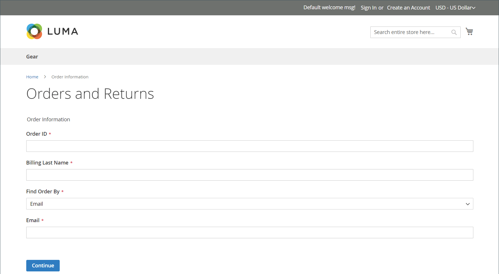

# Retourneert storefront-ervaring

{{ee-feature}}

De klanten kunnen één van beiden van het volgende gebruiken om een RMA van de storefront aan te vragen:

- [Bestellingen en retourneert widget](../content-design/widget-orders-returns.md) in de zijbalk
- _Orders en retourzendingen_ koppeling in voettekst

Als beste praktijken, zorg ervoor om een beschrijving van uw vereisten RMA en proces in het beleid van de Dienst van de Klant te omvatten.

>[!NOTE]
>
>Als u aanvullende informatie over geretourneerde objecten wilt verzamelen, kunt u uw eigen aangepaste [retourneert kenmerken](attributes-returns.md).

Alle klantenRMA informatie wordt getoond op **[!UICONTROL My Returns]** pagina in het dashboard voor de klantenaccount.

{width="700" zoomable="yes"}

## Een RMA aanvragen

De klant voltooit de volgende stappen op de winkel om een RMA voor te leggen:

1. Klik in de voettekst op **[!UICONTROL Orders and Returns]**.

1. Voer de bestelgegevens in:

   - Order-id
   - Achternaam facturering
   - E-mail

1. Klikken **[!UICONTROL Continue]**.

   {width="700" zoomable="yes"}

1. Klik onder de besteldatum op **[!UICONTROL Return]**.

   {width="700" zoomable="yes"}

1. Hiermee kiest u het item dat u wilt retourneren en voert u het **[!UICONTROL Quantity to Return]**.

1. Sets **[!UICONTROL Resolution]** op een van de volgende wijzen:

   - Exchange
   - [Terugbetaling](../customers/refunds-customer-account.md)
   - [Winkelkrediet](../customers/store-credit-using.md)

1. Sets **[!UICONTROL Item Condition]** op een van de volgende wijzen:

   - `Unopened`
   - `Opened`
   - `Damaged`

1. Sets **[!UICONTROL Reason to Return]** op een van de volgende wijzen:

   - `Wrong Color`
   - `Wrong Size`
   - `Out of Service`
   - `Other`

   {width="700" zoomable="yes"}

1. Indien nodig, sets **[!UICONTROL Contact Email Address]** en **[!UICONTROL Comments]**.

   >[!NOTE]
   >
   >Als de bestelling meerdere items bevat en de klant een ander item wil retourneren, kan hij of zij op **[!UICONTROL Add Item To Return]** selecteert u het item en stelt u alle vermelde opties in.

1. Klikken **[!UICONTROL Submit]**.
