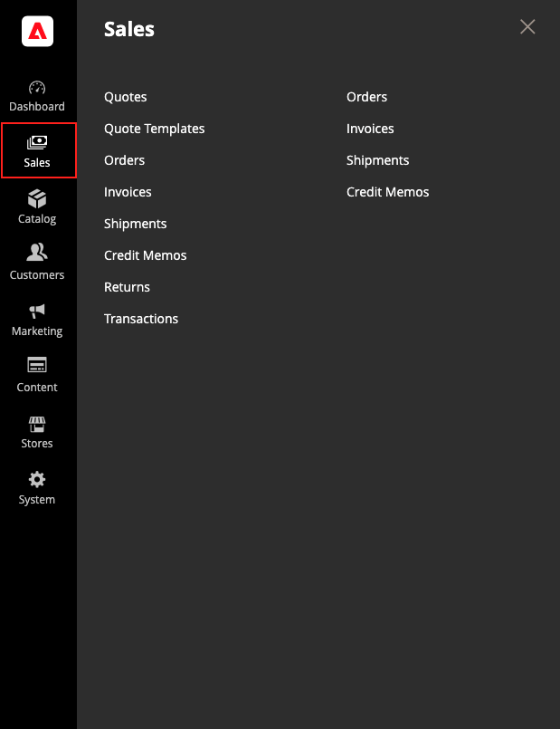

# [!UICONTROL Sales] menu

Het menu Verkoop bevat een overzicht van de transacties op basis van de plaats waar deze zich in de workflow bevinden. U zou aan elk van opties als een verschillend stadium in het leven van een orde kunnen denken.

>[!BEGINTABS]

>[!TAB  Adobe Commerce ]

[!BADGE  slechts PaaS ]{type=Informative url="https://experienceleague.adobe.com/en/docs/commerce/user-guides/product-solutions" tooltip="Is alleen van toepassing op Adobe Commerce op Cloud-projecten (door Adobe beheerde PaaS-infrastructuur) en op projecten in het veld."}

{width="450" zoomable="yes"}

>[!TAB  Adobe Commerce as a Cloud Service ]

[!BADGE  slechts SaaS ]{type=Positive url="https://experienceleague.adobe.com/en/docs/commerce/user-guides/product-solutions" tooltip="Alleen van toepassing op Adobe Commerce as a Cloud Service- en Adobe Commerce Optimizer-projecten (door Adobe beheerde SaaS-infrastructuur)."}

{width="450" zoomable="yes"}

>[!ENDTABS]

## Het menu [!UICONTROL Sales] weergeven

Voor _Admin_ sidebar, klik **[!UICONTROL Sales]**.

## Menuopties

### [!UICONTROL Quotes]

 (Beschikbaar met Adobe Commerce B2B)

De erkende kopers kunnen [ de prijs ](../b2b/quotes.md) met de verkoper bespreken door a [ verzoek ](../b2b/quote-request.md) van het winkelwagentje te verzenden.

### [!UICONTROL Quote Templates]

 (Beschikbaar met Adobe Commerce B2B)

Staat kopers en verkopers toe om het citaatproces te stroomlijnen door herbruikbare en klantgerichte [ citaatmalplaatjes ](../b2b/quote-templates-overview.md) te creëren.

### [!UICONTROL Orders]

Wanneer een [ orde ](orders.md) wordt geplaatst, wordt een verkooporde gecreeerd als tijdelijk verslag van de transactie. De betaling is niet verwerkt en de bestelling kan nog steeds worden geannuleerd.

### [!UICONTROL Invoices]

Een [ factuur ](invoices.md) is een verslag van het ontvangstbewijs van betaling voor een orde. Er kunnen meerdere facturen worden gemaakt voor één bestelling, elk met maximaal, of slechts een paar aangeschafte producten die u opgeeft. Afhankelijk van de betalingsactie kan de betaling automatisch worden vastgelegd wanneer de factuur wordt gegenereerd.

### [!UICONTROL Shipments]

A [ lading ](shipments.md) is een verslag van de producten in een orde die zijn verscheept. Net als bij facturen kunnen meerdere verzendingen aan één bestelling worden gekoppeld, totdat alle producten in de bestelling worden verzonden.

### [!UICONTROL Credit Memos]

A [ creditmemo ](credit-memos.md) is een document dat het bedrag toont dat de klant voor een volledige of gedeeltelijke terugbetaling verschuldigd is. Het bedrag kan op een aankoop worden toegepast of aan de klant worden terugbetaald.

### [!UICONTROL Returns]

 (slechts Adobe Commerce)

A [ teruggekeerde handelsvergunning ](returns.md) (RMA) kan aan klanten worden verleend die verzoeken om een punt voor vervanging of terugbetaling terug te keren. RMAs kan voor Eenvoudige, Gegroepeerde, Configurable, en de producttypes van de Bundel worden uitgegeven. RMA&#39;s zijn echter niet beschikbaar voor virtuele en downloadbare producten of cadeaukaarten.

### [!UICONTROL Billing Agreements]

[!BADGE  slechts PaaS ]{type=Informative url="https://experienceleague.adobe.com/en/docs/commerce/user-guides/product-solutions" tooltip="Is alleen van toepassing op Adobe Commerce op Cloud-projecten (door Adobe beheerde PaaS-infrastructuur) en op projecten in het veld."}

A [ het factureren overeenkomst ](paypal-billing-agreements.md) is gelijkaardig aan een kooporde, behalve dat is het niet beperkt tot één enkele aankoop. Tijdens het afrekenen kiest de klant Factureringsovereenkomst als betalingsmethode. Een factureringsovereenkomst stroomlijnt het afhandelingsproces omdat de klant geen betalingsinformatie hoeft in te voeren voor elke aankoop.

### [!UICONTROL Transactions]

De [ pagina van Transacties ](transactions.md) maakt een lijst van alle betalingsactiviteit die tussen uw opslag en alle betalingssystemen heeft plaatsgevonden, en verleent toegang tot meer gedetailleerde informatie.

### [!UICONTROL Braintree Virtual Terminal]

[!BADGE  slechts PaaS ]{type=Informative url="https://experienceleague.adobe.com/en/docs/commerce/user-guides/product-solutions" tooltip="Is alleen van toepassing op Adobe Commerce op Cloud-projecten (door Adobe beheerde PaaS-infrastructuur) en op projecten in het veld."}

Op de Braintree Virtual Terminal-pagina kan een Admin-gebruiker de betaling voor het geselecteerde bedrag accepteren. Om de eindeigenschap beschikbaar te maken, zou een handelaar fundamentele [ montages van Braintree ](braintree.md) moeten vormen. Braintree biedt een volledig aanpasbare afrekenervaring met fraudedetectie en PayPal-integratie.

### [!UICONTROL Archive]

 (slechts Adobe Commerce)

(De optie van het Archief moet worden toegelaten) [ het Archiveren orden ](order-archive.md) en andere verkoopdocumenten verbeteren regelmatig prestaties en houden uw werkruimte vrij van onnodige informatie.
