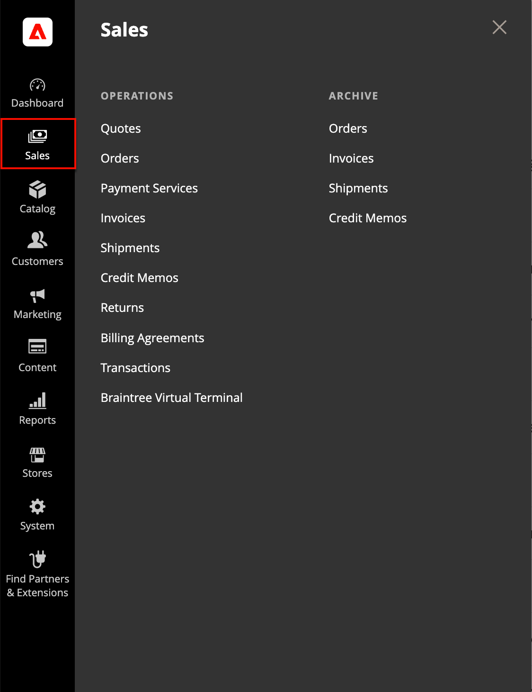

# [!UICONTROL Sales] menu

Het menu Verkoop bevat een overzicht van de transacties op basis van de plaats waar deze zich in de workflow bevinden. U zou aan elk van opties als een verschillend stadium in het leven van een orde kunnen denken.

{width="450" zoomable="yes"}

## De weergave van [!UICONTROL Sales] menu

Op de _Beheerder_ zijbalk, klikken **[!UICONTROL Sales]**.

## Menuopties

### [!UICONTROL Quotes]

 (Beschikbaar bij B2B voor Adobe Commerce)

Geautoriseerde kopers kunnen [de prijs](../b2b/quotes.md) met de verkoper door een [verzoek](../b2b/quote-request.md) uit de winkelwagentje.

### [!UICONTROL Orders]

Wanneer een [bestellen](orders.md) wordt geplaatst, wordt een verkooporde gecreeerd als tijdelijk verslag van de transactie. De betaling is niet verwerkt en de bestelling kan nog steeds worden geannuleerd.

### [!UICONTROL Invoices]

An [factuur](invoices.md) is een administratie van de ontvangst van een betaling voor een bestelling. Er kunnen meerdere facturen worden gemaakt voor één bestelling, elk met maximaal, of slechts een paar aangeschafte producten die u opgeeft. Afhankelijk van de betalingsactie kan de betaling automatisch worden vastgelegd wanneer de factuur wordt gegenereerd.

### [!UICONTROL Shipments]

A [verzending](shipments.md) is een register van de producten in een bestelling die zijn verzonden. Net als bij facturen kunnen meerdere verzendingen aan één bestelling worden gekoppeld, totdat alle producten in de bestelling worden verzonden.

### [!UICONTROL Credit Memos]

A [creditnota](credit-memos.md) is een document waarin het bedrag wordt weergegeven dat de klant verschuldigd is voor een volledige of gedeeltelijke terugbetaling. Het bedrag kan op een aankoop worden toegepast of aan de klant worden terugbetaald.

### [!UICONTROL Returns]

 (alleen Adobe Commerce)

A [geretourneerde handelsvergunning](returns.md) (RMA) kan worden toegekend aan klanten die een product willen retourneren ter vervanging of terugbetaling. RMAs kan voor Eenvoudige, Gegroepeerde, Configurable, en de producttypes van de Bundel worden uitgegeven. RMA&#39;s zijn echter niet beschikbaar voor virtuele en downloadbare producten of cadeaukaarten.

### [!UICONTROL Billing Agreements]

A [factureringsovereenkomst](paypal-billing-agreements.md) is vergelijkbaar met een inkooporder, behalve dat deze niet beperkt is tot één aankoop. Tijdens het afrekenen kiest de klant Factureringsovereenkomst als betalingsmethode. Een factureringsovereenkomst stroomlijnt het afhandelingsproces omdat de klant geen betalingsinformatie hoeft in te voeren voor elke aankoop.

### [!UICONTROL Transactions]

De [Transacties](transactions.md) Deze pagina bevat een overzicht van alle betalingsactiviteiten die hebben plaatsgevonden tussen je winkel en alle betalingssystemen en biedt toegang tot meer gedetailleerde informatie.

### [!UICONTROL Braintree Virtual Terminal]

Op de Virtuele Eindpagina van de Braintree, kan een gebruiker Admin de betaling voor het geselecteerde bedrag goedkeuren. Om de eindeigenschap beschikbaar te maken, zou een handelaar basisvorm moeten vormen [Braintree-instellingen](braintree.md). Braintree biedt een volledig aanpasbare uitcheckervaring met fraudedetectie en PayPal-integratie.

### [!UICONTROL Archive]

 (alleen Adobe Commerce)

(Archiveoptie moet zijn ingeschakeld) [Bestellingen archiveren](order-archive.md) en andere verkoopdocumenten verbeteren regelmatig de prestaties en zorgen ervoor dat uw werkruimte vrij blijft van overbodige informatie.
