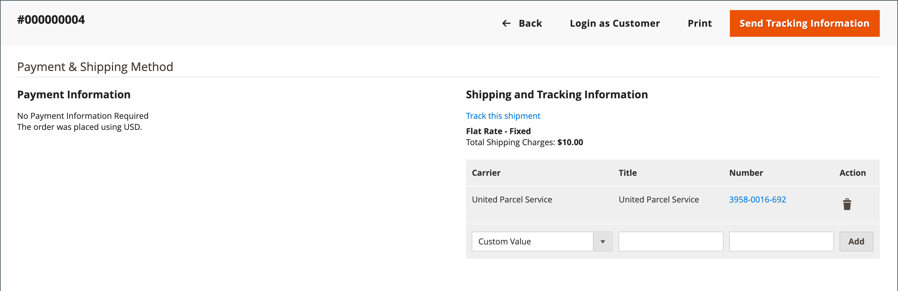

# Overbrengingen

De _[!UICONTROL Shipments]_In het rooster wordt een overzicht gegeven van alle facturen die voor verzending zijn opgesteld. Een ladingsverslag kan worden geproduceerd wanneer een orde is [gefactureerd](invoices.md) of hoger.

Adobe Commerce en Magento Open Source ondersteunen gedeeltelijke en volledige verzending van bestellingen, met extra opties beschikbaar van [Inventory management](../inventory-management/introduction.md) en extensies van derden.

{width="600" zoomable="yes"}

## Kolombeschrijvingen

| Kolom of besturingselement | Beschrijving |
|--- |--- |
| [!UICONTROL Select] | Schakel het selectievakje in voor elk aanhalingsteken dat aan een handeling moet worden onderworpen, of gebruik het selectiegereedschap in de kolomkop. Opties: `Select All` / `Deselect All` |
| [!UICONTROL Shipment] | Een uniek, opeenvolgend aantal dat wordt toegewezen wanneer een nieuwe lading voor het eerst wordt bewaard |
| [!UICONTROL Ship Date] | Verzenddatum |
| [!UICONTROL Order] | Uniek nummer van de bestelling |
| [!UICONTROL Order Date] | De datum en het tijdstip waarop de order is geplaatst |
| [!UICONTROL Ship-to Name] | De naam van de persoon aan wie de order is verzonden |
| [!UICONTROL Total Quantity] | Totale hoeveelheid te verzenden objecten |
| [!UICONTROL Action] | Weergeven opent de verzending in de bewerkingsmodus |

{style="table-layout:auto"}

Aanvullende kolommen:

| Kolom | Beschrijving |
|--- |--- |
| [!UICONTROL Order Status] | Hiermee wordt de status van de volgorde aangegeven |
| [!UICONTROL Purchased From] | Geeft de website-, opslag- en opslagweergave aan waar de volgorde is geplaatst |
| [!UICONTROL Customer Name] | De naam van de klant of koper die de bestelling heeft geplaatst |
| [!UICONTROL Email] | Het e-mailadres van een geregistreerde klant |
| [!UICONTROL Customer Group] | De naam van de klantengroep of gedeelde catalogus waaraan de klant is toegewezen |
| [!UICONTROL Billing Address] | De naam van de klant of koper die de bestelling heeft geplaatst |
| [!UICONTROL Shipping Address] | De naam van de persoon aan wie de order is verzonden |
| [!UICONTROL Payment Method] | De wijze van betaling die voor de opdracht moet worden gebruikt |
| [!UICONTROL Shipping Information] | De methode die moet worden gebruikt om de bestelling te verzenden |

{style="table-layout:auto"}

## Een verzending maken

Met de volgende instructies doorloopt u het proces voor het maken van een verzending in Adobe Commerce of Magento Open Source. Als je Inventory management hebt ingeschakeld, kun je het beste controleren [Multibronverzendingen maken](../inventory-management/shipments-create.md) en selecteer een bron (of locatie) en een hoeveelheid die u per regelitem wilt verzenden.

1. Op de _Beheerder_ zijbalk, ga naar **[!UICONTROL Sales]** > **[!UICONTROL Orders]**.

1. Zoek de volgorde in het raster en open deze.

1. Als de bestelling is betaald, gefactureerd en klaar is om te worden verzonden, klikt u op **[!UICONTROL Ship]**.

   De secties boven aan de verzending bevatten naam, adres en betalingsgegevens uit de verkooporder.

1. Vul elke sectie van het verzendformulier in met de instructies in de volgende secties.

### [!UICONTROL Items to Ship]

Voor elk lijnpunt in de orde, wijzig **[!UICONTROL Qty to Ship]** indien nodig.

### [!UICONTROL Shipping Information]

**Methode 1:** De bestelpagina gebruiken

1. Op de _Beheerder_ zijbalk, ga naar **[!UICONTROL Sales]** > **[!UICONTROL Orders]**.

1. In de **[!UICONTROL Action]** voor de geselecteerde volgorde klikt u op **[!UICONTROL View]**.

1. Klik op **[!UICONTROL Ship]**.

1. Omlaag schuiven naar de _[!UICONTROL Payment & Shipping Method]_blok en klik **[!UICONTROL Add Tracking Number]**.

1. Set **[!UICONTROL Carrier]**:

   - `Custom Value`
   - `DHL`
   - `Federal Express`
   - `United Parcel Service`
   - `United States Postal Service`

1. Als u de zending wilt volgen, voert u de **[!UICONTROL Title]** en **[!UICONTROL Number]** .

**Methode 2:** De verzendpagina gebruiken

Deze methode is alleen toegestaan als de verzending van de bestelling al vanaf de bestelpagina is gemaakt.
U kunt de verzendgegevens en trackinggegevens naar wens wijzigen met de pagina voor rechtstreekse verzending:

1. Op de _Beheerder_ zijbalk, ga naar **[!UICONTROL Sales]** > **[!UICONTROL Shipments]**.

1. De verzending zoeken en openen in de bewerkingsmodus.

1. Omlaag schuiven naar de _[!UICONTROL Payment & Shipping Method]_blokkeren.

1. Selecteer de **[!UICONTROL Carrier]**.

1. Voer een **[!UICONTROL Title]** voor het pakket.

1. De tekstspatiëring invoeren **[!UICONTROL Number]**.

1. Klik op **[!UICONTROL Add]**.

1. Als u een e-mail met trackinggegevens naar de klant wilt verzenden, klikt u op **[!UICONTROL Send Tracking Information]** en de actie bevestigen.

   Als u de locatie van een verzending wilt volgen, opent u de gewenste verzending in de bewerkingsmodus en klikt u op **[!UICONTROL Track this shipment]**.

   {width="600" zoomable="yes"}

### Knoppen

| Knop | Beschrijving |
|--- |--- |
| **[!UICONTROL Back]** | Sluit het nieuwe verzendformulier en keert terug naar de bestelling |
| **[!UICONTROL Submit Shipment]** | Voegt de zending voor de orde toe. |
| **[!UICONTROL Reset]** | Hiermee herstelt u de oorspronkelijke waarden van alle velden. |

{style="table-layout:auto"}

### Opmerkingen verzenden

1. Enter **Opmerkingen** voor de overbrenging, indien nodig.

1. Wanneer de verzending klaar is, klikt u op **Verzending verzenden**.

## Opmerkingen instellen voor verzendingen

1. Op de _Beheerder_ zijbalk, ga naar **[!UICONTROL Stores]** > _[!UICONTROL Settings]_>**[!UICONTROL Configuration]**.

1. Selecteer onder _[!UICONTROL Sales]_de optie **[!UICONTROL Sales Email]**.

1. Breid uit **Opmerkingen bij verzending** en wijzigt u de instellingen indien nodig:

   {width="600" zoomable="yes"}

   - De **[!UICONTROL Enabled]** optie is ingesteld op `Yes` standaard, wat betekent dat het e-mailbericht naar een klant wordt verzonden wanneer er een verzendopmerking wordt ingevoerd.

   - Voor **[!UICONTROL Shipment Comment Email Sender]**, selecteert u de persoon van wie het bericht met opmerkingen over de verzending is verzonden. Standaard zijn er vijf e-mailadressen.

   - Voor **[!UICONTROL Shipment Comment Email Template]** selecteert u de sjabloon op basis van uw vereisten of selecteert u de standaardoptie.

   - Voor **[!UICONTROL Shipment Comment Email Template for Guests]**, kiest u de sjabloon die wordt gebruikt voor klanten die geen account in uw winkel hebben.

   - Voor **[!UICONTROL Shipment Comment Email Copy To]**, voert u de e-mailadressen in om een kopie van de opmerkingen over de verzending te verzenden. Scheid meerdere e-mailadressen met een komma.

   - Voor **[!UICONTROL Shipment Comment Email Copy Method]**, selecteert u `bcc` (blinde koolstofkopie) of `separate email copy` op basis van uw voorkeur.

1. Klik op **[!UICONTROL Save Config]**.

## Een verzending annuleren

Voordat een zending naar een vervoerder wordt verzonden, kan deze worden geannuleerd door de bestelling te openen en naar de lading te navigeren, op voorwaarde dat de vervoerder annuleringen ondersteunt. Sommige dragers beperken of beperken annuleringen na het boeken. UPS staat bijvoorbeeld annuleringen toe, maar vereist dat u 24 uur wacht nadat de verzending is geboekt. Als een transport wordt geannuleerd, kan de annulering niet worden teruggedraaid. De enige mogelijkheid is om de bestelling opnieuw te maken.

1. Op de _Beheerder_ zijbalk, ga naar **[!UICONTROL Sales]** > **[!UICONTROL Orders]**.

1. Zoek de volgorde in het raster.

1. In de _Handeling_ kolom, kies **[!UICONTROL View]**.

1. Kies in het linkerdeelvenster de optie **[!UICONTROL Shipments]**.

   Als de overbrenging kan worden geannuleerd, _[!UICONTROL Cancel Shipment]_verschijnt als een optie in de hoogste knoopbar.

1. Klik op **[!UICONTROL Cancel Shipment]**.

1. Klik wanneer u wordt gevraagd om te bevestigen **[!UICONTROL OK]**.

De status van de overbrenging verandert in `Canceled`. Als de vervoerder geen annuleringen ondersteunt, wordt een foutbericht weergegeven waarin wordt uitgelegd waarom de verzending niet kan worden geannuleerd.

## Beschrijvingen van verzendvelden

### [!UICONTROL Shipping Information]

| Veld | Beschrijving |
|-----|-----------|
| [!UICONTROL Carrier] | De naam van de geselecteerde vervoerder |
| [!UICONTROL Title] | Een beschrijvende naam die door de vervoerder aan het pakket is toegewezen. |
| [!UICONTROL Number] | Het gekoppelde volgnummer dat aan het pakket is toegewezen. |
| [!UICONTROL Action] |  - Hiermee verwijdert u de pakketgegevens uit de ladingsrecord. |
| [!UICONTROL Add] | Voeg nog een pakket toe aan de verzending. |

{style="table-layout:auto"}

### [!UICONTROL Route Information]

| Veld | Beschrijving |
|-----|-----------|
| [!UICONTROL Origin Location] | Geeft een lijst met beschikbare locaties weer. |
| [!UICONTROL International] | Indien gecontroleerd, identificeert de zending als een internationale zending. |

{style="table-layout:auto"}

### [!UICONTROL Items Ordered]

| Veld | Beschrijving |
|-----|-----------|
| [!UICONTROL Description] | De beschrijving van het item. |
| [!UICONTROL SKU] | De voorraadbewaareenheid van het artikel. |
| [!UICONTROL Weight] | Het gewicht van het object. |
| [!UICONTROL Qty Ordered] | De hoeveelheid van het item dat is besteld. |
| [!UICONTROL Qty Shipped] | De hoeveelheid objecten die is verzonden. |
| [!UICONTROL Qty Packed] | Het aantal items dat in dit pakket is opgenomen. |

{style="table-layout:auto"}

### [!UICONTROL Shipment Comments]

| Veld | Beschrijving |
|-----|-----------|
| [!UICONTROL Comments] | Opmerkingen over de zending zijn bestemd voor intern gebruik. |

{style="table-layout:auto"}

### [!UICONTROL Documentation]

| Veld | Beschrijving |
|-----|-----------|
| [!UICONTROL Package Label] | **PNG** - Download het label van het verzendpakket. Grootte: A6 (105 x 148 mm; 4,1 x 5,6 inch) |

{style="table-layout:auto"}
