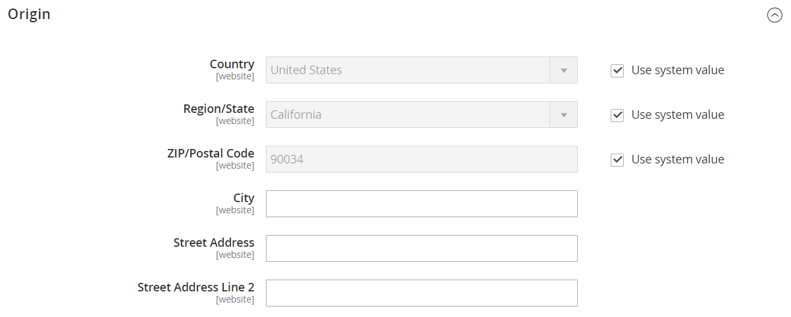

# Verzendinstellingen

De verzendconfiguratie bepaalt het uitgangspunt voor alle verzendingen, uw verzendbeleid en de verwerking van verzendingen naar meerdere adressen.

## Punt van oorsprong

Het punt van oorsprong wordt gebruikt voor de berekening van de kosten voor overbrengingen uit uw winkel of pakhuis, en bepaalt ook het belastingtarief voor verkochte producten. Wanneer het berekenen van [&#x200B; EU belastingen &#x200B;](international-tax-guidelines.md#eu-tax-configuration), zorg ervoor dat de [&#x200B; Berekening van de StandaardBelastingbestemming &#x200B;](../configuration-reference/sales/tax.md) voor elke opslagmening aan het Verschepende punt van Montages van oorsprong beantwoordt.

{width="600" zoomable="yes"}

1. Voor _Admin_ sidebar, ga **[!UICONTROL Stores]** > _[!UICONTROL Settings]_>**[!UICONTROL Configuration]**.

1. Vouw in het linkerdeelvenster **[!UICONTROL Sales]** uit en kies **[!UICONTROL Shipping Settings]** .

1. Breid  de **[!UICONTROL Origin]** sectie uit en voltooi het volgende:

   - [!UICONTROL Country]
   - [!UICONTROL Region / State]
   - [!UICONTROL ZIP / Postal Code]
   - [!UICONTROL City]
   - [!UICONTROL Street Address] (en regel 2, indien nodig)

1. Klik op **[!UICONTROL Save Config]**.

## Verzendbeleid

Een verzendbeleid moet uitleg geven over de bedrijfsregels en richtlijnen van uw bedrijf voor verzendingen. Als je bijvoorbeeld prijsregels hebt die gratis verzending activeren, kun je de voorwaarden in je verzendbeleid uitleggen.

{width="700" zoomable="yes"}

Als je je verzendbeleid tijdens het afrekenen wilt weergeven, voltooi je de parameters voor het verzendbeleid in de configuratie. De tekst verschijnt wanneer de klanten _klikken zie ons het verschepen beleid_ tijdens controle.

1. Voor _Admin_ sidebar, ga **[!UICONTROL Stores]** > _[!UICONTROL Settings]_>**[!UICONTROL Configuration]**.

1. Vouw in het linkerdeelvenster **[!UICONTROL Sales]** uit en kies **[!UICONTROL Shipping Settings]** .

1. Breid  de **[!UICONTROL Shipping Policy Parameters]** sectie uit.

1. Stel **[!UICONTROL Apply Custom Shipping Policy]** in op `Yes` .

1. Plak of typ de **[!UICONTROL Shipping Policy]** in het tekstvak.

   >[!NOTE]
   >
   >Als u een tekstverwerker gebruikt om de tekst samen te stellen, zorg ervoor om het document als .txt dossier te bewaren om het even welke controlekarakters uit de tekst te verwijderen. Vervolgens kopieert en plakt u de tekst in het tekstvak Verzendbeleid.

   {width="600" zoomable="yes"}

1. Klik op **[!UICONTROL Save Config]**.

## Meerdere adressen

Met de verzendopties voor meerdere adressen kunnen klanten tijdens het afrekenen een bestelling naar meerdere adressen verzenden en het maximumaantal adressen bepalen waarnaar een bestelling kan worden verzonden.

1. Voor _Admin_ sidebar, ga **[!UICONTROL Stores]** > _[!UICONTROL Settings]_>**[!UICONTROL Configuration]**.

1. Vouw in het linkerdeelvenster **[!UICONTROL Sales]** uit en kies **[!UICONTROL Multishipping Settings]** .

1. Breid  de **[!UICONTROL Options]** sectie uit.

   {width="600" zoomable="yes"}

1. Stel **[!UICONTROL Allow Shipping to Multiple Addresses]** in op `Yes` .

1. Voer de **[!UICONTROL Maximum Qty Allowed for Shipping to Multiple Addresses]** in.

1. Klik op **[!UICONTROL Save Config]**.

>[!NOTE]
>
> (Adobe Commerce B2B) voor orden met veelvoudige verschepende adressen, is de [&#x200B; Betaling op Rekening &#x200B;](../b2b/enable-basic-features.md#configure-payment-on-account) betalingsmethode, zelfs als toegelaten, niet beschikbaar tijdens de controle.
