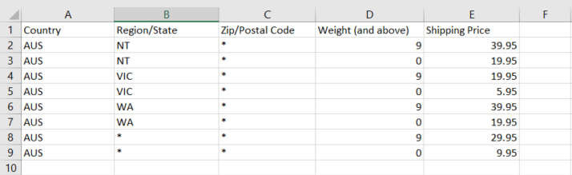

# Verzending van tabeltarieven

De _tabelsnelheid_ De verzendmethode verwijst naar een tabel met gegevens voor de berekening van de verzendkosten op basis van een combinatie van voorwaarden, waaronder:

- Gewicht v. bestemming
- Prijs v. bestemming
- Aantal objecten v. Doel

Als je pakhuis bijvoorbeeld in Los Angeles is, kost het minder om naar San Diego te verzenden dan naar Vermont. U kunt de verzending van tabeltarieven gebruiken om de besparingen door te geven aan uw klanten.

De gegevens die worden gebruikt om tabelsnelheden te berekenen, worden in een spreadsheet voorbereid en in uw winkel geïmporteerd. Wanneer de klant een prijsopgave aanvraagt, worden de resultaten weergegeven in de sectie met verzendramingen van het winkelwagentje.

>[!NOTE]
>
>Er kan slechts één set tabelsnelheidsgegevens tegelijk actief zijn.

{width="700" zoomable="yes"}

## Stap 1: De standaardinstellingen voltooien

De eerste stap bestaat uit het voltooien van de standaardinstellingen voor tabelsnelheden. U kunt deze stap voltooien zonder het werkingsgebied van de configuratie te veranderen.

1. Op de _Beheerder_ zijbalk, ga naar **[!UICONTROL Stores]** > _[!UICONTROL Settings]_>**[!UICONTROL Configuration]**.

1. In de _[!UICONTROL Sales]_in het linkerdeelvenster kiest u **[!UICONTROL Delivery Methods]**.

1. Uitbreiden  de **[!UICONTROL Table Rates]** sectie.

   >[!NOTE]
   >
   >Indien nodig eerst de **[!UICONTROL Use system value]** Schakel het selectievakje in om de volgende instellingen te wijzigen zoals beschreven.

   {width="600" zoomable="yes"}

1. Set **[!UICONTROL Enabled]** tot `Yes`.

1. Voer de **[!UICONTROL Title]** die u tijdens het afrekenen voor de sectie Tabeltarieven wilt weergeven.

   De standaardtitel is `Best Way`.

1. Voer de **[!UICONTROL Method Name]** dat u als etiket naast het berekende tarief in het winkelwagentje wilt verschijnen.

1. Set **[!UICONTROL Condition]** volgens een van de volgende berekeningsmethoden:

   - `Weight v. Destination`
   - `Price v. Destination`
   - `Number of Items v. Destination`

1. Voor orders die virtuele producten bevatten, stelt u **[!UICONTROL Include Virtual Products in Price Calculation]** tot `Yes` als u de virtuele producten in de berekening wilt kunnen opnemen.

   >[!NOTE]
   >
   >Omdat de virtuele producten-zulke als dienst-geen gewicht hebben, kunnen zij niet het resultaat van een berekening veranderen die op de voorwaarde van de Waarde v. van de Bestemming gebaseerd is. Virtuele producten kunnen echter het resultaat wijzigen van een berekening die is gebaseerd op de voorwaarde Prijs v. Doel of # van items vs. Doel.

1. Configureer de opties voor de behandelingskosten naar wens.

   De verpakkingskosten zijn optioneel en worden weergegeven als extra kosten die bij de verzendkosten worden opgeteld. Voer de volgende handelingen uit als u verpakkingskosten wilt opnemen:

   - Set **[!UICONTROL Calculate Handling Fee]**:

      - `Fixed`
      - `Percent`

   - Voer de **[!UICONTROL Handling Fee]** tarief volgens de methode die wordt gebruikt om de vergoeding te berekenen.

     Als de vergoeding bijvoorbeeld is gebaseerd op een vaste vergoeding, voert u het bedrag in als een decimaal, zoals `4.90`. Als de behandelingskosten echter zijn gebaseerd op een percentage van de bestelling, voert u het bedrag in als een percentage. Als u bijvoorbeeld zes procent van de bestelling in rekening brengt, voert u de waarde in als `.06`.

1. Wijzig, indien nodig, de **[!UICONTROL Displayed Error Message]**.

   Dit tekstvak is vooraf ingesteld met een standaardbericht, maar u kunt een ander bericht invoeren dat u wilt weergeven als deze leveringsmethode niet meer beschikbaar is.

1. Set **[!UICONTROL Ship to Applicable Countries]**:

   - `All Allowed Countries` - Klanten van iedereen [landen](../getting-started/store-details.md#country-options) gespecificeerd in uw archiefconfiguratie kan deze leveringsmethode gebruiken.
   - `Specific Countries` - Als u deze optie kiest, _[!UICONTROL Ship to Specific Countries]_wordt weergegeven. Selecteer elk land in de lijst waar deze leveringsmethode kan worden gebruikt.

1. Set **[!UICONTROL Show Method if Not Applicable]** tot `Yes` als u de Tarieven van de Lijst allen wilt tonen

1. Voor **[!UICONTROL Sort Order]** Voer een getal in om de volgorde te bepalen waarin Verzending tabelsnelheid wordt weergegeven wanneer deze bij andere leveringsmethoden wordt vermeld tijdens het afrekenen.

   `0` = eerst, `1` = seconde, `2` = derde, enzovoort.

1. Klik op **[!UICONTROL Save Config]**.

## Stap 2: De tabelsnelheidsgegevens voorbereiden

1. In de linkerbovenhoek, plaats **[!UICONTROL Store View]** tot `Main Website`of op elke andere website waarop de configuratie van toepassing is.

   >[!NOTE]
   >
   >Schakel indien nodig eerst de optie **[!UICONTROL Use system value]** Schakel het selectievakje in om de volgende instellingen te wijzigen zoals beschreven.

1. Wijzig de **[!UICONTROL Condition]** indien nodig.

1. Klik op **[!UICONTROL Export CSV]**.

   {width="700" zoomable="yes"}

1. Sla de `tablerates.csv` naar uw systeem.

1. Open het bestand in een spreadsheettoepassing.

1. Vul de tabel in met de juiste waarden voor de verzendberekeningsvoorwaarde.

   - Gebruik een asterisk (*) als vervanging die alle mogelijke waarden in om het even welke categorie vertegenwoordigt.
   - De _[!UICONTROL Country]_column must contain a [geldige code van drie tekens][1] voor elke rij.
   - Gegevens sorteren op _[!UICONTROL Region/State]_de specifieke locaties staan dus boven aan de lijst en onder aan de jokertekenlocaties. Het gebruiken van deze methode verwerkt eerst de regels met de absolute waarden, en later de vervangingswaarden.
   - Waarden in het dialoogvenster _[!UICONTROL Weight (and above)]_de kolom kan een maximum van vier decimalen hebben (zoals `2.5075`). Wanneer meer decimalen in de gegevens worden gebruikt, mislukt het importeren.

   {width="500"}

1. Sla de `tablerates.csv` bestand.

## Stap 3: De tabelsnelheidsgegevens importeren

1. Terugkeren naar de **[!UICONTROL Table Rates]** van uw winkelconfiguratie.

1. In de linkerbovenhoek, plaats **[!UICONTROL Store View]** naar de website waar deze methode wordt gebruikt.

1. Voor **[!UICONTROL Import]**, klikt u op **[!UICONTROL Choose File]** en selecteer de voltooide `tablerates.csv` bestand om de tarieven te importeren.

   {width="600" zoomable="yes"}

1. Klik op **[!UICONTROL Save Config]**.

## Stap 4: De tarieven verifiëren

Om ervoor te zorgen dat de gegevens van het lijsttarief correct zijn, ga het betalingsproces met verscheidene verschillende adressen door om ervoor te zorgen dat de verschepings en behandelende tarieven correct worden berekend.

### Voorbeeld 1: Prijs en bestemming

In dit voorbeeld wordt de voorwaarde Prijs v. bestemming gebruikt om een set van drie verschillende verzendtarieven te maken op basis van de hoeveelheid van het subtotaal voor bestellingen voor het Amerikaanse continent, Alaska en Hawaii. Het sterretje (*) is een jokerteken dat alle waarden vertegenwoordigt.

| LAND | REGIO/STAAT | ZIP/POSTCODE | SUBTOTAAL BESTELLEN (en hoger) | VERZENDPRIJS |
|--- |--- |--- |--- |--- |
| VS | HI | * | 100 | 10 |
| VS | HI | * | 50 | 15 |
| VS | HI | * | 0 | 20 |
| VS | AK | * | 100 | 10 |
| VS | AK | * | 50 | 15 |
| VS | AK | * | 0 | 20 |
| VS | * | * | 100 | 5 |
| VS | * | * | 50 | 10 |
| VS | * | * | 0 | 15 |

{style="table-layout:auto"}

### Voorbeeld 2: Gewicht en bestemming

In dit voorbeeld wordt de voorwaarde Dikte v. bestemming gebruikt om verschillende verzendkosten te maken op basis van het gewicht van de bestelling.

| LAND | REGIO/STAAT | ZIP/POSTCODE | GEWICHT (en hoger) | VERZENDPRIJS |
|--- |--- |--- |--- |--- |
| AUS | NT | * | 9 | 39.95 |
| AUS | NT | * | 0 | 19.95 |
| AUS | VIC | * | 9 | 19.95 |
| AUS | VIC | * | 0 | 5.95 |
| AUS | WA | * | 9 | 39.95 |
| AUS | WA | * | 0 | 19.95 |
| AUS | * | * | 9 | 29.95 |
| AUS | * | * | 0 | 9.95 |

{style="table-layout:auto"}

### Voorbeeld 3: Beperking van de gratis verzending naar het Amerikaanse vasteland

1. Een `tablerates.csv` bestand dat alle overheidsdoelen bevat waarvoor u gratis verzending wilt aanbieden.

1. Voltooi de configuratie van de tabelsnelheid met de volgende instellingen:

   | Instelling | Waarde |
   |----------|-------|
   | [!UICONTROL Condition] | `Price v. Destination` |
   | [!UICONTROL Method Name] | `Free Shipping` |
   | [!UICONTROL Ship to Applicable Countries] | `Specific Countries` |
   | [!UICONTROL Ship to Specific Countries] | `Select only United States` |
   | [!UICONTROL Show method if not applicable] | `No` |

   {style="table-layout:auto"}

1. In de linkerbovenhoek, plaats **[!UICONTROL Store View]** tot `Main Website`of op elke andere website waarop de configuratie van toepassing is.

1. Voor **[!UICONTROL Import]**, klikt u op **[!UICONTROL Choose File]** en selecteer de voltooide `tablerates.csv` bestand om de tarieven te importeren.

[1]: https://en.wikipedia.org/wiki/ISO_3166-1_alpha-3
