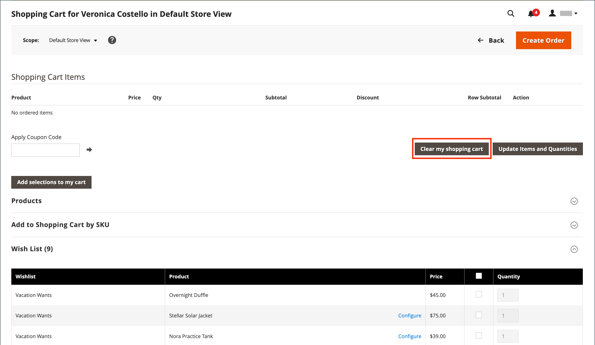

# Een winkelwagentje beheren

{{ee-feature}}

Als u een sessie voor ondersteund winkelen wilt starten, moet de klant bij de winkel zijn aangemeld bij de klant om de informatie beschikbaar te stellen. Als de klant geen rekening heeft, kunt u [ tot één ](../customers/account-create.md) leiden.

{width="600" zoomable="yes"}

## Handelingencontrole

| Optie | Beschrijving |
|--- |--- |
| [!UICONTROL Remove] | Hiermee verwijdert u items uit het huidige winkelwagentje |
| [!UICONTROL Move to Wish List] | Hiermee verplaatst u items naar de geselecteerde wenslijst van klanten |

{style="table-layout:auto"}

## Besturingsknoppen

| Knop | Beschrijving |
|--- |--- |
| [!UICONTROL Clear my shopping cart] | Hiermee verwijdert u alle items uit het winkelwagentje. |
| [!UICONTROL Update Items and Quantities|] ga het vereiste aantal op het **[!UICONTROL Qty]** gebied in en werk het aantal punten in het karretje bij. |
| [!UICONTROL Add selections to my cart] | Hiermee voegt u producten van alle secties toe aan het winkelwagentje. |

{style="table-layout:auto"}

## Controleren of de klant is aangemeld

1. Voor _Admin_ sidebar, ga **[!UICONTROL Customers]** > **[!UICONTROL Now Online]**.

   Alle bezoekers van de winkel en aangemelde klanten worden in de lijst weergegeven.

   {width="700" zoomable="yes"}

## Bied assistentie bij winkelen

1. Voor _Admin_ sidebar, ga **[!UICONTROL Customers]** > **[!UICONTROL All Customers]**.

1. Open in de lijst de klantrecord in de bewerkingsmodus.

   >[!TIP]
   >
   >Om het klantenverslag in een haast te vinden, gebruik de [ controle van Filters ](../getting-started/admin-grid-controls.md).

   In het klantprofiel onder _[!UICONTROL Personal Information]_&#x200B;toont de datum en tijd van&#x200B;_[!UICONTROL Last Logged In]_ dat de klant online is.

   {width="600" zoomable="yes"}

1. Als u de modus voor ondersteund winkelen wilt inschakelen, klikt u op **[!UICONTROL Manage Shopping Cart]** in de bovenste knopbalk.

   {width="600" zoomable="yes"}

## Producten aan winkelwagentje per kenmerk toevoegen

1. Breid  de **[!UICONTROL Products]** sectie uit.

1. Een product zoeken met een van de filters boven aan elke kolom.

1. Klik op **[!UICONTROL Search]**.

1. Gebruik een van de volgende stappen volgens het producttype:

### Een eenvoudig product toevoegen

1. Klik op het product dat u wilt bestellen.

   Met deze handeling wordt de record geselecteerd en wordt **[!UICONTROL Quantity]** ingesteld op de standaardwaarde van `1` .

1. Werk indien nodig de geordende hoeveelheid bij.

1. Klik links boven het raster op **[!UICONTROL Add selections to my cart]** .

   {width="600" zoomable="yes"} toe

   Het regelitem wordt boven aan de pagina toegevoegd aan het winkelwagentje.

   {width="600" zoomable="yes"}

### Een product met configuratie toevoegen

Er zijn drie typen producten die moeten worden geconfigureerd voordat u ze aan de winkelwagentje toevoegt: `Bundle Product`, `Configurable Product` en `Grouped Product` .

1. Klik in het raster op **[!UICONTROL Configure]** naast de productnaam.

   {width="600" zoomable="yes"}

1. In de _Verwante dialoog van Producten_, verkies elke productoptie om het punt te beschrijven dat moet worden bevolen, ga **[!UICONTROL Quantity]** in, en klik **[!UICONTROL OK]**.

   Het product wordt geselecteerd met een vinkje en de geordende hoeveelheid wordt weergegeven in het raster.

1. Klik op **[!UICONTROL Add selections to my cart]** om het product aan het winkelwagentje toe te voegen.

   {width="600" zoomable="yes"}

1. Werk zo nodig de productopties in het winkelwagentje bij:

   - Klik op **[!UICONTROL Configure]**.

   - Werk de opties bij en klik op **[!UICONTROL OK]** .

## Product toevoegen door SKU

1. Breid  de **[!UICONTROL Add to Shopping Cart by SKU]** sectie uit.

1. Voeg producten afzonderlijk toe door **[!UICONTROL SKU]** of voeg producten toe door een CSV-bestand te uploaden.

### Items afzonderlijk toevoegen door SKU

1. Voer de **[!UICONTROL SKU]** en **[!UICONTROL Qty]** in van het item dat moet worden geordend.

1. Klik op **[!UICONTROL Add another]** als u een ander product wilt bestellen.

   {width="600" zoomable="yes"} toe

1. Klik op **[!UICONTROL Add selections to my cart]**.

1. Als het item een configureerbaar product is, kiest u de productopties wanneer u hierom wordt gevraagd en klikt u op **[!UICONTROL Add to Shopping Cart]** .

### Producten toevoegen door een CSV-bestand te uploaden

1. Bereid a [ csv- dossier ](../systems/data-csv.md) met de punten voor die aan de kar moeten worden toegevoegd.

   Het bestand mag slechts twee kolommen bevatten, met `sku` en `qty` in de koptekst.

1. Upload het voorbereide bestand:

   - Klik op **[!UICONTROL Choose File]**.

   - Selecteer het bestand dat u wilt uploaden in de map.

## Een item overbrengen

U kunt objecten naar het winkelwagentje overbrengen vanuit de verlanglijst van een klant en onlangs bekeken, vergeleken of geordende objecten. Het aantal items in elke sectie wordt tussen haakjes achter de sectiekop weergegeven.

1. Breid  één van de volgende secties uit:

   - [!UICONTROL Wish List]
   - [!UICONTROL Products in the Comparison List]
   - [!UICONTROL Recently Compared Products]
   - [!UICONTROL Recently Viewed Products]
   - [!UICONTROL Last Ordered Items]

1. Selecteer in het raster elk product dat u wilt bestellen en voer de **[!UICONTROL Quantity]** in.

1. Als u de opties voor een configureerbaar product wilt invoeren, klikt u op **[!UICONTROL Configure]** en stelt u de gewenste opties in.

1. Klik op **[!UICONTROL Add selections to my cart]**.

1. Pas een of meer couponcodes toe, indien beschikbaar:

   - Voer bij **[!UICONTROL Apply Coupon Code]** een geldige couponcode in.

   - Klik _toepassen_ ( ) pijl.

1. Pas de geordende hoeveelheid naar wens aan:

   - Voer in de kolom **[!UICONTROL Qty]** van het aan te passen product de juiste hoeveelheid in.

   - Klik op **[!UICONTROL Update Items and Quantities]**.

## De volgorde maken

1. Klik op **[!UICONTROL Create Order]**.

   Op de pagina _[!UICONTROL Create New Order]_&#x200B;worden de objecten in het winkelwagentje weergegeven, gevolgd door de verzend- en betalingsgegevens.

1. Voltooi de verzend- en betalingsgegevens.

1. Klik op **[!UICONTROL Submit Order]**.

Meer leren, zie [ een orde ](customer-account-create-order.md) creëren.

## Alle items uit een winkelwagentje verwijderen

Het verwijderen van alle items uit de winkelwagentje van een klant in de modus voor ondersteund winkelen is handig als de klant opnieuw wil beginnen, onjuiste items heeft toegevoegd of zijn winkelwagentje moet wissen voordat een nieuwe bestelling wordt geplaatst. Hierdoor wordt ervoor gezorgd dat de winkelwagen alleen de producten bevat die de klant daadwerkelijk wil kopen.

1. Voor _Admin_ sidebar, ga **[!UICONTROL Customers]** > **[!UICONTROL All Customers]**.

1. Open in de lijst de klantrecord in de bewerkingsmodus.

1. Klik op **[!UICONTROL Manage Shopping Cart]** in de bovenste knopbalk.

1. Klik op **[!UICONTROL Clear my shopping cart]**.

   {width="600" zoomable="yes"}

1. Klik op **[!UICONTROL OK]** wanneer u wordt gevraagd de handeling te bevestigen.
