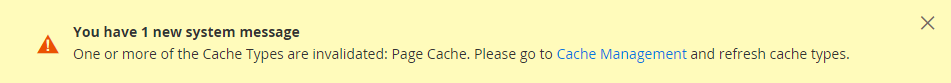

# URL&#39;s opslaan

Elke website in een Adobe Commerce- of Magento Open Source-installatie heeft een basis-URL die is toegewezen aan de storefront en een andere URL die is toegewezen aan de beheerder. De Adobe gebruikt variabelen om interne verbindingen met betrekking tot basis URL te bepalen, die het mogelijk maakt om een volledige opslag van één plaats aan een andere te bewegen zonder de verbindingen bij te werken. Standaard basis-URL&#39;s beginnen met `http`en beveiligde basis-URL&#39;s beginnen met `https`.

- **Basis-URL** — `http://www.yourdomain.com/magento/`
- **Beveiligde basis-URL** — `https://www.yourdomain.com/magento/`
- **URL met IP-adres** — `http://###.###.###.###/magento/` of `https://###.###.###.###/magento/`

>[!IMPORTANT]
>
>Wijzig de URL van de beheerder niet vanuit de standaard basis-URL-configuratie. Ga naar [Een aangepaste Admin URL gebruiken](#use-a-custom-admin-url).

## Beveiligd protocol gebruiken

De basis-URL&#39;s voor uw winkel zijn aanvankelijk ingesteld tijdens de Adobe Commerce-installatie. Als er op dat moment een beveiligingscertificaat beschikbaar was, kunt u opgeven voor `HTTPS` URL&#39;s die moeten worden gebruikt voor de winkel, beheerder of beide. Als uw Adobe Commerce-installatie meerdere winkels bevat of als u later meer winkels wilt toevoegen, kunt u de winkelcode opnemen in de URL. Alle middelen en verrichtingen van de Adobe kunnen met veilig protocol worden gebruikt.

Als een beveiligingscertificaat niet beschikbaar was voor het domein op het moment van de installatie, moet u de configuratie bijwerken voordat u de winkel start. Nadat een beveiligingscertificaat voor uw domein is ingesteld, kunt u ofwel basis-URL&#39;s configureren voor gebruik met de gecodeerde SSL (Secure Sockets Layer) en [Transport Layer Security][1] (TLS).

>[!IMPORTANT]
>
>Adobe beveelt ten zeerste aan alle pagina&#39;s van een productiesite, inclusief de inhoud en productpagina&#39;s, via een beveiligd protocol over te brengen.

Adobe Commerce en Magento Open Source kunnen zo worden geconfigureerd dat alle pagina&#39;s over `HTTPS` standaard. Als uw winkel het standaardprotocol gebruikt, kunt u de beveiliging verbeteren door [HTTP - Strikte vervoersbeveiliging][2] (HSTS) en een upgrade uitvoeren van onveilige paginaverzoeken. HSTS is een opt-in protocol dat browsers verhindert om norm terug te geven `HTTP` pagina&#39;s die met onbeveiligd protocol voor het gespecificeerde domein worden overgebracht. Omdat zoekprogramma&#39;s mogelijk al elke pagina van je winkel hebben geïndexeerd met standaard `HTTP` URLs, kunt u Handel vormen om het even welke onveilige paginaverzoeken te bevorderen aan `HTTPS` automatisch, zodat verliest u geen verkeer. Wanneer de Handel wordt gevormd om veilige URLs voor zowel de storefront als Admin te gebruiken, verschijnen twee extra gebieden die u toestaan om toe te laten `HSTS`.

## De basis-URL configureren

1. Op de _Beheerder_ zijbalk, ga naar **[!UICONTROL Stores]** > _[!UICONTROL Settings]_>**[!UICONTROL Configuration]**.

1. Onder _Algemeen_ in het linkerdeelvenster kiest u **[!UICONTROL Web]**.

1. Uitbreiden  de **[!UICONTROL Base URL]** sectie.

   - **[!UICONTROL Base URL]** — Voer de volledig gekwalificeerde basis-URL voor uw winkel in. Zorg ervoor dat u de URL beëindigt met een slash, zodat deze kan worden uitgebreid met extra URL-sleutels uit uw winkel. Bijvoorbeeld: `http://yourdomain.com/`

     >[!NOTE]
     >
     >Wijzig de plaatsaanduiding in het dialoogvenster _[!UICONTROL Base Link URL]_veld. Deze tijdelijke aanduiding wordt gebruikt om relatieve koppelingen naar de basis-URL te maken.

   - **[!UICONTROL Base URL for Static View Files]** — (Optioneel) Geef een alternatieve locatie op voor de basis-URL voor statische weergavebestanden door het pad in te voeren, te beginnen met de volgende tijdelijke aanduiding:

     \{\{unsecure_base_url}}

   - **[!UICONTROL Base URL for User Media Files]** — (Optioneel) Geef een alternatieve locatie voor de basis-URL voor gebruikersmediabestanden op door het pad in te voeren, te beginnen met de volgende tijdelijke aanduiding:

     \{\{unsecure_base_url}}

     Voor een gebruikelijke installatie is het niet nodig de paden voor de statische weergavebestanden of mediabestanden bij te werken, omdat deze relatief zijn ten opzichte van de basis-URL.

   {width="600" zoomable="yes"}

   >[!NOTE]
   >
   >Plaatsaanduidingen tussen dubbele accolades zijn opmaakcodes voor variabelen.

1. Klik op **[!UICONTROL Save Config]**.

## De beveiligde basis-URL configureren

Als uw domein een geldig veiligheidscertificaat heeft, kunt u URLs van zowel de storefront als Admin vormen om gegevens over een veilig (https) kanaal over te brengen. Zonder geldig beveiligingscertificaat kan uw winkel niet werken met het veilige protocol (SSL/TLS).

1. Uitbreiden  de _[!UICONTROL Base URLs (Secure])_ en voer de volgende handelingen uit:

   {width="600" zoomable="yes"}

   - **[!UICONTROL Secure Base URL]** — Voer de volledige beveiligde basis-URL in, gevolgd door een slash. Bijvoorbeeld: `https://yourdomain.com/`

   - **[!UICONTROL Secure Base Link URL]** — Wijzig de tijdelijke aanduiding niet in het veld URL van de beveiligde basiskoppeling. Deze wordt gebruikt om relatieve koppelingen naar de beveiligde basis-URL te maken.

   - **[!UICONTROL Secure Base URL for Static View Files]** — (Optioneel) Geef een alternatieve locatie op voor de beveiligde basis-URL voor statische weergavebestanden door het pad in te voeren, te beginnen met de volgende tijdelijke aanduiding:

     \{\{secure_base_url}}

   - **[!UICONTROL Secure Base URL for User Media Files]** — (Optioneel) Geef een alternatieve locatie op voor de beveiligde basis-URL voor gebruikersmediabestanden door het pad in te voeren, te beginnen met de volgende tijdelijke aanduiding:

     \{\{secure_base_url}}

1. Als u de beveiliging wilt verbeteren, stelt u beide volgende opties in op `Yes`.

   - **[!UICONTROL Use Secure URLs on Storefront]**
   - **[!UICONTROL Use Secure URLs in Admin]**

1. Voor _[!UICONTROL Enhanced Security Settings]_Ga als volgt te werk:

   - **[!UICONTROL Enable HTTP Strict Transport Security (HSTS)]** — Als u wilt dat uw winkel alleen beveiligde HTTPS-paginaverzoeken weergeeft, stelt u in op `Yes`.

   - **[!UICONTROL Upgrade Insecure Requests]** — Als u aanvragen voor standaard onbeveiligde HTTP-pagina&#39;s wilt bijwerken naar HTTPS, stelt u in op `Yes`.

1. Stel de **[!UICONTROL Offloader Header]** voor uw server.

   De meeste installaties van de Handel gebruiken het gebrek `X-Forward-Proto` het protocol aan te wijzen als: `HTTP` of `HTTPS`. Als uw serverconfiguratie een verschillende offloader_header gebruikt, ga het hier in.

1. Klik op **[!UICONTROL Save Config]**.

## De winkelcode opnemen in URL&#39;s

>[!NOTE]
>
>Wanneer de _Winkelcode toevoegen aan URL&#39;s_ optie is ingesteld op `Yes`, moet u opslagcodes opnemen in uw browser-URL&#39;s. Deze instelling zorgt ervoor dat herschreven URL-bestanden correct worden toegewezen en dat alle pagina&#39;s zijn geopend, zonder _&quot;404 Pagina niet gevonden&quot;_ fouten.

1. Op de _Beheerder_ zijbalk, ga naar **[!UICONTROL Stores]** > _[!UICONTROL Settings]_>**[!UICONTROL Configuration]**.

1. Onder _[!UICONTROL General]_in het linkerdeelvenster kiest u **[!UICONTROL Web]**.

1. Uitbreiden  de **[!UICONTROL URL Options]** sectie.

1. Set **[!UICONTROL Add Store Code]** naar uw voorkeur:

   - **[!UICONTROL URL with Store Code]**: `http://www.yourdomain.com/magento/[store-code]/index.php/url-identifier`
   - **[!UICONTROL URL without Store Code]**: `http://www.yourdomain.com/magento/index.php/url-identifier`

   {width="600" zoomable="yes"}

1. Klik op **[!UICONTROL Save Config]**.

1. Klik op de knop **[!UICONTROL Cache Management]** in het bericht boven aan de werkruimte. Volg vervolgens de instructies om de cache te vernieuwen.

   

## URL-probleemoplossing

Als na het volgen van de configuratieinstructies sommige pagina&#39;s met onveilige URL blijven worden gediend (`http://`), doet u het volgende:

- Wijzig de (onveilige) basis-URL in de beveiligde HTTPS-URL.
- Bewerk de `.htaccess` bestand (of taakverdelingsmechanisme), zodat de onveilige URL wordt omgeleid naar de beveiligde URL.

## Een aangepaste Admin URL gebruiken

Als [best practices op het gebied van beveiliging](https://experienceleague.adobe.com/docs/commerce-operations/implementation-playbook/best-practices/launch/security-best-practices.html), raadt Adobe u aan een unieke Admin-URL te gebruiken in plaats van de standaard _admin_ of een gemeenschappelijke term zoals _achterste_. Hoewel uw site niet direct wordt beschermd tegen een bepaalde slechte actor, kan de site de blootstelling aan scripts verminderen die proberen onbevoegde toegang te krijgen.

>[!NOTE]
>
>Vraag uw hostingprovider om advies voordat u een aangepaste Admin-URL implementeert. Sommige hostingproviders hebben een standaard-URL nodig om te voldoen aan de beveiligingsregels voor firewalls.

In een standaardinstallatie volgen de URL en het pad van de beheerder direct de basis-URL. Het beheerpad bevindt zich in een map onder het hoofdknooppunt.

- **Standaardbasis-URL**: `http://yourdomain.com/magento/`
- **Standaardbeheerpad**: `admin`
- **URL en pad voor standaardbeheerder**: `http://yourdomain.com/magento/admin`

Hoewel het mogelijk is de URL en het pad van de beheerder naar een andere locatie te wijzigen, verwijdert elke fout de toegang tot de beheerder en moet deze worden gecorrigeerd vanaf de server.

>[!NOTE]
>
>Als voorzorgsmaatregel, probeer niet om Admin URL zelf te veranderen tenzij u weet hoe te om configuratiedossiers op de server uit te geven. Voor Adobe Commerce-projecten die worden geïmplementeerd op een cloudinfrastructuur wijzigt u de URL voor Admin door de volgende stappen uit te voeren: [instructies](https://experienceleague.adobe.com/docs/commerce-cloud-service/user-guide/configure/env/stage/variables-admin.html?lang=en#admin-url) in de *Adobe Commerce on Cloud Infrastructure Guide*.

### Methode 1: Wijzigen ten opzichte van de beheerder

1. Op de _Beheerder_ zijbalk, ga naar **[!UICONTROL Stores]** > _[!UICONTROL Settings]_>**[!UICONTROL Configuration]**.

1. Vouw in het linkerdeelvenster uit **[!UICONTROL Advanced]** en kiest u **[!UICONTROL Admin]**.

1. Uitbreiden  de **[!UICONTROL Admin Base URL]** sectie.

1. Stel de configuratieopties voor de aangepaste URL in:

   {width="600" zoomable="yes"}

   Wis indien nodig de **[!UICONTROL Use system value]** Schakel het selectievakje in om de instelling te wijzigen.

   - Set **[!UICONTROL Use Custom Admin URL]** tot `Yes`.

   - Voer de **[!UICONTROL Custom Admin URL]**: `http://yourdomain.com/magento/`

     >[!NOTE]
     >
     >Admin URL moet in de zelfde installatie van de Handel zijn, en de zelfde documentwortel hebben zoals de storefront.

   - Set **[!UICONTROL Custom Admin Path]** tot `Yes`.

   - Voor **[!UICONTROL Custom Admin Path]**, voert u het pad in dat u als naam voor de aangepaste beheermap wilt gebruiken.

     Voorbeeld: `sample_custom_admin`

1. Klik op **[!UICONTROL Save Config]**.

1. Nadat de wijzigingen zijn opgeslagen, meldt u zich af bij Beheer en meldt u zich weer aan met de nieuwe Admin-URL en het nieuwe pad.

### Methode 2: Wijzig het beheerpad van de opdrachtregel van de server

1. Open de `app/etc/env.php` en wijzigt u de waarde van de `frontName` parameter van de `backend` sectie. Sla het bestand vervolgens op.

   Gebruik alleen kleine letters.

   >[!NOTE]
   >
   >   Met deze methode kunt u het beheerpad wijzigen, maar niet de beheerdersURL.

   >[!TIP]
   >
   >Voor Adobe Commerce op cloudinfrastructuur kunt u een aangepast beheerpad instellen met de `ADMIN_URL` in de interface van de cloud. Zie de [Onderwerp van beheervariabelen](https://experienceleague.adobe.com/docs/commerce-cloud-service/user-guide/configure/env/stage/variables-admin.html) in de _Handleiding voor handel in Cloud-infrastructuur_.

   - **Standaardbeheerpad**

     ```php?start_inline=1
     'backend' => [
      'frontName' => 'admin'
     ],
     ```

   - **Nieuw beheerpad**

     ```php?start_inline=1
     'backend' => [
         'frontName' => 'backend'
     ],
     ```

1. Gebruik een van de volgende methoden om de cache te wissen:

   - Op de _Beheerder_ zijbalk, ga naar **[!UICONTROL System]** > _[!UICONTROL Tools]_>**[!UICONTROL Cache Management]**. Klik vervolgens op **[!UICONTROL Flush Magento Cache]**.
   - Voer op de server het volgende uit:

     ```terminal
     php bin/magento cache:flush
     ```

   >[!NOTE]
   >
   >De wijzigingen die zijn aangebracht met behulp van methode 1 hebben voorrang op de wijzigingen die zijn aangebracht in de `app/etc/env.php` bestand.

### Methode 3: Wijzig de weg Admin gebruikend de Handel CLI

U kunt CLI gebruiken `setup:config:set` om het beheerpad te wijzigen. In het volgende voorbeeld wordt het `--backend-frontname` optie om de weg van de wortel van de Handel in een nieuw weg te veranderen Admin:

```terminal
bin/magento setup:config:set --backend-frontname="backend_front_name"
```

Met deze opdracht werkt u de `backend` > `frontName` configuratieoptie in het dialoogvenster `app/etc/env.php` bestand.

## Het standaardpad voor Admin URL en Admin herstellen

Als u een ongeldige Admin URL of een Weg van Admin hebt geplaatst en toegang tot het achterste eind verliest, is er een manier om het van de bevellijn te bevestigen.

1. Voer de volgende opdracht uit om terug te keren naar de standaard URL voor Admin:

   ```terminal
   php bin/magento config:set admin/url/use_custom 0
   ```

1. Als u het standaardbeheerpad wilt herstellen (ingesteld in het dialoogvenster `app/etc/env.php` zoals beschreven in methode 2), voert deze opdracht uit:

   ```terminal
   php bin/magento config:set admin/url/use_custom_path 0
   ```

1. Gebruik een van de volgende methoden om de cache te wissen:

   - Op de _Beheerder_ zijbalk, ga naar **[!UICONTROL System]** > _[!UICONTROL Tools]_>**[!UICONTROL Cache Management]**. Klik vervolgens op **[!UICONTROL Flush Magento Cache]**.
   - Voer op de server het volgende uit:

     ```terminal
     php bin/magento cache:flush
     ```


[1]: https://en.wikipedia.org/wiki/Transport_Layer_Security
[2]: https://en.wikipedia.org/wiki/HTTP_Strict_Transport_Security
