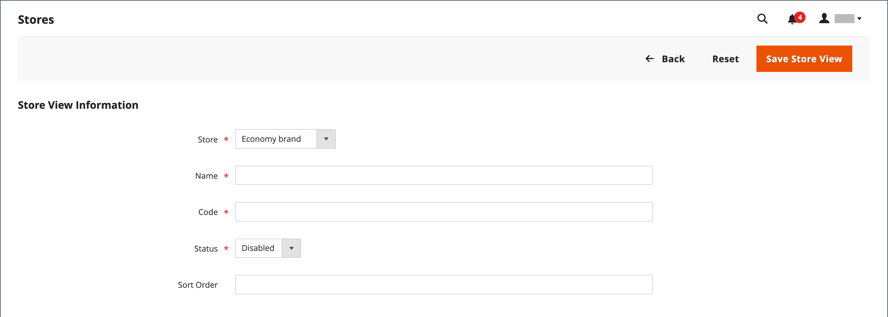

# Winkelweergaven

Winkelweergaven worden doorgaans gebruikt om de winkel in verschillende landinstellingen beschikbaar te maken. Klanten kunnen de taalkiezer in de koptekst van de winkel gebruiken om de winkelweergave te wijzigen.

{width="550"}

## Winkelweergave toevoegen

1. Op de _Beheerder_ zijbalk, ga naar **[!UICONTROL Stores]** > _[!UICONTROL Settings]_>**[!UICONTROL All Stores]**.

   {width="700" zoomable="yes"}

1. Klik op **[!UICONTROL Create Store View]**.

   {width="600" zoomable="yes"}

1. Set **[!UICONTROL Store]** naar de bovenliggende opslag van deze weergave.

1. Voer een **[!UICONTROL Name]** voor deze winkelweergave.

   De naam wordt weergegeven in de taalkiezer in de koptekst van de winkel. Bijvoorbeeld: `Spanish`.

1. Voor **[!UICONTROL Code]** Voer de code in die de weergave identificeert (in kleine letters).

   Bijvoorbeeld: `spanish`.

1. Als u de weergave wilt activeren, stelt u **[!UICONTROL Status]** tot `Enabled`.

1. (Optioneel) Voer een **[!UICONTROL Sort Order]** nummer om te bepalen in welke volgorde deze weergave wordt weergegeven bij andere weergaven.

1. Klik op **[!UICONTROL Save Store View]**.

## Een winkelweergave bewerken

Omdat de weergavenaam wordt weergegeven in de taalkiezer, kunt u de naam van de standaardweergave wijzigen in iets beschrijvender. De _Naam_ het veld is gewoon een label en kan gemakkelijk worden gewijzigd .

Als uw Adobe Commerce- of Magento Open Source-installatie meerdere sites of meerdere winkels heeft, wijzigt u het veld Code opslaan niet zonder te controleren of er niet naar de waarde wordt verwezen in het dialoogvenster `index.php` bestand. Als u geen toegang hebt tot de server om het bestand te onderzoeken, vraagt u een ontwikkelaar om hulp.

| Veld | Oorspronkelijke waarde | Bijgewerkte waarde |
| ----- | -------------- | ------------- |
| [!UICONTROL Name] | `Default Store View` | `English` |
| [!UICONTROL Code] | `default` | `english` |

{style="table-layout:auto"}

1. Op de _Beheerder_ zijbalk, ga naar **[!UICONTROL Stores]** >  _[!UICONTROL Settings]_>**[!UICONTROL All Stores]**.

1. In de _[!UICONTROL Store View]_Klik op de naam van de weergave die u wilt bewerken in de kolom van het raster.

   Als u de standaardweergave bewerkt, wordt _[!UICONTROL Store]_en_[!UICONTROL Status]_ velden zijn niet beschikbaar.

   {width="600" zoomable="yes"}

1. Werk indien nodig de volgende velden bij:

   - **[!UICONTROL Store]** (alleen niet-standaardweergaven)
   - **[!UICONTROL Name]**
   - **[!UICONTROL Code]** (alleen indien niet gebruikt in `index.php`)
   - **[!UICONTROL Status]** (alleen niet-standaardweergaven)
   - **[!UICONTROL Sort Order]**

1. Klik op **[!UICONTROL Save Store View]**.
