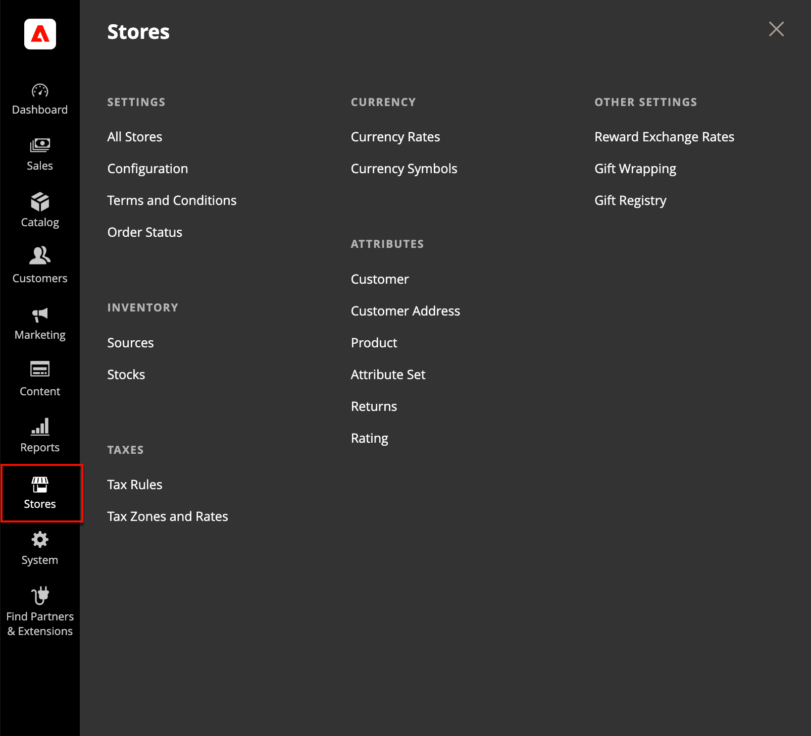

# [!UICONTROL Stores] menu

Via het menu _[!UICONTROL Stores]_&#x200B;hebt u toegang tot instellingen die minder vaak worden gebruikt, maar waarnaar in de hele installatie van Adobe Commerce of Magento Open Source wordt verwezen. Deze functies omvatten het instellen van de hiërarchie van de winkel, configuratie, verkoop- en orderinstellingen, belastingen en valuta, productkenmerken, beoordelingen van productevaluaties en klantengroepen.

>[!BEGINTABS]

>[!TAB  Adobe Commerce ]

[!BADGE &#x200B; slechts PaaS &#x200B;]{type=Informative url="https://experienceleague.adobe.com/nl/docs/commerce/user-guides/product-solutions" tooltip="Is alleen van toepassing op Adobe Commerce op Cloud-projecten (door Adobe beheerde PaaS-infrastructuur) en op projecten in het veld."}

{width="500" zoomable="yes"}

>[!TAB  Adobe Commerce as a Cloud Service ]

[!BADGE &#x200B; slechts SaaS &#x200B;]{type=Positive url="https://experienceleague.adobe.com/nl/docs/commerce/user-guides/product-solutions" tooltip="Alleen van toepassing op Adobe Commerce as a Cloud Service- en Adobe Commerce Optimizer-projecten (door Adobe beheerde SaaS-infrastructuur)."}

{width="500" zoomable="yes"}

>[!ENDTABS]

## Het menu [!UICONTROL Stores] weergeven

Voor _Admin_ sidebar, klik **[!UICONTROL Stores]**.

## Hoofdsecties

### [!UICONTROL Settings]

Beheer de hiërarchie van [&#x200B; websites, opslag, en opslagmeningen &#x200B;](stores.md#store-and-site-structure) in uw installatie van Adobe Commerce of Magento Open Source, en alle [&#x200B; configuratiemontages &#x200B;](../configuration-reference/guide-overview.md). Bovendien kunt u opstelling de [&#x200B; Termijnen en Voorwaarden &#x200B;](terms-and-conditions.md) van een verkoop, en [&#x200B; de montages van de ordestatus &#x200B;](order-status.md#custom-order-status) beheren.

### [!UICONTROL Inventory]

[&#x200B; beheer en creeer voorraden &#x200B;](../inventory-management/introduction.md) om uw verkoopkanalen of websites aan [&#x200B; bronnen &#x200B;](../inventory-management/sources-manage.md) te verbinden. De voorraden leveren een geaggregeerde verkoopbare hoeveelheid producten op. Single Source-handelaren gebruiken de standaardvoorraad terwijl Multi Source-handelaren extra aangepaste voorraden gebruiken.

### [!UICONTROL Taxes]

Beheer alle soorten [&#x200B; fiscale functies &#x200B;](taxes.md) over uw opslag, opstelling de belastingregels voor uw opslag, bepaal klant en productbelastingklassen, en beheer belastingstreken en tarieven. U kunt ook belastinggegevens in uw winkel importeren.

### [!UICONTROL Currency]

Beheren de tarieven voor de [&#x200B; valuta&#39;s &#x200B;](currency.md) die als betaling in uw opslag worden goedgekeurd en pas de muntsymbolen aan die in productprijzen en verkoopdocumenten verschijnen.

### [!UICONTROL Attributes]

Beheer attributen die voor [&#x200B; klant &#x200B;](../customers/attribute-properties.md) of [&#x200B; productinformatie &#x200B;](../catalog/attribute-product-create.md) worden gebruikt, keert, en productratings terug. U kunt attributen tot stand brengen, bestaande attributen uitgeven, en [&#x200B; attributenreeksen &#x200B;](../catalog/attribute-sets.md) beheren.

### [!UICONTROL Other Settings]

Beheer extra montages voor [&#x200B; beloningswisselkoersen &#x200B;](../merchandising-promotions/reward-exchange-rates.md), [&#x200B; gift het verpakken &#x200B;](cart-configuration.md#gift-wrap), en [&#x200B; giftenregisters &#x200B;](../merchandising-promotions/gift-registries.md).
