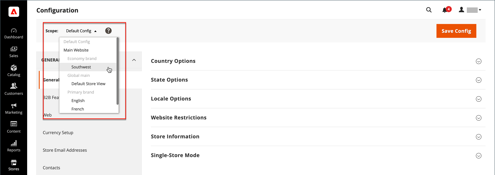

# Winkel- en sitestructuur

Wanneer Adobe Commerce of Magento Open Source is geïnstalleerd, wordt een hiërarchie gemaakt die een hoofdwebsite, winkel en winkelweergave bevat. Desgewenst kunt u aanvullende websites, winkels en winkelweergaven maken. Naast uw hoofdwebsite hebt u bijvoorbeeld mogelijk aanvullende websites met een ander domein. Binnen elke website kunt u meerdere winkels gebruiken en in elke winkel aparte weergaven voor de winkel. Veel installaties hebben één website en één winkel, maar met meerdere opslagweergaven om verschillende talen te ondersteunen.

Voordat u begint, plant u de catalogushiërarchie van uw winkel van tevoren, omdat in de hele configuratie naar deze hiërarchie wordt verwezen. Elke winkel kan een aparte [hoofdcategorie](../catalog/category-root.md), waardoor het mogelijk wordt voor elke winkel een geheel andere set hoofdmenuopties te gebruiken.

{width="550"}

## Opslag toevoegen

Eén installatie van Adobe Commerce of Magento Open Source kan meerdere opslagruimten hebben die een beheerder delen. Winkels die zich onder dezelfde website bevinden, hebben hetzelfde IP-adres en hetzelfde domein, gebruiken hetzelfde beveiligingscertificaat en delen één afrekenproces.

Belangrijk is dat de winkels dezelfde code gebruiken en een beheerder delen. Elke winkel kan een aparte catalogus hebben of de opslagruimten kunnen een catalogus delen. Elke winkel kan een aparte [hoofdcategorie](../catalog/category-root.md), waardoor het mogelijk wordt voor elke winkel een ander hoofdmenu te hebben. Winkels kunnen ook verschillende branding, presentatie en inhoud hebben. Neem wat tijd om uw opslaghiërarchie met toekomstige groei in mening te plannen alvorens u begint, omdat het door de configuratie wordt gebruikt.

{width="550"}

Hier zijn sommige voorbeelden van hoe URLs voor veelvoudige opslag kan worden gevormd:

| URL | Beschrijving |
| --- | ----------- |
| `yourdomain.com/store1` `yourdomain.com/store2` | Elke winkel heeft een ander pad, maar deelt een domein. |
| `store1.yourdomain.com` `store2.yourdomain.com` | Elke opslag heeft een verschillend subdomein van het primaire domein. |

Installaties voor meerdere opslagruimten van Adobe Commerce moeten worden geconfigureerd via de beheerfunctie en ook vanaf de opdrachtregel van de server. De Adobe Commerce [Configuratiegids](https://experienceleague.adobe.com/docs/commerce-operations/configuration-guide/multi-sites/ms-overview.html) biedt gedetailleerde instructies voor het configureren van de serveromgeving.

### Stap 1: kies het archiefdomein

De eerste stap bestaat uit het kiezen van de positie van de winkel. Moeten de opslag een domein delen, elk hebben subdomain, of duidelijk verschillende domeinen? Voer voor elke winkel een van de volgende handelingen uit:

- Als u de winkel één niveau onder het primaire domein wilt plaatsen, hoeft u niets te doen.
- Stel een subdomein van uw primaire domein in.
- Stel een ander primair domein in.

### Stap 2: De winkel maken

1. Op de _Beheerder_ zijbalk, ga naar **[!UICONTROL Stores]** > _[!UICONTROL Settings]_>**[!UICONTROL All Stores]**.

1. Klikken **[!UICONTROL Create Store]** en stel de opties voor de nieuwe winkel in:

   - **[!UICONTROL Web Site]** — Kies een website die de bovenliggende website van de nieuwe winkel moet worden. Accepteer de standaardwaarde (`Main Website`).

   - **[!UICONTROL Name]** — Voer een naam in voor de nieuwe winkel. De naam is alleen bedoeld voor interne referentie.

   - **[!UICONTROL Code]** — Voer een code in kleine letters in om de winkel te identificeren. Bijvoorbeeld: `mainstore`.

   - **[!UICONTROL Root Category]** — Instellen op [hoofdcategorie](../catalog/category-root.md) Hiermee definieert u de categoriestructuur voor het hoofdmenu van de nieuwe winkel. Als u al een specifieke hoofdcategorie voor de winkel hebt gemaakt, selecteert u deze. Anders selecteert u `Default Category`. U kunt later terugkomen en het plaatsen bijwerken.

   {width="600" zoomable="yes"}

1. Klik op **[!UICONTROL Save Store]**.

### Stap 3: Een standaardwinkelweergave maken

1. Klikken **[!UICONTROL Create Store View]** en stel de weergaveopties voor de winkel in:

   - **[!UICONTROL Store]** — Instellen op de nieuwe winkel die u hebt gemaakt.

   - **[!UICONTROL Name]** — Voer een naam in voor de weergave. Bijvoorbeeld, `English`.

   - **[!UICONTROL Code]** — Voer een code in voor de weergave in kleine letters.

   - **[!UICONTROL Status]** — Instellen op `Enabled`.

   - **[!UICONTROL Sort Order]** — Voer een getal in om de positie van de winkel te bepalen wanneer deze bij andere winkels wordt vermeld.

1. Klik op **[!UICONTROL Save Store View]**.

   Als u de winkel opent in de bewerkingsmodus, ziet u dat deze nu een standaardweergave heeft.

   {width="600" zoomable="yes"}

### Stap 4: De URL van de winkel configureren

1. Op de _Beheerder_ zijbalk, klikken **[!UICONTROL Stores]** > _[!UICONTROL Settings]_>**[!UICONTROL Configuration]**.

1. Onder _[!UICONTROL General]_in het linkerdeelvenster aan de linkerkant kiest u **[!UICONTROL Web]**.

1. In de linkerbovenhoek, plaats **[!UICONTROL Store View]** aan de mening die u voor de nieuwe opslag creeerde.

1. Indien gevraagd om te bevestigen [bereik](../getting-started/websites-stores-views.md#scope-settings) schakelen, klikken **[!UICONTROL OK]**.

   {width="600" zoomable="yes"}

1. Uitbreiden  de **[!UICONTROL Base URLs]** en voer de basis-URL voor de winkel in.

   Wis indien nodig de **[!UICONTROL Use system value]** Schakel het selectievakje in om de instelling te wijzigen.

   {width="600" zoomable="yes"}

1. Uitbreiden  de **[!UICONTROL Secure Base URLs]** sectie en herhaal de vorige stap als u de opslag wilt vormen [beveiligde URL](store-urls.md).

1. Klik op **[!UICONTROL Save Config]**.

### Stap 5: Configureer de server

Als u uw server zodanig wilt configureren dat deze meerdere websites ondersteunt, raadpleegt u [Meerdere websites of winkels](https://experienceleague.adobe.com/docs/commerce-operations/configuration-guide/multi-sites/ms-overview.html) in de _Configuratiegids_.

Zie de volgende bronnen voor hulp bij het configureren van uw webserver:

- [Meerdere websites instellen met NGNX](https://experienceleague.adobe.com/docs/commerce-operations/configuration-guide/multi-sites/ms-nginx.html)
- [Meerdere websites instellen met Apache](https://experienceleague.adobe.com/docs/commerce-operations/configuration-guide/multi-sites/ms-apache.html)

Voor Adobe Commerce over cloud-infrastructuur raadpleegt u [Meerdere websites of winkels instellen](https://experienceleague.adobe.com/docs/commerce-cloud-service/user-guide/configure-store/multiple-sites.html).

## Websites toevoegen

U kunt meerdere websites instellen vanuit één Adobe Commerce- of Magento Open Source-installatie met hetzelfde domein of verschillende domeinen. Standaard hebben opslagruimten die zich onder dezelfde website bevinden, hetzelfde IP-adres en hetzelfde domein, gebruiken ze hetzelfde beveiligingscertificaat en delen ze één afrekenproces. Als u elke opslag een specifiek controleproces onder zijn eigen domein wilt hebben, moet elke opslag een verschillend IP adres en een afzonderlijk veiligheidscertificaat hebben.

Installaties van Adobe Commerce of Magento Open Source op meerdere locaties moeten worden geconfigureerd via de beheerfunctie en ook via de opdrachtregel van de server. De handel [Configuratiegids](https://experienceleague.adobe.com/docs/commerce-operations/configuration-guide/multi-sites/ms-overview.html) biedt gedetailleerde instructies voor het configureren van de serveromgeving.

{width="550"}

### Stap 1: Een website maken

1. Op de _Beheerder_ zijbalk, ga naar **[!UICONTROL Stores]** > _[!UICONTROL Settings]_>**[!UICONTROL All Stores]**.

1. Klik in de rechterbovenhoek op **[!UICONTROL Create Website]**.

1. Stel de **[!UICONTROL Web Site Information]** opties:

   {width="600" zoomable="yes"}

   - **[!UICONTROL Name]** — Voer het domein van de nieuwe website in. Bijvoorbeeld, `domain.com`.

   - **[!UICONTROL Code]** — Voer een code in die op de server wordt gebruikt om naar het domein te wijzen.

     De code moet beginnen met een kleine letter (a-z) en kan elke combinatie van letters (a-z), cijfers (0-9) en het onderstrepingsteken (_) bevatten.

   - **[!UICONTROL Sort Order]** — _(Optioneel)_ Voer een getal in om de volgorde te bepalen waarin deze site bij andere sites wordt weergegeven. Als u deze site boven aan de lijst wilt weergeven, voert u een nul in (`0`).

1. Klik op **[!UICONTROL Save Web Site]**.

1. Elk item instellen [winkel](#add-stores) en [winkelweergave](store-views.md) dat is nodig voor de nieuwe website .

   Vervolgens kunt u de website openen in de bewerkingsmodus om de standaardopslag in te stellen.

### Stap 2: Vorm de opslag URL

Om te vormen [opslag-URL&#39;s](store-urls.md), volgt u de instructies.

### Stap 3: Configureer de server

Als u uw server zodanig wilt configureren dat deze meerdere websites ondersteunt, raadpleegt u [Meerdere websites of winkels](https://experienceleague.adobe.com/docs/commerce-operations/configuration-guide/multi-sites/ms-overview.html) in de _Configuratiegids_.

Raadpleeg de volgende zelfstudies voor hulp bij het configureren van uw webserver:

- [Meerdere websites instellen met NGNX](https://experienceleague.adobe.com/docs/commerce-operations/configuration-guide/multi-sites/ms-nginx.html)
- [Meerdere websites instellen met Apache](https://experienceleague.adobe.com/docs/commerce-operations/configuration-guide/multi-sites/ms-apache.html)

Voor Adobe Commerce over cloud-infrastructuur raadpleegt u [Meerdere websites of winkels instellen](https://experienceleague.adobe.com/docs/commerce-cloud-service/user-guide/configure-store/multiple-sites.html).
