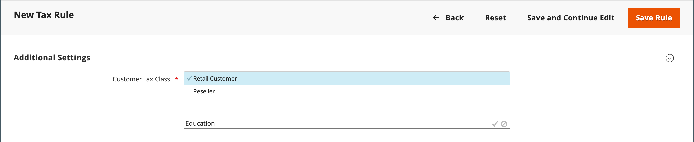

# Belastingklassen

Belastingklassen kunnen worden toegewezen aan klanten, producten en verzendingen. De handel analyseert het winkelwagentje van elke klant en berekent de aangewezen belasting volgens de klasse van de klant, de klasse van de producten in het karretje, en de regio. Het gebied wordt bepaald door het verzendadres, het factuuradres of de herkomst van de verzending van de klant. Nieuwe belastingklassen kunnen worden gemaakt wanneer een [belastingregel](tax-rules.md) is gedefinieerd.

- **Klant** — U kunt zo veel klassen van de klantenbelasting tot stand brengen aangezien u nodig hebt, en hen toewijzen aan [klantengroepen](../customers/customer-groups.md). In sommige rechtsgebieden bijvoorbeeld worden wholesaletransacties niet belast, maar retailtransacties wel. U kunt leden van de groep van de Klant van de Groothandel met de de belastingklasse van de Groothandel associëren.

- **Product** — De productklassen worden gebruikt in berekeningen om het correcte belastingtarief te bepalen wordt toegepast in het winkelwagentje. Wanneer u een product maakt, wordt dit toegewezen aan een specifieke belastingklasse. Voedsel mag bijvoorbeeld niet worden belast of worden belast tegen een ander tarief.

- **Verzending** — Als je winkel extra verzendkosten in rekening brengt, moet je een specifieke productbelastingklasse voor de verzendkosten aanwijzen. Geef deze vervolgens in de configuratie op als de belastingklasse die wordt gebruikt voor verzending.

## Belastingsklassen configureren

De belastingklasse die wordt gebruikt voor verzending en de standaardbelastingklassen voor [producten en klanten](#add-a-product-tax-class) worden ingesteld in het dialoogvenster _[!UICONTROL Sales]_configuratie.

1. Op de _Beheerder_ zijbalk, ga naar **[!UICONTROL Stores]** > _[!UICONTROL Settings]_>**[!UICONTROL Configuration]**.

1. Vouw in het linkerdeelvenster uit **[!UICONTROL Sales]** en kiest u **[!UICONTROL Tax]**.

1. Uitbreiden  de **[!UICONTROL Tax Classes]** sectie.

   {width="600" zoomable="yes"}

1. Kies de belastingklasse voor elk van de volgende opties:

   - **[!UICONTROL Set Tax Class for Shipping]**
   - **[!UICONTROL Tax Class for Gift Options]**
   - **[!UICONTROL Default Tax Class for Product]**
   - **[!UICONTROL Default Tax Class for Customer]**

1. Klik op **[!UICONTROL Save Config]**.

## Belastingsklassen toevoegen

Belastingklassen voor klanten en producten kunnen eenvoudig worden toegevoegd en vervolgens aan individuele klanten en producten worden toegewezen en in belastingregels worden gebruikt.

1. Op de _Beheerder_ zijbalk, ga naar **[!UICONTROL Stores]** > _[!UICONTROL Taxes]_>**[!UICONTROL Tax Rules]**.

1. Klik op **[!UICONTROL Add New Tax Rule]**.

1. Uitbreiden  de **[!UICONTROL Additional Settings]** sectie.

   {width="600" zoomable="yes"}

1. Onder _Belastingsklasse van klant_, klikt u op **[!UICONTROL Add New Tax Class]**.

1. Voer de **[!UICONTROL Name]** van de nieuwe belastingklasse in het tekstvak.

   {width="600" zoomable="yes"}

1. Als u de nieuwe klasse wilt toevoegen aan de lijst met beschikbare klassen voor klantbelasting, klikt u op het vinkje.

   {width="600" zoomable="yes"}

## Een productbelastingklasse toevoegen

1. Onder _Productbelastingklasse_, klikt u op **[!UICONTROL Add New Tax Class]**.

1. Voer de **[!UICONTROL Name]** van de nieuwe belastingklasse in het tekstvak.

1. Als u de nieuwe klasse wilt toevoegen aan de lijst met beschikbare productbelastingklassen, klikt u op het vinkje.

1. Klik op **[!UICONTROL Back]** in de knopbalk om terug te keren naar de knop _Belastingregels_ raster.

## Standaardbelastingbestemming

De standaardinstellingen voor de belastingbestemming bepalen het land, de staat en de postcode of de postcode die worden gebruikt als basis voor belastingberekeningen.

**_De standaardbelastingbestemming voor berekeningen configureren:_**

1. Op de _Beheerder_ zijbalk, ga naar **[!UICONTROL Stores]** > _[!UICONTROL Settings]_>**[!UICONTROL Configuration]**.

1. Vouw in het linkerdeelvenster uit **[!UICONTROL Sales]** en kiest u **[!UICONTROL Tax]**.

1. Uitbreiden  de **[!UICONTROL Default Tax Destination Calculation]** sectie.

   {width="600" zoomable="yes"}

1. Set **[!UICONTROL Default Country]** naar het land waarop de belastingberekeningen zijn gebaseerd.

1. Set **[!UICONTROL Default State]** aan de staat of provincie die als basis voor belastingberekeningen wordt gebruikt.

1. Set **[!UICONTROL Default Post Code]** op de postcode die wordt gebruikt als basis voor lokale belastingberekeningen.

1. Klik op **[!UICONTROL Save Config]**.
