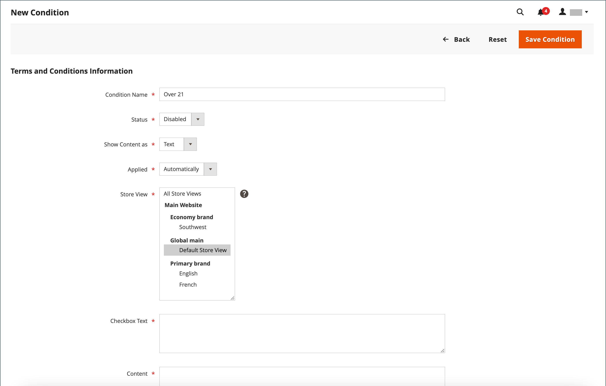

# Voorwaarden voor afhandeling

Indien handmatig _Voorwaarden en bepalingen_ functionaliteit is ingeschakeld, moeten klanten akkoord gaan met de verkoopvoorwaarden voordat de aankoop is voltooid. De verkoopvoorwaarden omvatten doorgaans informatie die wettelijk vereist is voor B2C- of B2B-sites, en schetst de rechten van de koper en de verkoper. Het bericht Voorwaarden en Voorwaarden wordt weergegeven na de betalingsgegevens, vlak voor de _Opdracht plaatsen_ knop.

{width="700" zoomable="yes"}

## Stap 1: Bepalingen en voorwaarden voor afhandeling inschakelen

1. Op de _Beheerder_ zijbalk, ga naar **[!UICONTROL Stores]** > _[!UICONTROL Settings]_>**[!UICONTROL Configuration]**.

1. Vouw in het linkerdeelvenster uit **[!UICONTROL Sales]** en kiest u **[!UICONTROL Checkout]**.

1. Uitbreiden  de **[!UICONTROL Checkout Options]** sectie.

   {width="600" zoomable="yes"}

1. Controleren of **[!UICONTROL Enable Onepage Checkout]** is ingesteld op `Yes`.

1. Set **[!UICONTROL Enable Terms and Conditions]** tot `Yes`.

1. Klik op **[!UICONTROL Save Config]**.

## Stap 2: Voeg uw eigen voorwaarden en bepalingen informatie toe

1. Op de _Beheerder_ zijbalk, ga naar **[!UICONTROL Stores]** > _[!UICONTROL Settings]_>**[!UICONTROL Terms and Conditions]**.

   {width="600" zoomable="yes"}

1. Klik in de rechterbovenhoek op **[!UICONTROL Add New Condition]**.

1. Voer de **[!UICONTROL Condition Name]** voor interne referentie.

   {width="600" zoomable="yes"}

1. Set **[!UICONTROL Status]** tot `Enabled`.

1. Set **[!UICONTROL Applied]** op een van de volgende wijzen:

   - `Automatically` - Voorwaarden worden automatisch geaccepteerd bij afhandeling.
   - `Manually` - Klanten moeten de voorwaarden voor het plaatsen van een bestelling handmatig accepteren.

1. Set **[!UICONTROL Show Content as]** op een van de volgende wijzen:

   - `Text` - Geeft de voorwaarden en inhoud weer als niet-opgemaakte tekst.
   - `HTML` - Geeft de inhoud weer als HTML die kan worden opgemaakt.

1. Selecteer elk **[!UICONTROL Store View]** waar u deze Voorwaarden wilt gebruiken.

1. Schuif omlaag en voltooi de informatie die moet worden weergegeven:

   - Voer de **[!UICONTROL Checkbox Text]** te gebruiken als de tekst voor de koppeling Voorwaarden. Bijvoorbeeld, `I understand and accept the terms and conditions of the sale`.

   - In de **[!UICONTROL Content]** Voer de volledige tekst van de verkoopvoorwaarden in.

1. (Optioneel) Voer de **[!UICONTROL Content Height (css)]** in pixels om de hoogte van het tekstvak te bepalen waarin de instructie terms and conditions tijdens het uitchecken wordt weergegeven.

   Als u bijvoorbeeld het tekstvak 1 inch hoog wilt maken op een scherm met 96 dpi, voert u `96`. Er wordt een schuifbalk weergegeven als de inhoud de hoogte van het vak overschrijdt.

1. Klik op **[!UICONTROL Save Condition]**.
