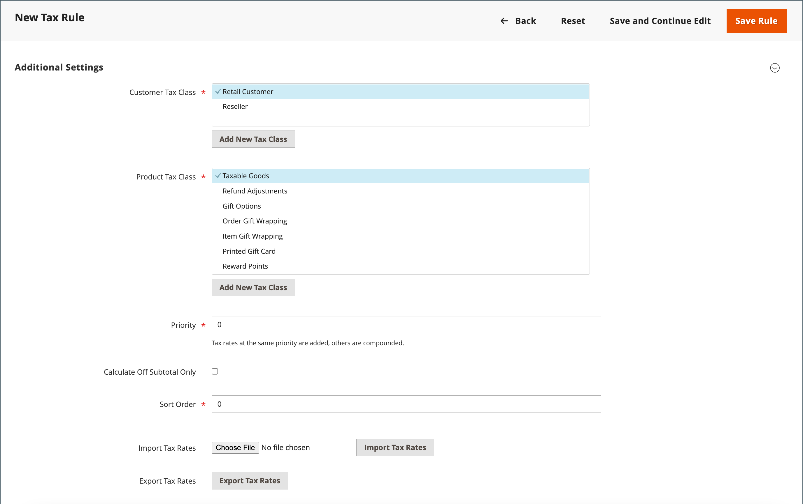

# Belasting over de toegevoegde waarde (btw)

Sommige landen heffen een belasting over de toegevoegde waarde (BTW) op goederen en diensten. Er kunnen verschillende BTW-tarieven zijn afhankelijk van het stadium in het productie- of distributieproces, de materialen of de diensten die u aan uw klanten verkoopt. Je kunt meer dan één BTW-tarief toepassen om de verschuldigde belasting correct te berekenen.

Commerce kan worden geconfigureerd om een belasting over de toegevoegde waarde in rekening te brengen op basis van het adres van de handelaar of de klant, als beide in hetzelfde land zijn. De btw-berekeningen zijn doorgaans gebaseerd op de bestemming van de zending in plaats van op het punt van herkomst. Voor de meeste scenario&#39;s, volstaat een configuratie die BTW berekent die op het adres van de klantenverzending wordt gebaseerd.

## Voorbeeldscenario&#39;s

- Voor een btw-geregistreerd bedrijf in een EU-land dat goederen levert aan een particulier in een ander EU-land, wordt de btw berekend als een &quot;verkoop op afstand&quot; op basis van de locatie van de handelaar.

- Een bedrijf in Nederland dat een aankoop doet van een winkel in het VK die naar een adres in het VK wordt verscheept, is verplicht BTW-tarieven in het VK te betalen.

- Voor de verkoop van [ downloadbare producten ](../catalog/product-create-downloadable.md), of _digitale goederen_, is het tarief van de BTW gebaseerd op de verzendende bestemming, eerder dan de handelaarplaats. Zie [ Plaats van levering voor digitale goederen ](taxes.md#place-of-supply-for-digital-goods-eu).

>[!TIP]
>
>Sommige grensoverschrijdende en B2B-overbrengingen hebben complexere belastingvereisten. Om de inheemse mogelijkheden van uw installatie van Commerce uit te breiden, overweeg toevoegend een oplossing van het belastingbeheer van de [ Marketplace ](https://marketplace.magento.com/extensions/accounting-finance/taxes.html).

## BTW configureren

De volgende instructies omvatten een steekproefprocedure om een BTW van 20% in het V.K. voor verkoop aan kleinhandelsklanten op te zetten. Voor andere belastingtarieven en landen volgt u de algemene procedure, maar voert u specifieke gegevens in die overeenkomen met uw land, BTW-tarief, soort klant, enzovoort.

>[!NOTE]
>
>Voordat u verdergaat, moet u weten welke regels en regels van toepassing zijn op de BTW in uw gebied.

Bij bepaalde business-to-business transacties wordt de btw niet beoordeeld. Commerce kan het BTW-identificatienummer van een klant valideren om ervoor te zorgen dat de btw correct wordt beoordeeld (of niet wordt beoordeeld). Zie [ de bevestiging van identiteitskaart van BTW ](#vat-id-validation).

### Stap 1: Klantbelastingklassen instellen

Het proces om een belastingregel tot stand te brengen begint door een belastingtarief toe te voegen.

1. Voor _Admin_ sidebar, ga **[!UICONTROL Stores]** > _[!UICONTROL Taxes]_>**[!UICONTROL Tax Zones and Rates]**.

   {width="600" zoomable="yes"}

1. Zorg ervoor dat er een klasse van de klantenbelasting is die geschikt om met de BTW te gebruiken is.

   Voor dit voorbeeld, zorg ervoor dat er een klasse van de klantenbelasting genoemd _DetailhandelsKlant_ is. Klik op **[!UICONTROL Add New Tax Rate]** als deze belastingklasse niet bestaat.

1. Voer de **[!UICONTROL Tax Identifier]** in voor de nieuwe belastingklasse.

   Alle belastingtarieven worden getoond op het _1} gebied van het Tarief van de Tarief {in de_ Informatie van de Regel van de Belasting _wanneer u belastingregels creeert._

1. Als u het postcodebereik wilt instellen (van / tot), schakelt u het selectievakje **[!UICONTROL Zip/Post is Range]** in.

1. Kies de **[!UICONTROL Country]** waar het belastingtarief van toepassing is.

1. Voer de **[!UICONTROL Rate Percent]** in die voor de berekening van het belastingtarief bij aankoop zou worden gebruikt.

1. Klik op **[!UICONTROL Save Rate]** als de bewerking is voltooid.

Op basis van het verzonden BTW-tarief kunt u volgende belastingregels maken. Bij gebrek aan belastingtarieven wordt het onmogelijk om belastingregels op te stellen.

### Stap 2: Klassen voor productbelasting instellen

1. Voor _Admin_ sidebar, ga **[!UICONTROL Stores]** > _[!UICONTROL Taxes]_>**[!UICONTROL Tax Rules]**.

1. Klik op **[!UICONTROL Add New Tax Rule]**.

1. Breid  de **[!UICONTROL Additional Settings]** sectie uit.

   {width="600" zoomable="yes"}

1. Onder _Klasse van de Belasting van het Product_, klik **[!UICONTROL Add New Tax Class]**.

1. Als u de nieuwe klasse wilt toevoegen aan de lijst met beschikbare productbelastingklassen en drie nieuwe klassen wilt maken, voert u de **[!UICONTROL Name]** van de nieuwe belastingklasse in en klikt u op het vinkje:

   - `VAT Standard`
   - `VAT Reduced`
   - `VAT Zero`

1. Klik op **[!UICONTROL Save Class]** voor elke nieuwe klasse die u toevoegt.

1. Klik op **[!UICONTROL Save Rule]**.

### Stap 3: Instellen van belastingzones en -tarieven

1. Voor _Admin_ sidebar, ga **[!UICONTROL Stores]** > _[!UICONTROL Taxes]_>**[!UICONTROL Tax Zones and Rates]**.

   In dit voorbeeld kunt u de Amerikaanse belastingtarieven verwijderen of ze ongewijzigd laten.

1. Klik op **[!UICONTROL Add New Tax Rate]**.

   {width="600" zoomable="yes"}

1. Definieer de nieuwe tarieven als volgt:

   **Norm van BTW**

   - Belastings-id: `VAT Standard`
   - Land en staat: `United Kingdom`
   - Percentage van snelheid: `20.00`

   **Verminderde BTW**

   - Belastings-id: `VAT Reduced`
   - Land en staat: `United Kingdom`
   - Percentage van snelheid: `5.00`

1. Klik op **[!UICONTROL Save Rate]** voor elke frequentie.

### Stap 4: Belastingregels instellen

Een belastingregel is een combinatie van een klasse van de klantenbelasting, een klasse van de productbelasting, en een belastingtarief.

1. Voor _Admin_ sidebar, ga **[!UICONTROL Stores]** > _[!UICONTROL Taxes]_>**[!UICONTROL Tax Rules]**.

1. Voeg als volgt nieuwe belastingregels toe:

   **Norm van BTW**

   - Naam: `VAT Standard`
   - Belastingklasse van klant: `Retail Customer`
   - Productbelastingsklasse: `VAT Standard`
   - Belastingtarief: `VAT Standard Rate`

   **Verminderde Vat**

   - Naam: `VAT Reduced`
   - Belastingklasse van klant: `Retail Customer`
   - Productbelastingsklasse: `VAT Reduced`
   - Belastingtarief: `VAT Reduced Rate`

1. Klik op **[!UICONTROL Save Rule]** voor elke frequentie.

### Stap 5: Belastingsklassen toepassen op producten

1. Voor _Admin_ sidebar, ga **[!UICONTROL Catalog]** > **[!UICONTROL Manage Products]**.

1. Open een product uit uw catalogus in de bewerkingsmodus.

1. Voor de _Algemene_ pagina, vind de **[!UICONTROL Tax Class]** optie en selecteer **[!UICONTROL VAT Class]** die op het product van toepassing is.

1. Klik op **[!UICONTROL Save]** als de bewerking is voltooid.

   {width="600" zoomable="yes"} toe

## Veldomschrijvingen

### Winkelgegevens

Commerce gebruikt de volgende [ de configuratiemontages van de Informatie van de Opslag ](../configuration-reference/general/general.md#store-information) om BTW te berekenen die op handelsinformatie wordt gebaseerd.

**[!UICONTROL VAT Number]** - Het BTW-nummer dat aan de handelaar wordt toegekend.

**[!UICONTROL Validate VAT Number]** - {de bevestiging van 1} BTW ](#vat-id-validation) bevestigt dat het btw aantal het overeenkomstige verslag in het [ Europese Commissie ](https://ec.europa.eu/taxation_customs/vies/) gegevensbestand aanpast.[

### Klantgegevens

Commerce gebruikt de volgende gebieden om BTW te berekenen die op [ klanteninformatie ](../customers/account-dashboard-account-information.md) wordt gebaseerd).

#### Accountgegevens

**[!UICONTROL Tax/VAT Number]** - Indien van toepassing, het belastingnummer of BTW-nummer dat aan de klant is toegekend.

#### Adressen

**[!UICONTROL VAT Number]** - Indien van toepassing, het BTW-nummer dat is gekoppeld aan een specifiek factuuradres of verzendadres van de klant. Voor de verkoop van [ digitale goederen ](taxes.md#place-of-supply-for-digital-goods-eu)) binnen de EU, is het bedrag van de BTW gebaseerd op verzendbestemming.

### Klantenaccount

Commerce gebruikt de volgende [ montages van de klantenconfiguratie ](../customers/account-options-new.md) om BTW te berekenen.

**[!UICONTROL Show VAT Number on Storefront]** - Hiermee wordt bepaald of het veld BTW-nummer van de klant is opgenomen in het adresboek dat beschikbaar is in de klantenaccount.

**[!UICONTROL Default Value for Disable Automatic Group Changes Based on VAT ID]** - Het BTW-identificatienummer is een intern identificatienummer voor het BTW-nummer van de klant wanneer dit wordt gebruikt bij BTW-validatie. Tijdens de bevestiging van BTW, bevestigt Commerce dat het aantal het [ gegevensbestand van de Europese Commissie ](https://ec.europa.eu/taxation_customs/vies/) aanpast. Klanten kunnen automatisch worden toegewezen aan een van de vier standaardklantengroepen op basis van de validatieresultaten.

## Validatie van BTW-id

_Validering van identiteitskaart van de BTW_ berekent automatisch de vereiste belasting voor B2B transacties die binnen de Europese Unie (EU) plaatsvinden, die op de handelaars en klantenscène wordt gebaseerd. Commerce voert de bevestiging van BTW identiteitskaart gebruikend de Webdiensten van de [ Europese Commissie ][1] server uit.

>[!NOTE]
>
>De btw-regels beïnvloeden andere belastingregels niet en belemmeren de toepassing van andere belastingregels niet. Er kan slechts één belastingregel tegelijk worden toegepast.

- Er wordt BTW in rekening gebracht als de handelaar en de klant zich in hetzelfde EU-land bevinden.
- Er wordt geen btw geheven als de handelaar en de klant in verschillende EU-landen zijn, en beide partijen zijn in de EU geregistreerde ondernemingen.

De opslagbeheerder leidt tot meer dan één standaardklantengroep die automatisch aan de klant tijdens rekeningsverwezenlijking, adresverwezenlijking of update, en controle kan worden toegewezen. Het gevolg is dat verschillende belastingregels worden gebruikt voor verkoop binnen het land (binnenlands) en binnen de EU.

>[!IMPORTANT]
>
>Als u virtuele of downloadbare producten verkoopt waarvoor geen verzending vereist is, moet het BTW-tarief van het land van vestiging van de klant worden gebruikt voor zowel intracommunautaire als binnenlandse verkoop. Maak aanvullende individuele belastingregels voor productbelastingklassen die overeenkomen met de virtuele producten.

### Workflow voor klantregistratie

Als Validering van BTW-identificatienummer is ingeschakeld, wordt na registratie aan elke klant voorgesteld het BTW-identificatienummer in te voeren. Van alleen kopers met een btw-registratie wordt echter verwacht dat ze dit veld invullen.

Nadat een klant het BTW-nummer en andere adresvelden heeft opgegeven en ervoor kiest om op te slaan, slaat het systeem het adres op en verzendt het verzoek tot validatie van het BTW-identificatienummer naar de server van de Europese Commissie. Volgens de resultaten van de validatie wordt een van de standaardgroepen toegewezen aan een klant. Deze groep kan worden gewijzigd als een klant of een beheerder het BTW-identificatienummer van het standaardadres wijzigt of het volledige standaardadres wijzigt. Soms kan de groep tijdelijk worden gewijzigd (groepswijziging wordt geëmuleerd) tijdens het uitchecken van één pagina.

Als deze optie is ingeschakeld, kunt u de BTW-ID-validatie voor individuele klanten overschrijven door het selectievakje op de pagina _[!UICONTROL Customer Information]_in te schakelen.

### Workflow voor uitchecken

Als de btw-validatie van een klant tijdens de afhandeling wordt uitgevoerd, worden de btw-aanvraagidentificatiecode en de datum van het btw-verzoek opgeslagen in de sectie Geschiedenis van opmerkingen van de bestelling.

Het systeemgedrag betrokken bij de bevestiging van BTW identiteitskaart en de verandering van de klantengroep tijdens de controle hangt af van hoe Valideren op Elke Transactie en de onbruikbaar maken Automatische montages van de Verandering van de Groep worden gevormd. In dit gedeelte wordt de implementatie beschreven van de Validering van het BTW-identificatienummer voor de afhandeling aan de voorzijde.

Als de klant Google Express Checkout, PayPal Express Checkout of een andere externe betalingsmethode gebruikt, wordt het afrekenen volledig uitgevoerd aan de zijkant van de externe betaalgateway. Voor dit scenario, bevestigt _op Elke Transactie_ het plaatsen niet kan worden toegepast en de klantengroep kan niet tijdens controle veranderen.

{width="550" zoomable="yes"}

### Validatie van BTW-id configureren

Om de bevestiging van BTW identiteitskaart te vormen, moet u eerst opstelling de klantengroepen die nodig zijn, en de verwante belastingklassen, tarieven, en regels tot stand brengen. Schakel vervolgens de validatie van BTW-ID in voor de winkel en voltooi de configuratie.

In de volgende voorbeelden ziet u hoe belastingklassen en -tarieven worden gebruikt voor validatie van BTW-id&#39;s. Bekijk de voorbeelden en volg vervolgens de instructies voor het instellen van de belastingklassen en -regels die nodig zijn voor uw winkel.

#### Voorbeeld: minimale belastingregels vereist voor validatie van BTW-ID

| Belastingregel 1 |  |
|--- |--- |
| Belastingsklasse van klant | De de belastingklassen van de klant moeten omvatten:   klasse A voor binnenlandse klanten.   een klasse voor klanten met verkeerd geformatteerde BTW IDs.  een klasse voor klanten de waarvan bevestiging van BTW identiteitskaart ontbrak. |
| Productbelastingklasse | Productbelastingklassen moeten een klasse voor alle typen producten bevatten, behalve bundel en virtueel. |
| Belastingtarief | Het belastingtarief moet het BTW-tarief van het land van de handelaar omvatten. |

{style="table-layout:auto"}

| Belastingregel 2 |   |
|--- |--- |
| Belastingsklasse van klant | Een klasse voor klanten binnen de unie. |
| Productbelastingklasse | Een klasse voor producten van alle types, behalve virtueel. |
| Belastingtarief | BTW-tarieven voor alle EU-landen, met uitzondering van het land van de handelaar. Momenteel is dit percentage 0%. |

{style="table-layout:auto"}

| Belastingregel 3 | (Vereist voor virtuele en downloadbare producten) |
|--- |--- |
| Belastingsklasse van klant | De de belastingklassen van de klant moeten omvatten:   klasse van A voor binnenlandse klanten   A klasse voor klanten met ongeldige BTW identiteitskaart A klasse voor klanten, voor wie de bevestiging van BTW identiteitskaart ontbrak |
| Productbelastingklasse | Een klasse voor virtuele producten. |
| Belastingtarief | BTW-tarief van het land van de handelaar. |

{style="table-layout:auto"}

| Belastingregel 4 | (Vereist voor virtuele en downloadbare producten) |
|--- |--- |
| Belastingsklasse van klant | Een klasse voor klanten binnen de unie. |
| Productbelastingklasse | Een klasse voor virtuele producten. |
| Belastingtarief | BTW-tarieven voor alle EU-landen, met uitzondering van het land van de handelaar. Momenteel is dit percentage 0%. |

{style="table-layout:auto"}

#### Stap 1: Btw-gerelateerde klantgroepen maken

De Validering van BTW-ID wijst automatisch een van de vier standaardklantengroepen toe aan klanten volgens de resultaten van de BTW-ID-validatie:

- Binnenland
- Intra-EU
- Ongeldig BTW-identificatienummer
- Validatiefout

U kunt klantengroepen voor de Bevestiging van BTW-identiteitskaart tot stand brengen of bestaande groepen gebruiken, als zij aan uw bedrijfslogica voldoen. Wanneer u Validatie BTW-id configureert, moet u elk van de gemaakte klantengroepen als een standaardinstelling voor klanten met de juiste resultaten voor BTW-id-validatie toewijzen.

#### Stap 2: Maak aan BTW gerelateerde klassen, tarieven en regels

Elke belastingregel wordt gedefinieerd door drie entiteiten:

- Belastingklassen voor klanten
- Productbelastingklassen
- Belastingtarieven

Creeer de [ belastingregels ](tax-rules.md) voor effectief het gebruiken van de Bevestiging van identiteitskaart van de BTW.

- De belastingregels omvatten belastingtarieven en [ belastingklassen ](tax-class.md).
- De klassen van de belasting worden toegewezen aan [ klantengroepen ](../customers/customer-groups.md).

#### Stap 3: Validering van BTW-id inschakelen en configureren

1. Voor _Admin_ sidebar, ga **[!UICONTROL Stores]** > _[!UICONTROL Settings]_>**[!UICONTROL Configuration]**.

1. Stel, indien nodig, de **[!UICONTROL Store View]** voor de configuratie in.

1. Vouw in het linkerdeelvenster **[!UICONTROL Customers]** uit en kies **[!UICONTROL Customer Configuration]** .

1. Breid  de **[!UICONTROL Create New Account Options]** sectie uit.

   In het volgende voorbeeld zijn de algemene klantinstellingen die niet gerelateerd zijn aan BTW-validatie grijs.

   {width="600" zoomable="yes"}

1. Stel **[!UICONTROL Enable Automatic Assignment to Customer Group]** in op `Yes` en vul de volgende velden naar wens in.

   - **[!UICONTROL Default Group]**
   - **[!UICONTROL Default Value for Disable Automatic Group Changes Based on VAT ID]**
   - **[!UICONTROL Show VAT Number on Storefront]**

1. Klik op **[!UICONTROL Save Config]** als de bewerking is voltooid.

#### Stap 4: Je BTW-identificatienummer en het land van vestiging instellen

1. Vouw in het linkerdeelvenster **[!UICONTROL General]** uit en kies **[!UICONTROL General]** eronder.

1. Breid  de **[!UICONTROL Store Information]** sectie uit.

   {width="600" zoomable="yes"}

1. Selecteer de **[!UICONTROL Country]** .

1. Voer uw **[!UICONTROL VAT Number]** in en klik op **[!UICONTROL Validate VAT Number]** .

   Het resultaat wordt direct weergegeven.

1. Klik op **[!UICONTROL Save Config]** als de bewerking is voltooid.

#### Stap 5: De lijst van EU-lidstaten verifiëren

1. Het voortzetten in de _Algemene_ configuratiepagina, breidt  de **[!UICONTROL Countries Options]** sectie uit.

   {width="600" zoomable="yes"}

1. Controleer in de **[!UICONTROL European Union Countries]** -lijst of elk land van de EU is geselecteerd.

   Om het gebrek te veranderen dat plaatst, ontruim het **systeemwaarden van het Gebruik** checkbox. Houd Ctrl (PC) of Command (Mac) ingedrukt en klik op elk land dat u wilt toevoegen of verwijderen.

1. Klik op **[!UICONTROL Save Config]** als de bewerking is voltooid.

[1]: https://ec.europa.eu/taxation_customs/vies/
