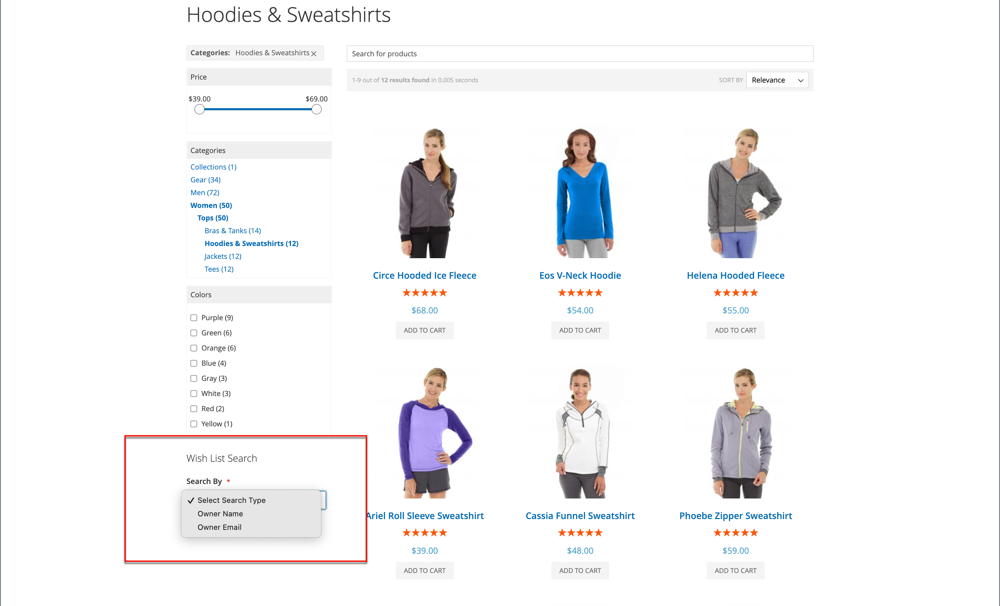

# Wenslijsten configureren

De configuratie van de wensenlijst laat wensen lijsten toe en bepaalt het e-mailmalplaatje en de afzender van e-mailberichten die worden gebruikt wanneer een verlanglijst wordt gedeeld.

## Functionaliteit voor wensenlijst inschakelen

1. Voor _Admin_ sidebar, ga **[!UICONTROL Stores]** > _[!UICONTROL Settings]_>**[!UICONTROL Configuration]**.

1. Vouw in het linkerdeelvenster **[!UICONTROL Customers]** uit en kies **[!UICONTROL Wish List]** .

1. Breid  de **[!UICONTROL General Options]** sectie uit en doe het volgende:

   {width="600" zoomable="yes"}

   - Schakel **[!UICONTROL Enabled]** in op `Yes` , waardoor de module voor wensenlijsten voor de winkel wordt geactiveerd.

   -  (Adobe Commerce slechts) Knevel **[!UICONTROL Enable Multiple Wish Lists]** aan `Yes`, die klanten toestaat om veelvoudige wenslijsten tot stand te brengen en te handhaven.

   -  (Adobe Commerce slechts) om het aantal wenslijsten te beperken klanten met hun rekening kunnen geassocieerd hebben, ga waarde voor **[!UICONTROL Number of Multiple Wish Lists]** in.

   - Schakel **[!UICONTROL Show in Sidebar]** in en uit naar `Yes` , waarin de wenslijsten worden weergegeven in het zijpaneel.

1. Breid  de **[!UICONTROL Share Options]** sectie uit en doe het volgende:

   {width="600" zoomable="yes"}

   - Stel de **[!UICONTROL Email Sender]** in op de opslagcontactpersoon die als verzender van het bericht moet worden weergegeven. Opties: Algemene contactpersoon, Verkoper, Klantenondersteuning, Aangepaste e-mail.

   - Stel de **[!UICONTROL Email Template]** in die moet worden gebruikt wanneer een klant een verlanglijst deelt.

   - Voer een **[!UICONTROL Max Emails Allowed to be Sent]** waarde in om het totale aantal e-mailberichten dat een klant kan verzenden te beperken. De standaardwaarde is 10 en het toegestane maximum is 10.000.

   - Voer een waarde in voor **[!UICONTROL Email Text Length Limit]** om de grootte van het bericht te beperken. De standaardwaarde is 255.

1. Breid  de **[!UICONTROL My Wish List Link]** sectie uit en reeks **[!UICONTROL Display Wish List Summary]** aan één van het volgende:

   - `Display number of items in wish list`
   - `Display item quantities`

   {width="600" zoomable="yes"}

1. Klik op **[!UICONTROL Save Config]** als de bewerking is voltooid.

## Zoekopdracht voor wensenlijst toevoegen

 (slechts Adobe Commerce)

Om het even welke openbare wensenlijst kan worden gevonden gebruikend het Onderzoek van de Lijst van de Vergroting [&#x200B; widget &#x200B;](../content-design/widgets.md). Met de widget kan een klant zoeken op de naam of het e-mailadres van de eigenaar van de wenslijst. Winkelklanten kunnen wensenlijsten vinden die bij andere klanten horen, hen bekijken en producten van hen bestellen, of de producten toevoegen aan hun eigen wensen lijsten. Als een object door een andere klant van een openbare verlanglijst wordt gekocht, wordt het niet uit de oorspronkelijke verlanglijst verwijderd. De _widget van het Onderzoek van de Lijst van de Wenslijst_ kan aan om het even welke pagina van uw opslag worden toegevoegd om het voor klanten gemakkelijk te maken om de verlanglijsten van vrienden en familieleden te vinden.

{width="700" zoomable="yes"}

1. Voor _Admin_ sidebar, ga **[!UICONTROL Content]** > _[!UICONTROL Elements]_>**[!UICONTROL Widgets]**.

1. Klik in de rechterbovenhoek op **[!UICONTROL Add Widget]** .

1. Ga als volgt te werk op het tabblad _[!UICONTROL Settings]_:

   - Stel **[!UICONTROL Type]** in op `Wish List Search` .

   - Stel **[!UICONTROL Design Theme]** in op het thema van de winkel waar de lijst met wensen wordt toegevoegd.

   - Klik op **[!UICONTROL Continue]**.

1. Voltooi de instructie _[!UICONTROL Storefront Properties]_:

   - Voer de **[!UICONTROL Widget Title]** in.

   - Stel **[!UICONTROL Assign to Store Views]** in op de weergave of website waar de widget moet worden gebruikt.

   - Voer bij **[!UICONTROL Sort Order]** een getal in om de plaatsing van de widget in de bijbehorende container te bepalen.

     `0` = first (standaardwaarde), `1` = second, `2` = third, enzovoort.

1. Klik in de sectie _[!UICONTROL Layout Updates]_&#x200B;op **[!UICONTROL Add Layout Update]**&#x200B;en stel **[!UICONTROL Display on]**&#x200B;in op een van de volgende opties:

   - _[!UICONTROL Categories]_

      - `Anchor Categories`
      - `Non-Anchor Categories`

   - _[!UICONTROL Products]_

      - `All Product Type`
      - `Simple Product`
      - `Virtual Product`
      - `Bundle Product`
      - `Configurable Product`
      - `Downloadable Product`
      - `Gift Card`
      - `Grouped Product`

   - _[!UICONTROL Generic Page]_

      - `All Pages`
      - `Specified Page`
      - `Page Layouts`

1. Kies in de lijst **[!UICONTROL Container]** het gebied van de paginalay-out waar u de pagina wilt plaatsen.

   {width="700" zoomable="yes"}

1. Kies **[!UICONTROL Widget Options]** in het linkerdeelvenster.

1. Stel **[!UICONTROL Quick Search Form Types]** in op een van de volgende opties:

   - `All Forms` - Klanten kunnen zoeken op basis van alle beschikbare parameters.
   - `Owner Name` - Klanten kunnen naar verlanglijsten zoeken op naam van de eigenaar.
   - `Owner Email` - Klanten kunnen zoeken naar lijsten met wensen per e-mailadres van de eigenaar.

   >[!NOTE]
   >
   >Verzendadressen worden niet opgenomen in verlanglijsten.

1. Vorm om het even welke resterende widgeigenschappen zoals nodig, na de standaard [&#x200B; instructies &#x200B;](../content-design/widget-create.md).

1. Klik op **[!UICONTROL Save]** als de bewerking is voltooid.

1. Vernieuw bij de aanwijzing alle ongeldige caches.
