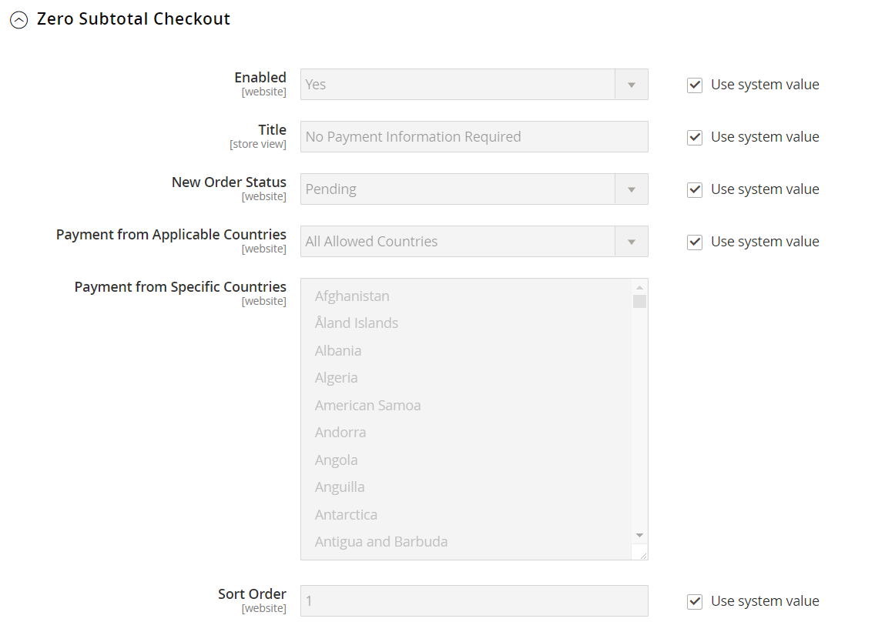

# Uitchecken op nul subtotaal

_Nul subtotal checkout_ kan voor orden met een subtotaal van nul worden gebruikt die worden belast nadat een korting wordt toegepast. Het subtotaal van nul kan bijvoorbeeld in de volgende situaties worden gebruikt:

- Een korting geldt voor de volledige aankoopprijs, zonder extra verzendkosten.

- De klant voegt a [&#x200B; downloadbaar &#x200B;](../catalog/product-create-downloadable.md) of [&#x200B; virtueel &#x200B;](../catalog/product-create-virtual.md) product aan het winkelwagentje toe, en de prijs evenaart nul.

- De prijs van a [&#x200B; eenvoudig &#x200B;](../catalog/product-create-simple.md) product is nul, en de [&#x200B; vrije het verschepen &#x200B;](shipping-free.md) methode is beschikbaar.

- A [&#x200B; couponcode &#x200B;](../merchandising-promotions/price-rules-cart-coupon.md) behandelt de volledige prijs van producten en het verschepen.

Om tijd te besparen, kunnen de geen bevelen van het subtotaal aan automatisch factuur worden geplaatst.

**_om nul subtotal checkout te vormen:_**

1. Voor _Admin_ sidebar, ga **[!UICONTROL Stores]** > _[!UICONTROL Settings]_>**[!UICONTROL Configuration]**.

1. Vouw in het linkerdeelvenster **[!UICONTROL Sales]** uit en kies **[!UICONTROL Payment Methods]** .

1. Onder _[!UICONTROL Other Payment Methods]_, breid  uit de **[!UICONTROL Zero Subtotal Checkout]**&#x200B;sectie.

   {width="600" zoomable="yes"}

   >[!NOTE]
   >
   >Schakel indien nodig eerst het selectievakje **[!UICONTROL Use system value]** uit om deze instellingen te wijzigen.

1. Als u het uitchecken van het subtotaal nul wilt activeren, stelt u **[!UICONTROL Enabled]** in op `Yes` .

1. Voer bij **[!UICONTROL Title]** een titel in die de methode Subtotaal nul aangeeft tijdens het uitchecken.

1. Als orders doorgaans wachten op goedkeuring, accepteert u de standaardwaarde **[!UICONTROL New Order Status]** als `Pending"` totdat de volgorde is goedgekeurd.

   U kunt desgewenst de status `Processing` of `Suspected Fraud` gebruiken voor nieuwe bestellingen met deze betalingsmethode.

1. Stel **[!UICONTROL Automatically Invoice All Items]** in op `Yes` als u alle items met een nulsaldo automatisch wilt factureren.

   Deze optie is alleen beschikbaar als de optie **[!UICONTROL New Order Status]** is ingesteld op `Processing` .

   >[!NOTE]
   >
   >Als _[!UICONTROL New Order Status]_&#x200B;aan `Processing` wordt geplaatst en&#x200B;_[!UICONTROL Automatically Invoice All Items]_ aan `No` wordt geplaatst, moet u ook **[!UICONTROL Order Status]** = `Processing` voor **[!UICONTROL Order State]** = `Pending` en **[!UICONTROL Default Status]** = `No` afbeelding op de [&#x200B; pagina van de Status van de Orde &#x200B;](order-status.md#custom-order-status) toewijzen.

1. Stel **[!UICONTROL Payment from Applicable Countries]** in op een van de volgende opties:

   - `All Allowed Countries` - de klanten van alle [&#x200B; landen &#x200B;](../getting-started/store-details.md#country-options) die in uw opslagconfiguratie worden gespecificeerd kunnen deze betalingsmethode gebruiken.
   - `Specific Countries` - Nadat u deze optie hebt gekozen, wordt de lijst _[!UICONTROL Payment from Specific Countries]_&#x200B;weergegeven. Als u meerdere landen wilt selecteren, houdt u Ctrl (PC) of Command (Mac) ingedrukt en klikt u op elke optie.

1. Voer bij **[!UICONTROL Sort Order]** een getal in dat de positie van dit item bepaalt in de lijst met betalingsmethoden die tijdens het afrekenen wordt weergegeven.

   Dit getal is relatief ten opzichte van de andere betalingsmethoden. (`0` = first, `1` = second, `2` = third, enzovoort.)

1. Klik op **[!UICONTROL Save Config]** als de bewerking is voltooid.
