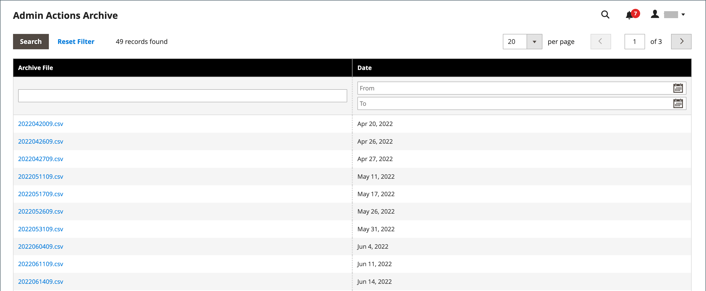

# Archief van handelingenlogboek

{{ee-feature}}

De beheerder [handelingen](action-log.md) In archief worden de CSV-logbestanden weergegeven die op de server zijn opgeslagen. In de configuratie, kunt u specificeren hoe lang de logboekingangen worden opgeslagen, en hoe vaak zij worden gearchiveerd. Standaard bevat de bestandsnaam de huidige datum in de ISO-indeling:  `yyyyMMddHH`

>[!NOTE]
>
>Voor archivering van logbestanden is een [snijtaak](cron.md) op te zetten.

## Logarchief configureren

1. Op de _Beheerder_ zijbalk, ga naar **[!UICONTROL Stores]** > _[!UICONTROL Settings]_>**[!UICONTROL Configuration]**.

1. Vouw in het linkerdeelvenster uit **[!UICONTROL Advanced]** en kiest u **[!UICONTROL System]**.

1. Uitbreiden  de **[!UICONTROL Admin Actions Log Archiving]** en stel de volgende opties in:

   - **[!UICONTROL Log Entry Lifetime, Days]** — Voer het aantal dagen in dat u de logbestandvermeldingen in de database wilt bewaren voordat ze worden verwijderd.
   - **[!UICONTROL Log Archiving Frequency]** — Instellen op `Daily`, `Weekly`, of `Monthly`.

   {width="600" zoomable="yes"}

   Voor een gedetailleerde lijst van de configuratiemontages, zie [Logbestand voor beheeracties archiveren](../configuration-reference/advanced/system.md) in de _Configuratieverwijzing_.

1. Klik op **[!UICONTROL Save Config]**.

## Het archief weergeven

Op de _Beheerder_ zijbalk, ga naar **[!UICONTROL System]** > _[!UICONTROL Actions Logs]_>**[!UICONTROL Archive]**.

{width="600" zoomable="yes"}
