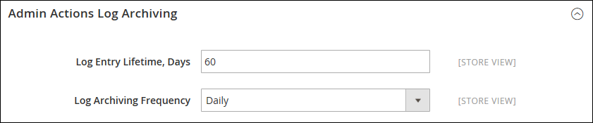

# Archief van handelingenlogboek

{{ee-feature}}

Het archief van de Acties Admin  maakt een lijst van de CSV logboekdossiers die op de server worden opgeslagen. In de configuratie, kunt u specificeren hoe lang de logboekingangen worden opgeslagen, en hoe vaak zij worden gearchiveerd. Standaard bevat de bestandsnaam de huidige datum in de ISO-indeling:  `yyyyMMddHH`

>[!NOTE]
>
>Het archiveren van het logboek vereist a [ cron baan ](cron.md) om opstelling te zijn.

## Logarchief configureren

1. Voor _Admin_ sidebar, ga **[!UICONTROL Stores]** > _[!UICONTROL Settings]_>**[!UICONTROL Configuration]**.

1. Vouw in het linkerdeelvenster **[!UICONTROL Advanced]** uit en kies **[!UICONTROL System]** .

1. Breid  de **[!UICONTROL Admin Actions Log Archiving]** sectie uit en plaats deze opties:

   - **[!UICONTROL Log Entry Lifetime, Days]** — Voer het aantal dagen in dat u de logbestandvermeldingen in de database wilt behouden voordat ze worden verwijderd.
   - **[!UICONTROL Log Archiving Frequency]** — Ingesteld op `Daily` , `Weekly` of `Monthly` .

   {width="600" zoomable="yes"}

   Voor een gedetailleerde lijst van de configuratiemontages, zie [ Logarchivering van Acties Admin ](../configuration-reference/advanced/system.md) in de _Verwijzing van de Configuratie_.

1. Klik op **[!UICONTROL Save Config]** als de bewerking is voltooid.

## Het archief weergeven

Voor _Admin_ sidebar, ga **[!UICONTROL System]** > _[!UICONTROL Actions Logs]_>**[!UICONTROL Archive]**.

{width="600" zoomable="yes"}
