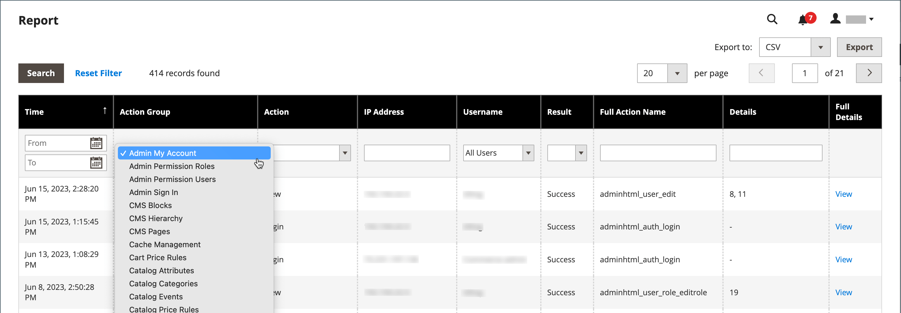

# Rapport Action Logs

{{ee-feature}}

Het _Logboeken van de Actie_ rapport toont een gedetailleerd verslag van alle acties Admin die voor registreren worden toegelaten. Elk verslag is tijdstempels, en registreert het IP adres en de naam van de gebruiker. Het logboekgegeven omvat admin gebruikersgegevens en verwante veranderingen die tijdens de actie werden aangebracht.

De acties die u in het rapport wilt tonen moeten in het [ Logging van Acties Admin ](action-log.md) scherm in de opslagmontages worden toegelaten. Als het actietype wordt gecontroleerd (toegelaten), worden die types van acties Admin getoond in het Logs van de Actie rapport.

Het rapport kan worden gefilterd gebruikend de opties in elke kolom. U kunt één filteroptie instellen of filteropties voor meerdere kolommen instellen om het rapport te beperken tot een lijst met specifieke handelingen. U kunt rapportgegevens in of Csv of formaat van XML van Excel ook uitvoeren.

Het rapport Action Logs bevat de volgende informatie:

- **[!UICONTROL Time]** - De datum en tijd waarop de handeling heeft plaatsgevonden
- **[!UICONTROL Action Group]** - toont het actietype, correleert met de acties die op _worden toegelaten het Registreren van Acties Admin_ scherm in uw opslagmontages
- **[!UICONTROL Action]** - Geeft de handeling weer die is vastgelegd
- **[!UICONTROL IP Address]** - Geeft het IP-adres weer van het apparaat waarop de handeling is uitgevoerd
- **[!UICONTROL Username]** - Hiermee wordt de aanmeldings-id weergegeven voor de gebruiker die de handeling heeft uitgevoerd
- **[!UICONTROL Result]** - Geeft aan of de handeling van de gebruiker is gelukt of mislukt
- **[!UICONTROL Full Action Name]** - Geeft de naam van de achterste handeling weer
- **[!UICONTROL Details]** - Hiermee geeft u de categorie voor de achterste handeling weer
- **[!UICONTROL Full Details]** - Alle geregistreerde details van de beheeractie worden weergegeven

## Het rapport Handelingenlogboeken weergeven

1. Voor _Admin_ sidebar, ga **[!UICONTROL System]** > _[!UICONTROL Actions Logs]_>**[!UICONTROL Report]**.

   {width="600" zoomable="yes"}

1. Klik op **[!UICONTROL View]** als u alle details van een vermelde beheeractie wilt weergeven.

   {width="600" zoomable="yes"}

## Het rapport Handelingenlogboeken filteren

U kunt de velden met filteropties definiëren en vervolgens op **[!UICONTROL Search]** klikken om de weergegeven acties te beperken.

Klik op **[!UICONTROL Reset Filter]** om de filteropties te wissen en terug te keren naar het volledige rapport.

{width="600" zoomable="yes"}

| Veld | beschrijving |
|--- |--- |
| [!UICONTROL Time] | Klik in **[!UICONTROL From]** om een datum in de dynamische kalender te selecteren om de begindatum voor het filter te definiëren. Klik in **[!UICONTROL To]** om een datum te selecteren waarop de einddatum voor het filter moet worden gedefinieerd. |
| [!UICONTROL Action Group] | Kies een actiegroep. |
| [!UICONTROL Action] | Kies een handeling. |
| [!UICONTROL IP Address] | Voer het IP-adres in van de computer die voor een handeling wordt gebruikt. |
| [!UICONTROL Username] | Kies een gebruikersnaam. De standaardwaarde is `All Users` . |
| [!UICONTROL Result] | Kies Succes of Fout. |
| [!UICONTROL Full Action Name] | Voer tekst in die overeenkomt met de zoekopdracht in het veld. |
| [!UICONTROL Details] | Voer tekst in die overeenkomt met de zoekopdracht in het veld. |

{style="table-layout:auto"}

## Het rapport Handelingenlogboeken exporteren

1. Kies bij **[!UICONTROL Export to]** een exportindeling:

   - `CSV` - Een bestand met komma&#39;s als scheidingsteken dat normale tekstgegevens bevat
   - `Excel XML` - Een op XML gebaseerde indeling voor spreadsheetgegevens

1. Klik op **[!UICONTROL Export]**.

   Het gegenereerde bestand wordt automatisch voor downloads opgeslagen in de door u aangewezen map.

   {width="200"}
