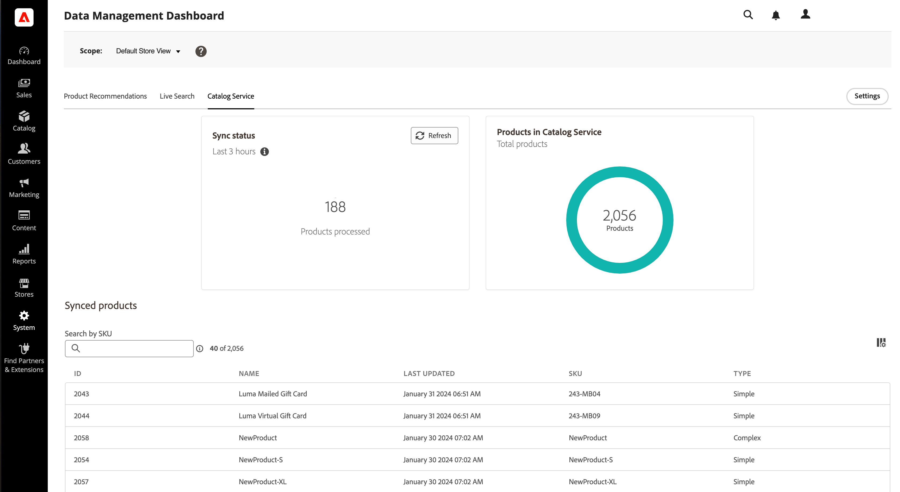

# Gegevensbeheerdashboard

Het gegevensbeheerdashboard biedt inzicht in gegevensstromen voor Adobe Commerce SaaS-producten. Gebruikers van [!DNL Live Search], [!DNL Product Recommendations], en [!DNL Catalog Service] U kunt de status van productsynchronisatie bekijken en gegevens vanaf één dashboard opnieuw synchroniseren.

Het gegevensbeheerdashboard bevindt zich op *Systeem* > Gegevensoverdracht > *Gegevensbeheerdashboard*.

## Instellingen

Met de knop Instellingen aan de rechterkant van de pagina wordt het dialoogvenster [[!DNL Catalog Sync]](https://experienceleague.adobe.com/docs/commerce-merchant-services/user-guides/data-services/catalog-sync.html) instellingenvenster.

Normaal gesproken worden de [!DNL Catalog Sync] proces wordt automatisch, eenmaal per uur uitgevoerd.

Het opnieuw synchroniseren van catalogusgegevens dwingt de dienst om gegevens van het gegevensbestand van de Handel opnieuw te bepalen, die ervoor zorgen dat de recentste veranderingen in de dienst en op uw plaats worden weerspiegeld. Gebruik deze knop als u meerdere productwijzigingen hebt aangebracht en u deze wijzigingen wilt bijwerken voordat u het normale automatische synchronisatieproces start.

## Synchronisatiestatus

De _[!UICONTROL Sync]_het statuspaneel rapporteert het aantal producten dat in de laatste drie uur is gesynchroniseerd. Als u uw catalogus niet vaak bijwerkt, is deze waarde vaak nul. Klikken **[!UICONTROL Refresh]**om de telling te vernieuwen.

## Aantal producten

Het deelvenster Producentelling geeft het totale aantal catalogusproducten weer dat beschikbaar is voor de service.

De [!DNL Catalog Service] het dashboard weerspiegelt het totale aantal producten in de catalogus die beschikbaar zijn voor de service . Dit zijn over het algemeen alle producten in het gegevensbestand van de Handel.

Op de dashboards Product Recommendations en Live Search wordt het totale aantal weergegeven [_doorzoekbaar_](https://experienceleague.adobe.com/docs/commerce-admin/catalog/catalog/search/search.html) producten. Als sommige producten niet doorzoekbaar zijn, is dit het verschil in producttotalen tussen [!DNL Product Recommendations] en [!DNL Live Search], en [!DNL Catalog Service].

## Gesynchroniseerde producten

De tabel Gesynchroniseerde catalogusproducten bevat gegevens over de producten in de index. Deze tabel wordt standaard gesorteerd op Laatst bijgewerkt.

Als u een specifiek product wilt zoeken, gebruikt u de[!UICONTROL Search by SKU]** veld .
Klik op **[!UICONTROL Customize Table]** rechts van de tabel.
