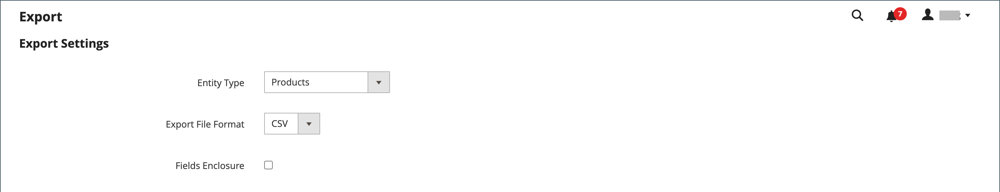

# Gegevens exporteren

De beste manier om vertrouwd te raken met de structuur van uw database is de gegevens te exporteren en deze in een spreadsheet te openen. Nadat u met het proces vertrouwd bent geworden, kunt u het als efficiënte manier gebruiken om grote hoeveelheden informatie te beheren.

Speciale tekens, zoals het gelijkteken, groter en kleiner dan symbolen, enkele en dubbele aanhalingstekens, backslash, pipe en en en ampersand-symbolen, kunnen problemen veroorzaken tijdens de gegevensoverdracht. Om ervoor te zorgen dat dergelijke speciale tekens correct worden geïnterpreteerd, kunnen ze worden gemarkeerd als een _escapereeks_. Als de gegevens bijvoorbeeld een tekenreeks bevatten, zoals `code="str"`, `code="str2"`, zorgt het insluiten van de tekst tussen dubbele aanhalingstekens ervoor dat de oorspronkelijke dubbele aanhalingstekens worden beschouwd als onderdeel van de gegevens: `"code="str""`. Wanneer het systeem een dubbele reeks dubbele citaten ontmoet, begrijpt het dat de buitenste reeks dubbele citaten de daadwerkelijke gegevens omsluit.

Het exporteren van gegevens is een asynchrone bewerking die op de achtergrond wordt uitgevoerd, zodat u kunt blijven werken in Beheer zonder te wachten tot de bewerking is voltooid. Het systeem geeft een bericht weer wanneer de taak is voltooid.

## Uitvoercriteria

Exportfilters worden gebruikt om de gegevens op te geven die u in het exportbestand wilt opnemen op basis van de kenmerkwaarde. Daarnaast kunt u opgeven welke kenmerkgegevens u wilt opnemen in of uitsluiten van de exportbewerking.

{width="600" zoomable="yes"}

### Exportfilters

U kunt filters gebruiken om te bepalen welke SKUs in het de uitvoerdossier inbegrepen zijn. Als u bijvoorbeeld een waarde invoert in het filter Land van vervaardiging, bevat het geëxporteerde CSV-bestand alleen producten die in dat land zijn gemaakt.

Het type filter komt overeen met het gegevenstype. Voor datumvelden kunt u de datum kiezen in de kalender . Zie [Kenmerkinvoertypen](../catalog/attributes-input-types.md) voor meer informatie .

De datumnotatie wordt bepaald door de [landinstelling](../getting-started/store-details.md#locale-options).

Als u alleen records met een specifieke waarde wilt opnemen, zoals een SKU, voert u de waarde in het veld Filter in. Sommige velden, zoals Prijs, Dikte en Product instellen als Nieuw, hebben een waardebereik van/tot.

### Kenmerken uitsluiten

Het selectievakje in de eerste kolom wordt gebruikt om kenmerken uit te sluiten van het exportbestand. Als een attribuut wordt uitgesloten, is de bijbehorende kolom in de uitvoergegevens inbegrepen, maar leeg.

| Uitsluiten | Filter | Resultaat |
|--- |--- |--- |
|  | Nee | Het geëxporteerde bestand bevat elk kenmerk voor alle bestaande records. |
|  | Ja | Het exportbestand bevat elk kenmerk met alleen de records die door het filter zijn toegestaan. |
|  | Nee | Het exportbestand bevat niet de kolom voor het uitgesloten kenmerk, maar wel alle bestaande records. |
|  | Ja | Het exportbestand bevat niet de kolom voor het uitgesloten kenmerk en bevat alleen de records die door het filter zijn toegestaan. |

{style="table-layout:auto"}

## Gegevens exporteren

1. Op de _Beheerder_ zijbalk, ga naar **[!UICONTROL System]** > _[!UICONTROL Data Transfer]_>**[!UICONTROL Export]**.

1. In de _Exportinstellingen_ sectie, set **[!UICONTROL Entity Type]** op een van de volgende wijzen:

   - `Advanced Pricing`
   - `Products`
   - `Customer Finances`
   - `Customers Main File`
   - `Customer Addresses`
   - `Stock Sources`

   {width="600" zoomable="yes"}

1. De standaardinstelling accepteren **[!UICONTROL Export File Format]** van CSV.

1. Als u speciale tekens wilt insluiten die in de gegevens kunnen worden gevonden als een _escapereeks_, selecteert u de **[!UICONTROL Fields Enclosure]** selectievakje.

1. Wijzig zo nodig de weergave van de entiteitskenmerken.

   Standaard worden in de sectie Entiteitskenmerken alle beschikbare kenmerken in alfabetische volgorde weergegeven. U kunt de standaard [lijstbesturingselementen](../getting-started/admin-grid-controls.md) om naar specifieke attributen te zoeken en de lijst te sorteren. Met de besturingselementen Filter Zoeken en Herstellen bepaalt u de weergave van de lijst, maar dit heeft geen invloed op de selectie van de kenmerken die moeten worden opgenomen in het exportbestand.

   {width="600" zoomable="yes"}

1. Ga als volgt te werk om de geëxporteerde gegevens te filteren op basis van de kenmerkwaarde:

   - Als u alleen records met specifieke kenmerkwaarden wilt exporteren, voert u de vereiste waarde in het dialoogvenster **[!UICONTROL Filter]** kolom. In het volgende voorbeeld wordt alleen een specifieke SKU geëxporteerd.

   - Als u een kenmerk wilt weglaten uit het exportbestand, selecteert u de optie **[!UICONTROL Exclude]** Schakel het selectievakje aan het begin van de rij in. Als u bijvoorbeeld alleen de opdracht `sku` en `image` kolommen, selecteer checkbox van elk ander attribuut. De kolom wordt weergegeven in het exportbestand, maar zonder waarden.

1. Omlaag schuiven en klikken **[!UICONTROL Continue]** rechtsonder op de pagina.

   Na voltooiing van de taak wordt het bestand verwerkt via een wachtrij met berichten (zorg ervoor dat de uitsnijdtaak wordt uitgevoerd). Het geëxporteerde bestand wordt opgeslagen in het dialoogvenster `var/export/ folder`. Voor meer informatie over de berichtrij, zie [Berichtenrijen beheren](https://experienceleague.adobe.com/docs/commerce-operations/configuration-guide/message-queues/manage-message-queues.html) in de _Configuratiegids_.

   U kunt het geëxporteerde CSV-bestand opslaan of openen als spreadsheet, de gegevens vervolgens bewerken en weer importeren in uw winkel.

   >[!NOTE]
   >
   >Standaard bevinden alle geëxporteerde bestanden zich in de `<Magento-root-directory>/var/export` map. Als de externe opslagmodule is ingeschakeld, bevinden alle geëxporteerde bestanden zich in de `<remote-storage-root-directory>/import_export/export` map.

## Bronnen voor probleemoplossing

Voor hulp bij het oplossen van problemen bij de uitvoer van gegevens, zie de volgende artikelen van de Kennisbank van de Steun van de Handel:

- [Het CSV-bestand met geëxporteerde producten wordt niet weergegeven](https://experienceleague.adobe.com/docs/commerce-knowledge-base/kb/troubleshooting/miscellaneous/exported-products-.csv-file-does-not-appear.html)
- [Het exportbestand van het product wordt niet weergegeven in Admin](https://experienceleague.adobe.com/docs/commerce-knowledge-base/kb/support-tools/patches/v1-0-9/mdva-31168-magento-patch-product-export-file-does-not-show-in-admin.html)
- [Uitgave in CSV-indeling voor het exporteren van orders](https://experienceleague.adobe.com/docs/commerce-knowledge-base/kb/support-tools/patches/v1-0-8/mdva-31242-magento-patch-issue-in-exporting-orders-in-csv-format.html)
