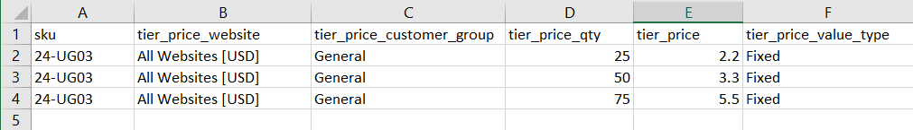

# Invoerprijzen

In plaats van in te voeren [termijnprijzen](../catalog/product-price-tier.md) voor elk product kan het efficiënter zijn om [import](data-import.md) de prijsgegevens. Maak voordat u begint een voorbeeldbestand met geëxporteerde prijsgegevens voor lagen die u als sjabloon kunt gebruiken.

{width="700" zoomable="yes"}

## Stap 1: Gegevens over de laagprijs exporteren

In het volgende voorbeeld worden prijsgegevens voor lagen voor één product geëxporteerd. Vervolgens kunt u de geëxporteerde gegevens gebruiken als een sjabloon voor het bulkimporteren van gegevens over de laagprijs. Voor meer informatie over het exporteren van geavanceerde prijsgegevens raadpleegt u [Geavanceerde prijsgegevens](data-attributes-product.md#advanced-pricing-attributes).

{width="600" zoomable="yes"}

1. Aan _Beheerder_ zijbalk, ga naar  **[!UICONTROL System]** > _[!UICONTROL Data Transfer]_>**[!UICONTROL Export]**.

1. Onder _[!UICONTROL Export Settings]_, set **[!UICONTROL Entity Type]**tot `Advanced Pricing`.

1. In de **[!UICONTROL Entity Attributes]** het net, scrol neer aan de attributen van SKU en doe het volgende:

   - Voor laagprijzen die op een disconteringspercentage zijn gebaseerd, de SKU van elk uit te voeren product, die door een komma wordt gescheiden.

     {width="600" zoomable="yes"}

   - Voer voor de op een vast bedrag gebaseerde prijzen de SKU van elk product in.

   - Omlaag schuiven en klikken **[!UICONTROL Continue]**.

1. Zoek het exportbestand op de downloadlocatie voor uw webbrowser en open het bestand.

   {width="600" zoomable="yes"}

**_Geëxporteerde prijsgegevens op lijst_**

De volgende kolommen worden opgenomen in de geëxporteerde gegevens:

- `sku`
- `tier_price_website`
- `tier_price_customer_group`
- `tier_price_qty`
- `tier_price`
- `tier_price_value_type`

U gebruikt de geëxporteerde gegevens als een sjabloon voor het importeren van gegevens over de laagprijs.

## Stap 2: De gegevens bijwerken

1. Werk indien nodig de gegevens over de laagprijs voor elk product bij.

   Producten zonder update van de laagprijs kunnen uit het CSV-bestand worden verwijderd. Producten die niet zijn gewijzigd, hoeven niet opnieuw te worden geïmporteerd.

1. **[!UICONTROL Save]** het bijgewerkte CSV-bestand.

>[!NOTE]
>
>Een importbestand mag niet groter zijn dan 2 MB.

## Stap 3: De bijgewerkte gegevens importeren

1. Aan _Beheerder_ zijbalk, ga naar **[!UICONTROL System]** > _[!UICONTROL Data Transfer]_>**[!UICONTROL Import]**.

1. Onder _Instellingen importeren_, set **[!UICONTROL Entity Type]** tot `Advanced Pricing`.

1. Set **[!UICONTROL Import Behavior]** tot `Add/Update`.

1. Onder **[!UICONTROL File to Import]**, klikt u op **[!UICONTROL Choose File]** en selecteer het bestand dat u uit uw map wilt importeren.

1. Klik in de rechterbovenhoek op **[!UICONTROL Check Data]**.

1. Als het bestand geldig is, klikt u **[!UICONTROL Import]**.

   Als dat niet het geval is, verhelpt u elk probleem met de gegevens in het bericht en probeert u het bestand opnieuw te importeren.
