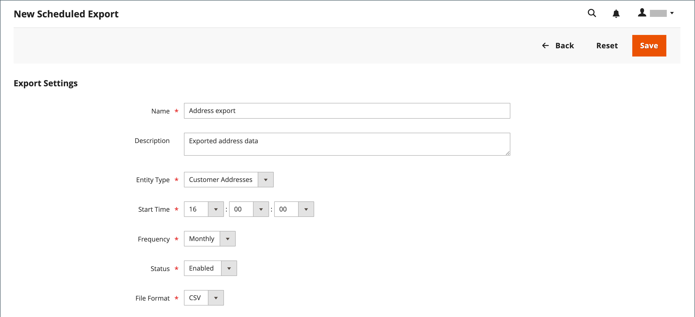

# Geplande import en export

{{ee-feature}}

De geplande invoer en de uitvoer kunnen op een dagelijkse, wekelijkse, of maandbasis worden lopen. De bestanden die geïmporteerd of geëxporteerd moeten worden, kunnen zich op lokale Adobe Commerce-servers of op externe FTP-servers bevinden. De geplande Invoer/de Uitvoer wordt uitgevoerd door gebrek, en vereist geen extra configuratie. Alle geplande import en export worden beheerd door de Cron job planner.

## Toegang tot geplande import/export

1. Op de _Beheerder_ zijbalk, ga naar **[!UICONTROL System]** > _[!UICONTROL Data Transfer]_>**[!UICONTROL Scheduled Imports/Exports]**.

   {width="700" zoomable="yes"}

1. Als u een nieuwe geplande import- of exporttaak wilt maken, klikt u op de betreffende knop en volgt u de instructies voor het type geplande taak.

   - [Geplande export toevoegen](#schedule-an-export)
   - [Geplande import toevoegen](#schedule-an-import)

1. Wanneer de record wordt opgeslagen, wordt de taak weergegeven in het dialoogvenster _[!UICONTROL Scheduled Import/Export]_raster.

   >[!NOTE]
   >
   >Wanneer u een geplande import/export maakt of bijwerkt, leidt dit tot een wijziging in de systeemconfiguratie. Nadat u het bestand hebt opgeslagen, controleert u of u de melding van de cachevalidatie die boven aan de beheerpagina wordt weergegeven, hebt opgelost en verwijdert u de cache om het nieuwe of bijgewerkte schema toe te passen.

1. Na elke geplande taak wordt er een kopie van het bestand in de `var/log/import_export` op de lokale Adobe Commerce-server.

   De details van elke verrichting worden niet geschreven aan het logboek. Als een fout optreedt, wordt een melding verzonden van de mislukte import-/exporttaak, met een beschrijving van de fout.

## Importeren plannen

Voor de beschikbare bestandsindeling voor import en de typen importentiteiten is het geplande importproces vergelijkbaar met het handmatig importeren:

- Het importbestand moet de CSV-indeling hebben
- U kunt product- en klantgegevens importeren

Het voordeel van geplande importbewerkingen is dat u een gegevensbestand meerdere keren automatisch kunt importeren nadat u de importparameters en -planning hebt opgegeven.

De details van elke importbewerking worden niet naar een logbestand geschreven, maar als er een fout optreedt, ontvangt u een _Importeren mislukt_ email met een beschrijving van de fout. Het resultaat van de laatste geplande importtaak wordt weergegeven in de kolom Laatste resultaat op de geplande pagina Importeren/exporteren.

Na elke importbewerking wordt een kopie van het importbestand in het dialoogvenster `var/log/import_export` directory op de server waar Adobe Commerce of Magento Open Source wordt geïmplementeerd. De tijdstempel, de markering van de geïmporteerde entiteit (producten of klanten) en het type bewerking (in dit geval importeren) worden toegevoegd aan de naam van het importbestand.

Na elke geplande importtaak wordt automatisch een herindexeringsbewerking uitgevoerd. Op de voorgrond worden wijzigingen in de beschrijvingen en andere tekstinformatie weerspiegeld nadat de bijgewerkte gegevens naar de database gaan, en de prijswijzigingen worden pas na de herindexeringsoperatie doorgevoerd.

### Stap 1: De importinstellingen voltooien

1. Op de _Beheerder_ zijbalk, ga naar **[!UICONTROL System]** > _[!UICONTROL Data Transfer]_>**[!UICONTROL Scheduled Import/Export]**.

1. Klik in de rechterbovenhoek op **[!UICONTROL Add Scheduled Import]**.

1. Stel de opties voor plannen en importeren in:

   - **[!UICONTROL Name]** — Voer een naam in voor de geplande import.

   - **[!UICONTROL Description]** — Voer een korte beschrijving in met uitleg over het doel van de import en de manier waarop deze moet worden gebruikt.

   - **[!UICONTROL Entity Type]** — Stel een van de volgende opties in:

      - `Products`
      - `Advanced Pricing`
      - `Customers and Addresses (single file)`
      - `Customer Addresses`
      - `Customer Finances`
      - `Customers Main File`
      - `Stock Sources`

   - **[!UICONTROL Import Behavior]** — Stel een van de volgende opties in:

      - `Add/Update Complex Data` — Voegt nieuwe complexe gegevens toe of werkt deze bij aan de bestaande complexe gegevens voor bestaande gegevens in de database. Dit is de standaardwaarde.
      - `Replace` — Schrijft over bestaand complex voor bestaande entiteiten in het gegevensbestand.
      - `Delete Entities` — Verwijdert bestaande vermeldingen in de database.
      - `Custom Action` - Aanpast bestaande entiteiten in de database.

     >[!NOTE]
     >
     >Voor de _[!UICONTROL Advanced Pricing]_,_[!UICONTROL Products]_, _[!UICONTROL Customers and Addresses (single file)]_, en_[!UICONTROL Stock Sources]_ entiteitstypen, worden deze importgedragingen weergegeven: `Add/Update`, `Replace`, en `Delete`. Voor de _Klantenfinanciën_, _Hoofdbestand van klanten_, en _Klanten en adressen_ entiteitstypen, worden deze importgedragingen weergegeven: `Add/Update Complex Data`, `Delete Entities`, en `Custom Action`.

   - **[!UICONTROL Start Time]** — Stel dit in op het uur, de minuut en de seconde waarop het importeren moet beginnen.

   - **[!UICONTROL Frequency]** — Stel een van de volgende opties in: `Daily`, `Weekly`, of `Monthly`

   - **[!UICONTROL On Error]** - Stel een van de volgende opties in: `Stop Import` of `Continue Processing`

   - **[!UICONTROL Status]** — Als u de geplande import wilt activeren, stelt u in op `Enabled`.

   - **[!UICONTROL Field Separator]** — Voer het teken in dat wordt gebruikt om velden in het importbestand van elkaar te scheiden. Het standaardteken is een komma.

   - **[!UICONTROL Multiple Value Separator]** — Voer het teken in dat wordt gebruikt om meerdere waarden in een veld van elkaar te scheiden.

   {width="600" zoomable="yes"}

### Stap 2: de gegevens van het importbestand invullen

1. Set **[!UICONTROL Server Type]** op een van de volgende wijzen:

   - `Local Server` - Hiermee importeert u de gegevens van dezelfde server waarop Adobe Commerce is geïnstalleerd.
   - `Remote FTP` - De gegevens worden geïmporteerd vanaf een externe server.

   {width="600" zoomable="yes"}

   >[!NOTE]
   >
   >Wanneer de externe opslagmodule is ingeschakeld, `Local Server` schakelt automatisch over naar `Remote Storage`.

1. Voer de **[!UICONTROL File Directory]** waar het importbestand vandaan komt.

   - `Local Server` - Voer een relatief pad in bij de installatie van Commerce. Bijvoorbeeld, `var/import`. Als de externe opslagmodule is geconfigureerd, gebruikt u `import_export/import`.
   - `Remote FTP server` - Voer de volledige URL en het volledige pad naar de importmap op de externe server in.

1. Voer de **[!UICONTROL File Name]** in te voeren.

1. Voor **[!UICONTROL Images File Directory]**, voert u het pad in naar de map waarin de productafbeeldingen zijn opgeslagen.

   Voer op een lokale server een relatief pad in, bijvoorbeeld: `var/import`. Voer op een externe opslaglocatie een relatief pad in, zoals: `import_export/import` of `import_export/import/some/dir`.

### Stap 3: het importeren van mislukte e-mails configureren

{width="600" zoomable="yes"}

1. Set **[!UICONTROL Failed Email Receiver]** aan de opslagcontactpersoon die meldingen ontvangt als er een fout optreedt tijdens het importeren.

1. Set **[!UICONTROL Failed Email Sender]** aan het opslagcontact dat als afzender van het bericht verschijnt.

1. Set **[!UICONTROL Failed Email Template]** aan het malplaatje dat voor het bericht wordt gebruikt.

1. Voor **[!UICONTROL Send Failed Email Copy To]** Voer het e-mailadres in van iedereen die een kopie van de melding moet ontvangen.

   Scheid meerdere e-mailadressen met een komma.

1. Set **[!UICONTROL Failed Email Copy Method]** op een van de volgende wijzen:

   - `Bcc` - Hiermee wordt een blinde, hoffelijke kopie van de mislukte melding bij importeren verzonden. De naam en het adres van de ontvanger zijn opgenomen in de oorspronkelijke e-maildistributie, maar zijn niet zichtbaar.
   - `Separate Email` - Hiermee verzendt u een kopie van het mislukte importbericht als een aparte e-mail.

1. Klik op **[!UICONTROL Save]**.

   De nieuwe geplande importtaak wordt toegevoegd aan de lijst in het dialoogvenster _[!UICONTROL Scheduled Import/Export]_pagina. Vanaf deze pagina kan deze direct worden uitgevoerd voor testen en worden bewerkt. Het importbestand wordt gevalideerd voordat elke importtaak wordt uitgevoerd.

>[!NOTE]
>
>Wanneer u een geplande import/export maakt of bijwerkt, leidt dit tot een wijziging in de systeemconfiguratie. Nadat u het bestand hebt opgeslagen, controleert u of u de melding van de cachevalidatie die boven aan de beheerpagina wordt weergegeven, hebt opgelost en verwijdert u de cache om het nieuwe of bijgewerkte schema toe te passen.

### Veldomschrijvingen

#### [!UICONTROL Import Settings]

| Veld | Beschrijving |
| ----- | ----------- | 
| [!UICONTROL Name] | De naam van de importbewerking. Hiermee kunt u een onderscheid maken tussen vele verschillende geplande importbewerkingen. |
| [!UICONTROL Description] | (Optioneel) U kunt een beschrijving invoeren. |
| [!UICONTROL Entity Type] | Hiermee definieert u de gegevens die moeten worden geïmporteerd. |
| [!UICONTROL Import Behavior] | Hiermee definieert u hoe complexe gegevens worden verwerkt als de entiteiten die worden geïmporteerd in de database bestaan. Complexe gegevens voor producten omvatten categorieën, websites, aangepaste opties, laagprijzen, verwante producten, upsells, cross-sells en bijbehorende productgegevens. De complexe gegevens voor klanten omvatten adressen. Opties: **[!UICONTROL Add/Update Complex Data]**- De nieuwe complexe gegevens worden toegevoegd aan of bijgewerkt met de bestaande complexe gegevens voor bestaande gegevens in de database. Dit is de standaardwaarde. **[!UICONTROL Add/Update]** - Er worden nieuwe gegevens toegevoegd aan de bestaande gegevens in de database. Alle velden behalve `sku` kan voor producten worden bijgewerkt. Meerdere veldwaarden die niet in het CSV-bestand worden vermeld, zoals categorieën of websites, blijven na het importeren in de database staan. **[!UICONTROL Replace]**- De bestaande complexe gegevens voor de bestaande entiteiten worden vervangen. **[!UICONTROL Delete Entities]** - Als er geïmporteerde entiteiten in de database staan, worden deze uit de database verwijderd. **[!UICONTROL Custom Action]**- De bestaande complexe entiteiten worden tijdens het importproces aangepast. |
| [!UICONTROL Start Time] | Stel het beginuur, minuten en seconden van het importeren in. |
| [!UICONTROL Frequency] | Bepaal hoe vaak het importeren wordt uitgevoerd. Opties: `Daily` / `Weekly` / `Monthly` |
| [!UICONTROL On Error] | Definieer het systeemgedrag voor het geval er tijdens de bestandsvalidatie fouten worden gevonden. Opties: **Importeren stoppen** — Het bestand wordt niet geïmporteerd als er fouten zijn aangetroffen tijdens de validatie. Dit is de standaardwaarde. **Doorgaan met verwerking** - Als tijdens de validatie fouten worden gevonden, maar importeren mogelijk is, wordt het bestand geïmporteerd. |
| [!UICONTROL Status] | Importeren is standaard ingeschakeld. U kunt dit opschorten door de status in te stellen op `Disabled`. |
| [!UICONTROL Field Separator] | Bepaalt welk teken wordt gebruikt om velden te scheiden. Standaardwaarde: `,` (komma) |
| [!UICONTROL Multiple Value Separator] | Bepaalt het teken dat wordt gebruikt om meerdere waarden binnen een veld van elkaar te scheiden. Standaardwaarde: `,` (komma) |

{style="table-layout:auto"}

#### [!UICONTROL Import File Information]

| Veld | Beschrijving |
| ----- | ----------- | 
| [!UICONTROL Server Type] | U kunt importeren vanuit een bestand op dezelfde server als waar de Handel wordt geïmplementeerd (selecteer `Local Server`) of van de externe FTP-server (selecteer `Remote FTP`). Als u _[!UICONTROL Remote FTP]_, worden extra opties voor referenties en instellingen voor bestandsoverdracht weergegeven. Als de externe opslagmodule is ingeschakeld, `Local Server` tekst wordt automatisch geschakeld naar `Remote Storage`. |
| [!UICONTROL File Directory] | Geef de map op waarin het importbestand zich bevindt. Als Servertype is ingesteld op _[!UICONTROL Local Server]_geeft u het pad op ten opzichte van de installatiemap Handel. Bijvoorbeeld: `var/import` of `import_export/import` voor externe opslag. |
| [!UICONTROL File Name] | Geef de naam van het importbestand op. |
| [!UICONTROL Images File Directory] | Voer het pad in naar de map waarin de productafbeeldingen zijn opgeslagen. Voer voor een lokale server een relatief pad in. Bijvoorbeeld: `var/import` of `import_export/import` voor externe opslag. |

{style="table-layout:auto"}

#### [!UICONTROL Import Failed Emails]

| Veld | Beschrijving |
| ----- | ----------- | 
| [!UICONTROL Failed Email Receiver] | Geef het e-mailadres op waarnaar een e-mailmelding (niet-geïmporteerde e-mail) wordt verzonden als het importeren is mislukt. |
| [!UICONTROL Failed Email Sender] | Geef het e-mailadres op dat wordt gebruikt als de afzender voor het niet-geïmporteerde e-mailbericht. |
| [!UICONTROL Failed Email Template] | Selecteer een sjabloon voor het e-mailbericht voor importeren. Standaard is alleen de optie Importeren mislukt (standaardsjabloon van landinstelling is beschikbaar). Aangepaste sjablonen kunnen worden gemaakt onder _[!UICONTROL System]_>_[!UICONTROL Transactional Emails]_. |
| [!UICONTROL Send Failed Email Copy To] | Het e-mailadres waarnaar een kopie van het niet-geïmporteerde e-mailbericht is verzonden. |
| [!UICONTROL Send Failed Email Copy Method] | Selecteer de methode voor het verzenden van kopieën voor de niet-geïmporteerde e-mail. |

{style="table-layout:auto"}

## Een exportbewerking plannen

Gepland exporteren lijkt op een handleiding [Exporteren](data-export.md) in de beschikbare bestandsindeling voor export en de typen entiteiten die kunnen worden geëxporteerd:

- U kunt exporteren naar de CSV-indeling
- U kunt product- en klantgegevens exporteren

Het voordeel van het gebruik van Geplande export is dat u gegevens meerdere keren automatisch kunt exporteren, nadat u de exportparameters hebt opgegeven, en slechts één keer kunt plannen.

De details van elke export worden niet naar een logboek geschreven, maar als er een fout optreedt, ontvangt u een e-mail met exportfout die de foutbeschrijving bevat. Het resultaat van de laatste exporttaak wordt weergegeven in de kolom Laatste resultaat op de pagina Geplande import/export.

Na elke exportbewerking wordt het exportbestand op de door de gebruiker gedefinieerde locatie geplaatst en wordt een kopie in het dialoogvenster `var/log/import_export` directory op de server waar Adobe Commerce of Magento Open Source wordt geïmplementeerd. Het tijdstempel en de markering van de geëxporteerde entiteit (producten of klanten) en het type bewerking (in dit geval exporteren) worden toegevoegd aan de naam van het exportbestand.

### Stap 1: de exportinstellingen voltooien

1. Op de _Beheerder_ zijbalk, ga naar **[!UICONTROL System]** > _[!UICONTROL Data Transfer]_>**[!UICONTROL Scheduled Import/Export]**.

1. Klik in de rechterbovenhoek op **[!UICONTROL Add Scheduled Export]** en voer de volgende handelingen uit:

   - Voer een **[!UICONTROL Name]** voor de geplande export.

   - Voer een korte beschrijving in **[!UICONTROL Description]** dit verklaart het doel van de uitvoer en de wijze waarop deze zal worden gebruikt .

   - Set **[!UICONTROL Entity Type]** op een van de volgende wijzen:

      - `Advanced Pricing`
      - `Products`
      - `Customer Financing`
      - `Customers Main File`
      - `Customer Addresses`
      - `Stock Sources`

     De _[!UICONTROL Entity Attributes]_onder aan de pagina wordt het geselecteerde Type entiteit weergegeven.

   - Set **[!UICONTROL Start Time]** tot het uur, de minuut, en de tweede dat de uitvoer gepland is te beginnen.

   - Set **[!UICONTROL Frequency]** op een van de volgende wijzen:

      - `Daily`
      - `Weekly`
      - `Monthly`

1. Als u de geplande export wilt activeren, stelt u **[!UICONTROL Status]** tot `Enabled`.

1. Accepteren `CSV` als standaard **[!UICONTROL File Format]**.

   {width="600" zoomable="yes"}

### Stap 2: de gegevens van het exportbestand invullen

1. Set **[!UICONTROL Server Type]** op een van de volgende wijzen:

   - `Local Server` - Het exportbestand opslaan op dezelfde server als waarop Commerce is geïnstalleerd.
   - `Remote FTP` — Het exportbestand opslaan op een externe server.

   {width="600" zoomable="yes"}

   >[!NOTE]
   >
   >Wanneer de externe opslagmodule is ingeschakeld, wordt de `Local Server` schakelt automatisch over naar `Remote Storage`.

1. Voor **[!UICONTROL File Directory]** voert u als volgt de map in waarin het exportbestand moet worden opgeslagen:

   - Voor **[!UICONTROL Local Server]** voert u een relatief pad in in de installatie van Commerce, bijvoorbeeld `var/export`. Als de externe opslagmodule is geconfigureerd, gebruikt u `import_export/export`.
   - Voor **[!UICONTROL Remote FTP server]**, voert u de volledige URL en het pad naar de doelmap op de doelserver in.

1. Als de _[!UICONTROL Remote FTP]_server is geselecteerd, voert u verbindingsgegevens naar de server in en selecteert u aanvullende instellingen:

   - Voor **[!UICONTROL FTP Host[:Port]]** Voer het externe FTP-hostadres in.
   - Voor **[!UICONTROL User Name]**, voert u de gebruikersnaam in die wordt gebruikt voor toegang tot de externe server.
   - Voor **[!UICONTROL Password]**, voert u het wachtwoord van het opgegeven gebruikersaccount in.
   - Voor **[!UICONTROL File Mode]**, kiest u `Binary` of `ASCII`.
   - Voor **[!UICONTROL Passive Mode]**, kiest u `No` of `Yes`.

### Stap 3: de e-mails met exportfouten configureren

1. Set **[!UICONTROL Failed Email Receiver]** aan het opslagcontact wie bericht moet ontvangen als een fout tijdens de uitvoer voorkomt.

1. Set **[!UICONTROL Failed Email Sender]** aan het opslagcontact dat als afzender van het bericht verschijnt.

1. Set **[!UICONTROL Failed Email Template]** aan het malplaatje dat voor het bericht wordt gebruikt.

1. Voor **[!UICONTROL Send Failed Email Copy To]** Voer het e-mailadres in van iedereen die een kopie van de melding moet ontvangen.

   Voor meerdere e-mailadressen scheidt u deze met een komma.

1. Set **[!UICONTROL Failed Email Copy Method]** op een van de volgende wijzen:

   - `Bcc` - Verzendt een blinde hoffelijke kopie. De naam en het adres van de ontvanger zijn opgenomen in de oorspronkelijke e-maildistributie, maar zijn niet zichtbaar.
   - `Separate Email` — Verzendt de kopie als een aparte e-mail.

### Stap 4: kies de entiteitskenmerken

1. In de _[!UICONTROL Entity Attributes]_de kenmerken kiezen die u in de exportgegevens wilt opnemen.

   - Als u exportgegevens wilt filteren op kenmerkwaarde, voert u de kenmerkwaarde in het dialoogvenster _[!UICONTROL Filter]_kolom.
   - Als u producten of klanten met bepaalde kenmerkwaarden wilt uitsluiten, voert u de waarden in van de kenmerken die u wilt uitsluiten en schakelt u het selectievakje Overslaan in de kolom Overslaan in.

1. Klik op **[!UICONTROL Save]**.

   De nieuwe geplande exporttaak wordt toegevoegd aan de lijst in het dialoogvenster _[!UICONTROL Scheduled Import/Export]_pagina. Vanaf deze pagina kan het onmiddellijk worden uitgevoerd, getest en bewerkt.

>[!NOTE]
>
>Wanneer u een geplande import/export maakt of bijwerkt, leidt dit tot een wijziging in de systeemconfiguratie. Nadat u het bestand hebt opgeslagen, controleert u of u de melding van de cachevalidatie die boven aan de beheerpagina wordt weergegeven, hebt opgelost en verwijdert u de cache om het nieuwe of bijgewerkte schema toe te passen.

### Veldomschrijvingen

#### [!UICONTROL Export Settings]

| Veld | Beschrijving |
| ----- | ----------- | 
| [!UICONTROL Name] | De naam van de exportbewerking. Hiermee kunt u een onderscheid maken tussen vele verschillende geplande exportbewerkingen. |
| [!UICONTROL Description] | (Optioneel) Een beschrijving van de geplande export. |
| [!UICONTROL Entity Type] | Identificeert de gegevens die moeten worden geëxporteerd. Nadat u de selectie hebt gemaakt, worden de entiteitskenmerken hieronder weergegeven. Opties: `Advanced Pricing` / `Products` / `Customer Finances` / `Customers Main File` / `Customer Addresses` / `Stock Sources` |
| [!UICONTROL Start Time] | Stel het beginuur, de minuten en de seconden van het exporteren in. |
| [!UICONTROL Frequency] | Bepaal hoe vaak de exporttaak wordt uitgevoerd. Opties: `Daily` / `Weekly` / `Monthly` |
| [!UICONTROL Status] | Een nieuwe geplande export is standaard ingeschakeld. U kunt dit opschorten door Status in te stellen op Uitgeschakeld. Opties: `Enabled` / `Disabled` |
| [!UICONTROL File Format] | Selecteer de indeling van het exportbestand. Momenteel alleen de `.CSV` is beschikbaar. |

{style="table-layout:auto"}

#### [!UICONTROL Export Settings Information]

| Veld | Beschrijving |
| ----- | ----------- | 
| [!UICONTROL Server Type] | Bepaalt de locatie van het exportbestand. Opties: **Lokale server** — Plaatst het exportbestand op dezelfde server als waar Commerce wordt geïmplementeerd. Als de externe opslagmodule is ingeschakeld, `Local Server` wordt geschakeld naar `Remote Storage`. **Externe FTP** — Plaatst het exportbestand op een externe server. Er worden extra opties voor referenties en instellingen voor bestandsoverdracht weergegeven. |
| [!UICONTROL File Directory] | Geef de map op waarin het exportbestand wordt geplaatst. In geval van _[!UICONTROL Server Type]_is ingesteld op `Local Server`geeft u het pad op ten opzichte van het installatiepad voor Handel. Bijvoorbeeld: `var/export`, of `import_export/export` voor externe opslag. |

{style="table-layout:auto"}

#### [!UICONTROL Export Failed Emails]

| Veld | Beschrijving |
| ----- | ----------- | 
| [!UICONTROL Failed Email Receiver] | Geef het e-mailadres op waarnaar een e-mailmelding (niet-geëxporteerde e-mail) wordt verzonden als het exporteren is mislukt. |
| [!UICONTROL Failed Email Sender] | Geef het e-mailadres op dat wordt gebruikt als e-mailafzender met exportfout. |
| [!UICONTROL Failed Email Template] | Selecteer een sjabloon voor de mislukte e-mail voor exporteren. Standaard worden alleen de `Export Failed (Default Template from Locale)` is beschikbaar. |
| [!UICONTROL Send Failed Email Copy To] | Het e-mailadres waarnaar een kopie van de niet-geëxporteerde e-mail wordt verzonden. |
| [!UICONTROL Send Failed Email Copy Method] | Geef de methode op voor het verzenden van kopieën voor de niet-geëxporteerde e-mail. |

{style="table-layout:auto"}
