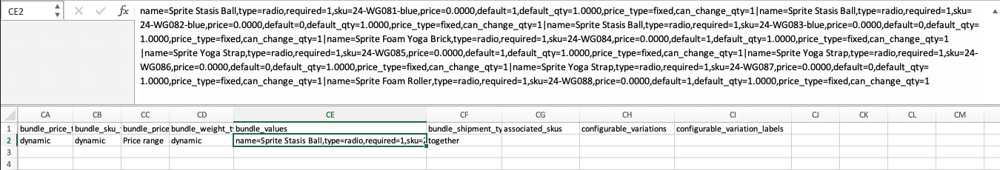

# Bundelproducten importeren

Een bundelproduct biedt een selectie van items en biedt klanten de mogelijkheid om de items te kiezen die ze willen kopen. Alle items waaruit een bundel bestaat, bestaan in de catalogus als [Eenvoudige producten](../catalog/product-create-simple.md) of [Virtuele producten](../catalog/product-create-virtual.md). Gewoonlijk worden bundelproducten gemaakt en bijgewerkt via de beheerder. U kunt echter ook gegevens importeren om een bundelproduct te maken of u kunt bestaande bundelproducten exporteren, de gegevens bewerken en weer importeren in de catalogus. De Sprite Yoga Companion Kit is een bundelproduct in de voorbeeldgegevens die in de volgende voorbeelden worden gebruikt.

{width="700" zoomable="yes"}

## De volgorde van bundelitems wijzigen

Er zijn twee manieren om de orde van punten in een bundelproduct te veranderen.

### Methode 1: Slepen en neerzetten

Als u werkt met een [Bundel](../catalog/product-create-bundle.md) vanuit Beheer kunt u items en secties naar de juiste positie slepen.

{width="600" zoomable="yes"}

### Methode 2: De productgegevens bewerken

De beste manier om de structuur van een bundelproduct te begrijpen is het product uit te voeren en de gegevens in een spreadsheet te onderzoeken. U kunt de volgorde van bundelitems wijzigen door het product te exporteren en een positieparameter toe te voegen aan de gegevens voor elk item. De itemgegevens bevinden zich in de `bundle_values` kolom van het uitgevoerde product. Wanneer de items in een spreadsheet worden geopend, bevinden alle items die aan het product zijn gekoppeld zich in één cel als een lange tekenreeks. De `bundle_values` de kolom bevat de volgende elementen voor elk item:

- Naam van de itemsectie
- Invoerbesturingselement
- Vereiste itemindicator
- SKU
- Kleur
- Prijs
- Standaard, optie-indicator
- Standaardhoeveelheid
- Prijssoort
- Indicator voor bewerkbare hoeveelheid

#### Stap 1: Het bundelproduct exporteren

In deze stap wordt de Sprite Yoga Companion Kit geëxporteerd als ([CSV](data-csv.md) bestand. U kunt elk ander bundelproduct gebruiken dat u in uw catalogus hebt.

1. Op de _Beheerder_ zijbalk, ga naar **[!UICONTROL System]** > _[!UICONTROL Data Transfer]_>**[!UICONTROL Export]**.

1. Onder _Exportinstellingen_, set **[!UICONTROL Entity Type]** tot `Products`.

1. Blader in de lijst met productkenmerken omlaag naar **[!UICONTROL SKU]** en voert u de SKU in van het bundelproduct dat u wilt exporteren.

   De SKU is `24-WG080` voor het product in dit voorbeeld.

1. Omlaag schuiven naar de onderkant van de sectie en klikken **[!UICONTROL Continue]**.

1. In de _[!UICONTROL Action]_kolom van de_[!UICONTROL File name]_ raster, klikken **[!UICONTROL Select]** en kiest u `Download`.

   Het bestand wordt weergegeven op de downloadlocatie die door de browser wordt gebruikt.

#### Stap 2: De gegevens bewerken

1. Open het gedownloade CSV-bestand in een spreadsheet.

1. Naar rechts schuiven, totdat u de `bundle_values` kolom.

   In de `bundle_values` gegevens, wordt elk element gescheiden door komma&#39;s, en elk bundelpunt wordt gescheiden van volgende met een verticale bar. (Het laatste item eindigt niet met een verticale balk.) De geëxporteerde bundelgegevens moeten er ongeveer als volgt uitzien:

   {width="600" zoomable="yes"}

1. Om het gemakkelijker te maken om uit te geven, kunt u kopiëren `bundle_values` gegevens, en kleef het in een tekstredacteur, dan, voeg een lijnonderbreking na elk punt toe, zodat is elk punt op een afzonderlijke lijn.

1. Nadat u de gegevens hebt bewerkt, verwijdert u zorgvuldig de regeleinden en plakt u de bewerkte gegevens weer in de `bundle_values` kolom.

   In de volgende afbeelding wordt `position=[number]` Er wordt een parameter toegevoegd aan elke yoga-riem om de volgorde van de items in de winkellijst te wijzigen.

   {width="500" zoomable="yes"}

1. Na het bewerken van de gegevens, **[!UICONTROL Save]** het CSV-bestand.

#### Stap 3: het bijgewerkte product importeren

1. Op de _Beheerder_ zijbalk, ga naar **[!UICONTROL System]** > _[!UICONTROL Data Transfer]_>**[!UICONTROL Import]**.

1. Onder _[!UICONTROL Import Settings]_, set **[!UICONTROL Entity Type]**tot `Products`.

1. Set **[!UICONTROL Import Behavior]** tot `Replace`.

   Met deze optie overschrijft u de vorige gegevens voor het bundelproduct in plaats van uw wijzigingen toe te voegen als extra items.

1. Omlaag schuiven naar de _Te importeren bestand_ sectie en klik op **[!UICONTROL Choose File]**.

1. Selecteer het CSV-bestand dat u hebt bewerkt.

1. Klikken **[!UICONTROL Check Data]** en wacht even tot de gegevens zijn gecontroleerd.

1. Als het bestand geldig is, klikt u **[!UICONTROL Import]**.

1. Wanneer het proces is voltooid, ga naar **[!UICONTROL System]** > _[!UICONTROL Tools]_>**[!UICONTROL Cache Management]**en klik op **[!UICONTROL Flush Cache Storage]**.

   Dit zorgt ervoor dat het bijgewerkte product direct beschikbaar is in de winkel.
