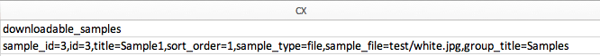

# downloadbare producten importeren

De stroom voor het invoeren van downloadbare producten is het zelfde als voor [Bundel producten](data-transfer-bundle-products.md) of [Configureerbare producten](data-transfer-configurable-products.md). Het verschil is dat een downloadbaar product [downloadbare koppelingen](../catalog/product-create-downloadable.md) en [downloadbare voorbeelden](../catalog/product-create-downloadable.md) met de afbeeldingen.

De standaardhoofdmap voor downloadbare koppelingen en voorbeelden is `<Magento-root-folder>/pub/media/import`. Als de externe opslagmodule is ingeschakeld, is de standaardhoofdmap voor downloadbare koppelingen en voorbeelden de standaardhoofdmap `<remote-storage-root-folder>/media/import` directory.

Het CSV-bestand heeft aparte kolommen voor `downloadable_links` en `downloadable_samples`.

- **Downloadbare koppelingsafbeeldingen** — In het volgende voorbeeld kunnen koppelingsafbeeldingen worden gedownload (`red.jpg` en `black.jpg`) in de `<Magento-root-folder>/pub/media/import/test` map. Als externe opslag is ingeschakeld, bevinden deze afbeeldingen zich in de `<remote-storage-root-folder>/media/import/test` map.

  {width="600" zoomable="yes"}

- **Downloadbare voorbeeldafbeeldingen** — In het volgende voorbeeld wordt de te downloaden voorbeeldafbeelding (`white.jpg`) bevindt zich in de `<Magento-root-folder>/pub/media/import/test` map. Als externe opslag is ingeschakeld, bevindt deze afbeelding zich in de `<remote-storage-root-folder>/media/import/test` map.

  {width="400" zoomable="yes"}

Ga voor meer informatie over het inschakelen en beheren van de externe opslagmodule naar [Externe opslag configureren](https://experienceleague.adobe.com/docs/commerce-operations/configuration-guide/storage/remote-storage/remote-storage.html) in de _Configuratiegids_.
