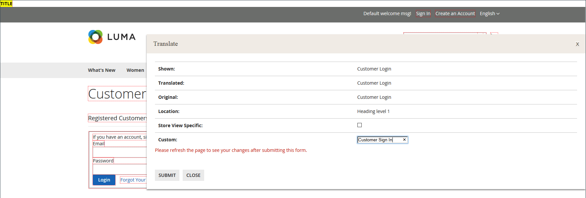

# Gereedschappen voor ontwikkelaars

Gebruik de geavanceerde ontwikkelaarshulpmiddelen om de compilatiemodus tijdens frontend ontwikkeling te bepalen, een lijst van gewenste personen van IP adressen, en de wenken van de de wegweg van het vertoningsmalplaatje te creëren. Er is ook een gereedschap waarmee u eenvoudig steunwijzigingen in de tekst in de interface van de winkel en Admin kunt aanbrengen.

- [Handelingenlogboeken](action-log.md)  (alleen Adobe Commerce)
- [Frontend Development Workflow](#frontend-development-workflow)
- [Statische bestandshandtekeningen gebruiken](#static-file-signatures)
- [Optimalisatie van bronbestanden](#optimizing-resource-files)
- [Beperkingen voor ontwikkelaarsclient](#client-restrictions)
- [Tips voor sjabloonpad](#template-path-hints)
- [Inline vertalen](#translate-inline)

## Bewerkingsmodi

Uw Adobe Commerce- of Magento Open Source-instantie kan worden geïmplementeerd om te worden uitgevoerd in _productie_ of _ontwikkelmodus_. De hulpmiddelen en configuratiemontages die specifiek voor ontwikkelaars worden ontworpen kunnen slechts worden betreden terwijl de opslag binnen loopt _ontwikkelmodus_.

De bewerkingsmodus kan alleen worden gewijzigd vanaf de opdrachtregel van de server door een gebruiker met de juiste machtigingen. Zie [De bewerkingsmodus instellen](https://experienceleague.adobe.com/docs/commerce-operations/configuration-guide/cli/set-mode.html) in de _Configuratiegids_ voor meer informatie .

De meeste onderwerpen in de handelsdocumentatie zijn op een instantie van de Handel van toepassing die op productiemodus loopt. Nochtans, kunnen de volgende configuratiemontages en de hulpmiddelen slechts worden gebruikt wanneer de installatie op ontwikkelaarwijze loopt.

## Workflow voor ontwikkeling vóór

Het stroomtype van het Werkschema van de Ontwikkeling Frontend bepaalt als Minder compilatie op cliënt- of serverkant tijdens ontwikkeling plaatsvindt. Minder is een uitbreiding van CSS die extra eigenschappen en overeenkomsten heeft, en die gestroomlijnde code produceert. Minder compilatie aan de clientzijde wordt aanbevolen voor de ontwikkeling van thema&#39;s. De server-zijcompilatie is de standaardwijze. De opties voor de ontwikkelingswerkstroom zijn niet beschikbaar voor winkels in de productiemodus.
Zie [LESS-compilatie aan clientzijde versus server-side](https://developer.adobe.com/commerce/frontend-core/guide/css/quickstart/compilation-mode/){:target=&quot;_blank&quot;} in de documentatie voor ontwikkelaars van Commerce.

>[!NOTE]
>
>De configuratie van de ontwikkelworkflow vooraf is beschikbaar in [Modus Ontwikkelaar](../systems/developer-tools.md#operation-modes) alleen.

{width="600" zoomable="yes"}

1. Op de _Beheerder_ zijbalk, ga naar **[!UICONTROL Stores]** > _[!UICONTROL Settings]_>**[!UICONTROL Configuration]**.

1. Vouw in het linkerdeelvenster uit **[!UICONTROL Advanced]** en kiest u **[!UICONTROL Developer]**.

1. Uitbreiden  de **[!UICONTROL Front-end Development Workflow]** sectie.

1. Set **[!UICONTROL Workflow Type]** op een van de volgende wijzen:

   - `Client side less compilation` - Compilatie vindt plaats in de browser met behulp van de native `less.js` bibliotheek.
   - `Server side less compilation` - Compilatie vindt plaats op de server met behulp van de Minder PHP bibliotheek. Dit is de standaardmodus voor productie.

1. Klik op **[!UICONTROL Save Config]**.

## Statische bestandshandtekeningen

Door een digitale handtekening toe te voegen aan de URL van statische bestanden, kunnen browsers detecteren wanneer een nieuwere versie van het bestand beschikbaar is. Statische bestanden die met digitale handtekeningen kunnen worden bijgehouden, zijn onder andere JavaScript, CSS, afbeeldingen en lettertypen. De handtekening wordt direct na de basis-URL aan het pad toegevoegd. Als de handtekening van een bestand afwijkt van die in de cache van de browser, wordt de nieuwere versie van het bestand gebruikt.

Zie [Statische ondertekening van inhoud](https://experienceleague.adobe.com/docs/commerce-operations/configuration-guide/cache/static-content-signing.html){:target=&quot;_blank&quot;} in de documentatie voor ontwikkelaars van Commerce.

>[!NOTE]
>
>De statische configuratie van de Montages van het Dossier is beschikbaar slechts wanneer het werken in [ontwikkelmodus](../systems/developer-tools.md#operation-modes).

{width="600" zoomable="yes"}

Voor een gedetailleerde lijst van de configuratiemontages, zie [_Statische bestandsinstellingen_](../configuration-reference/advanced/developer.md) in de _Configuratieverwijzing_.

**_Ondertekende statische bestanden inschakelen:_**

1. Op de _Beheerder_ zijbalk, ga naar **[!UICONTROL Stores]** > _[!UICONTROL Settings]_>**[!UICONTROL Configuration]**.

1. Vouw in het linkerdeelvenster uit **[!UICONTROL Advanced]** en kiest u **[!UICONTROL Developer]**.

1. Uitbreiden  de **[!UICONTROL Static Files Settings]** sectie.

1. Set **[!UICONTROL Sign Static Files]** tot `Yes`.

1. Klik op **[!UICONTROL Save Config]**.

## Optimalisatie van bronbestanden

De tijd die nodig is om bronbestanden te laden, kan worden verkort door bestanden samen te voegen en te bundelen en door code te minimaliseren.

- Bij het samenvoegen worden afzonderlijke bestanden van hetzelfde type gecombineerd tot één bestand.
- Bundelen is een techniek waarbij afzonderlijke bestanden worden gegroepeerd om het aantal HTTP-aanvragen te verminderen dat nodig is om een pagina te laden.
- Met Minificatie verwijdert u spaties, regeleinden en opmerkingen, maar dit heeft geen invloed op de functionaliteit van de code. Omdat geminimaliseerde bestanden niet kunnen worden bewerkt, dient u het proces alleen toe te passen wanneer u klaar bent om in productie te gaan.

Standaard voegen Adobe Commerce en Magento Open Source geen bestanden samen, bundelen of minimaliseren, en de projectontwikkelaar moet dan bepalen welke methoden voor het optimaliseren van bestanden moeten worden gebruikt.

Zie [Best practices voor prestaties](https://experienceleague.adobe.com/docs/commerce-operations/performance-best-practices/overview.html) voor meer informatie .

>[!NOTE]
>
>CSS- en JavaScript-bestanden kunnen worden geoptimaliseerd in [Modus voor ontwikkelaars](../systems/developer-tools.md#operation-modes) alleen.

| Bestandstype | Ondersteunde bewerkingen |
| --------------- | -------------------- |
| CSS-bestanden | `MergeMinify` |
| JavaScript-bestanden | `MergeBundleMinify` |
| Sjabloonbestanden | `Minify` |

{style="table-layout:auto"}

**_Bronbestanden optimaliseren:_**

1. Op de _Beheerder_ zijbalk, ga naar **[!UICONTROL Stores]** > _[!UICONTROL Settings]_>**[!UICONTROL Configuration]**.

1. Vouw in het linkerdeelvenster uit **[!UICONTROL Advanced]** en kiest u **[!UICONTROL Developer]**.

1. Als u CSS-bestanden wilt optimaliseren, vouwt u  de **[!UICONTROL CSS Settings]** en voer de volgende handelingen uit:

   - Set **[!UICONTROL Merge CSS Files]** tot `Yes`.
   - Set **[!UICONTROL Minify CSS Files]** tot `Yes`.

   {width="600" zoomable="yes"}

[_CSS-instellingen_](../configuration-reference/advanced/developer.md)

1. Vouw om JavaScript-bestanden te optimaliseren  de **[!UICONTROL JavaScript Settings]** en voer de volgende handelingen uit:

   - Set **[!UICONTROL Merge JavaScript Files]** tot `Yes`.
   - Set **[!UICONTROL Minify JavaScript Files]** tot `Yes`.

   {width="600" zoomable="yes"}

1. Als u PHTML-sjabloonbestanden wilt miniaturen, vouwt u  de **[!UICONTROL Template Settings]** sectie en set **[!UICONTROL Minify Html]** tot `Yes`.

   {width="600" zoomable="yes"}

1. Klik op **[!UICONTROL Save Config]**.

## Clientbeperkingen

Voordat u een gereedschap zoals [tips voor sjabloonpaden](#template-path-hints), zorg ervoor om uw IP adres aan de lijst van gewenste personen van de Beperkingen van de Cliënt van de Ontwikkelaar toe te voegen om de het winkelen ervaring van klanten in de opslag te verhinderen te verstoren. Als u uw IP adres niet kent, kunt u naar het online zoeken.

>[!NOTE]
>
>De Beperkingen van de Cliënt van de ontwikkelaar kunnen in worden geplaatst [Modus voor ontwikkelaars](../systems/developer-tools.md#operation-modes) alleen.

Voor technische informatie, zie [Aangepaste VCL voor het toestaan van aanvragen](https://experienceleague.adobe.com/docs/commerce-cloud-service/user-guide/cdn/custom-vcl-snippets/fastly-vcl-allowlist.html) in de _Handleiding voor handel in Cloud-infrastructuur_.

**_Om uw IP adres aan de lijst van gewenste personen toe te voegen:_**

1. Op de _Beheerder_ zijbalk, ga naar **[!UICONTROL Stores]** > _[!UICONTROL Settings]_>**[!UICONTROL Configuration]**.

1. Vouw in het linkerdeelvenster uit **[!UICONTROL Advanced]** en kiest u **[!UICONTROL Developer]**.

1. Uitbreiden  de **[!UICONTROL Developer Client Restrictions]** sectie.

   {width="600" zoomable="yes"}

1. Voor **[!UICONTROL Allow IPs]**, voer uw IP-adres in.

   Als de toegang van veelvoudige IP adressen nodig is, scheidt elk met een komma.

1. Klik op **[!UICONTROL Save Config]**.

1. Vernieuw bij de aanwijzing eventuele ongeldige caches.

## Tips voor sjabloonpad

Tips voor sjabloonpaden zijn een diagnostisch hulpmiddel dat notatie toevoegt aan het pad naar elke sjabloon die op de pagina wordt gebruikt. Tips voor sjabloonpaden kunnen worden ingeschakeld voor de winkel of de beheerder.

>[!NOTE]
>
>Tips voor sjabloonpaden kunnen worden bewerkt in [ontwikkelmodus](../systems/developer-tools.md#operation-modes) alleen.

Zie [Sjablonen, lay-outs en stijlen zoeken](https://developer.adobe.com/commerce/frontend-core/guide/themes/debug/){:target=&quot;_blank&quot;} in de documentatie voor ontwikkelaars van Commerce.

{width="700" zoomable="yes"}

### Stap 1: Voeg uw IP adres aan de lijst van gewenste personen toe

Voordat u tips voor sjabloonpaden kunt gebruiken, voegt u uw IP-adres toe aan de [lijst van gewenste personen](#client-restrictions) om interferentie met klanten die in de winkel winkelen te voorkomen. Wanneer u wordt gebeëindigd, zorg ervoor om het geheime voorgeheugen van de Handel te ontruimen om alle wenken uit de opslag te verwijderen.

{width="600" zoomable="yes"}

### Stap 2: tips voor sjabloonpaden inschakelen

1. Op de _Beheerder_ zijbalk, ga naar **[!UICONTROL Stores]** > _[!UICONTROL Settings]_>**[!UICONTROL Configuration]**.

1. Vouw in het linkerdeelvenster uit **[!UICONTROL Advanced]** en kiest u **[!UICONTROL Developer]**.

1. Uitbreiden  de **[!UICONTROL Debug]** en voer de volgende handelingen uit:

   {width="600" zoomable="yes"}

   - Als u padhints voor de winkel wilt activeren, stelt u **[!UICONTROL Enabled Template Path Hints for Storefront]** tot `Yes`.

   - Om malplaatjewegwenken voor de opslag slechts toe te laten wanneer URL omvat `templatehints` parameter, set **Tips inschakelen voor Storefront met URL-parameter** tot `Yes`. Stel vervolgens indien nodig waarde voor de parameter in. De standaardwaarde is `magento`, maar u kunt een aangepaste waarde gebruiken. Als u bijvoorbeeld de waarde wijzigt in `lorem`, gebruikt u `mymagento.com?templatehints=lorem` om sjabloonhints weer te geven.

   - Als u padtips voor sjablonen voor de beheerder wilt activeren, stelt u **[!UICONTROL Enabled Template Path Hints for Admin]** tot `Yes`.

   - Als u de namen van blokken wilt opnemen, stelt u **[!UICONTROL Add Block Class Type to Hints]** tot `Yes`.

1. Klik op **[!UICONTROL Save Config]**.

### Stap 3: De cache wissen

1. Op de _Beheerder_ zijbalk, ga naar **[!UICONTROL System]** > _[!UICONTROL Tools]_>**[!UICONTROL Cache Management]**.

1. Klik in de rechterbovenhoek op **[!UICONTROL Flush Magento Cache]**.

## Inline vertalen

U kunt het gereedschap Inline vertalen gebruiken in [ontwikkelmodus](../systems/developer-tools.md#operation-modes) om de tekst in de interface aan te passen aan uw stem en merk. Wanneer de modus Inline omzetten is geactiveerd, wordt alle tekst op de pagina die kan worden bewerkt, in rood omlijnd. Het is gemakkelijk om gebiedslabels, berichten, en andere tekst uit te geven die door storefront en Admin verschijnt. Veel thema&#39;s gebruiken bijvoorbeeld terminologie, zoals _Mijn account_, _Mijn lijst_, en _Mijn dashboard_, om klanten te helpen hun weg te vinden. Misschien wilt u echter liever gewoon de woorden gebruiken _Account_, _Wishlist_, en _Dashboard_.

>[!NOTE]
>
>Het gereedschap Inline vertalen is alleen beschikbaar wanneer u in [ontwikkelmodus](../systems/developer-tools.md#operation-modes).

Zie [Overzicht van vertalingen](https://developer.adobe.com/commerce/frontend-core/guide/translations/) in de documentatie voor de ontwikkeling van de handel.

{width="700" zoomable="yes"}

Als uw winkel in meerdere talen beschikbaar is, kunt u de vertaalde tekst voor de landinstelling nauwkeurig aanpassen. Op de server wordt de interfacetekst onderhouden in een apart CSV-bestand voor elk uitvoerblok en wordt deze geordend door de landinstelling. Als alternatieve benadering in plaats van de _Inline vertalen_ kunt u de CSV-bestanden ook rechtstreeks op de server bewerken. Vertaalbestanden worden opgeslagen in `app/code/Magento/<module_name>/i18n/<language_locale>.csv`.

>[!NOTE]
>
>Als u het gereedschap Inline vertalen wilt gebruiken, moet uw browser pop-ups toestaan.

### Stap 1: Uitvoercache uitschakelen

1. Op de _Beheerder_ zijbalk, ga naar **[!UICONTROL System]** > _[!UICONTROL Tools]_>**[!UICONTROL Cache Management]**.

1. Selecteer de volgende selectievakjes:

   - `Blocks HTML output`
   - `Page Cache`
   - `Translations`

1. Stel de **[!UICONTROL Actions]** controle op `Disable` en klik op **[!UICONTROL Submit]**.

### Stap 2: Het gereedschap Inline transleren inschakelen

1. Op de _Beheerder_ zijbalk, ga naar **[!UICONTROL Stores]** > _[!UICONTROL Settings]_>**[!UICONTROL Configuration]**.

1. Als u met een specifieke winkelweergave wilt werken, stelt u de optie **[!UICONTROL Store View]** bij te werken.

1. Vouw in het linkerdeelvenster uit **[!UICONTROL Advanced]** en kiest u **[!UICONTROL Developer]**.

1. Uitbreiden  de **[!UICONTROL Translate Inline]** sectie.

   Wis de **[!UICONTROL Use Website]** Schakel het selectievakje naar wens in om deze instellingen te wijzigen.

   De _[!UICONTROL Enabled for Admin]_Deze optie is niet beschikbaar wanneer u een specifieke winkelweergave bewerkt.

   {width="600" zoomable="yes"}

1. Set **[!UICONTROL Enabled for Storefront]** tot `Yes`.

1. Klik op **[!UICONTROL Save Config]**.

1. Vernieuw desgevraagd de ongeldige caches, maar laat de uitgeschakelde caches ongewijzigd.

### Stap 3: De tekst bijwerken

1. Open de winkel in een browser en ga naar de pagina die u wilt bewerken.

   Gebruik indien nodig de taalkiezer om de winkelweergave te wijzigen. Elke tekstreeks die kan worden vertaald, wordt in rood omlijnd. Wanneer u de cursor op een tekstvak plaatst, verschijnt er een boekpictogram (  ) wordt weergegeven.

1. Klik op het boekpictogram om het dialoogvenster _Vertalen_ en voer de volgende handelingen uit:

   - Als de wijziging geldt voor de specifieke winkelweergave, selecteert u de optie **[!UICONTROL Store View Specific]** selectievakje.

   - Voer de nieuwe **[!UICONTROL Custom]** tekst.

1. Klik op **[!UICONTROL Submit]**.

   {width="700" zoomable="yes"}

1. Vernieuw de browser om de wijzigingen in de winkel te zien.

1. Herhaal dit proces voor alle elementen in de winkel die moeten worden gewijzigd.

### Stap 4: De oorspronkelijke instellingen herstellen

1. Ga terug naar de beheerder van uw winkel.

1. Op de _Beheerder_ zijbalk, ga naar **[!UICONTROL Stores]** > _[!UICONTROL Settings]_>**[!UICONTROL Configuration]**.

1. Set **[!UICONTROL Store View]** naar de specifieke weergave die is bewerkt.

1. Vouw in het linkerdeelvenster uit **[!UICONTROL Advanced]** en kiest u **[!UICONTROL Developer]**.

1. Uitbreiden  de **[!UICONTROL Translate Inline]** sectie.

1. Set **[!UICONTROL Enabled for Frontend]** tot `No`.

1. Klik op **[!UICONTROL Save Config]**.

1. Op de _Beheerder_ zijbalk, ga naar **[!UICONTROL System]** > _[!UICONTROL Tools]_>**[!UICONTROL Cache Management]**.

1. Schakel het selectievakje in van de volgende uitvoercache die eerder was uitgeschakeld:

   - `Blocks HTML output`
   - `Page Cache`
   - `Translations`

1. Stel de **[!UICONTROL Actions]** controle op `Enable` en klik op **[!UICONTROL Submit]**.

1. Vernieuw bij de aanwijzing eventuele ongeldige caches.

### Stap 5: controleer de wijzigingen in uw winkel

Ga naar de winkel en bekijk elke pagina die is bijgewerkt om te controleren of de wijzigingen correct zijn. In dit voorbeeld: `Customer Login` is gewijzigd in `Customer Sign In`. Als er wijzigingen zijn aangebracht in een specifieke weergave, gebruikt u Taalkiezer om over te schakelen naar de juiste weergave.

{width="700" zoomable="yes"}
