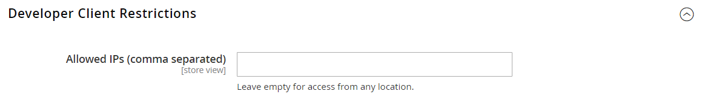

# Gereedschappen voor ontwikkelaars

Gebruik de geavanceerde ontwikkelaarshulpmiddelen om de compilatiemodus tijdens frontend ontwikkeling te bepalen, een lijst van gewenste personen van IP adressen, en de wenken van de de wegweg van het vertoningsmalplaatje te creëren. Er is ook een gereedschap waarmee u eenvoudig steunwijzigingen in de tekst in de interface van de winkel en Admin kunt aanbrengen.

- [ Logboeken van de Actie ](action-log.md)  (slechts Adobe Commerce)
- [Frontend Development Workflow](#frontend-development-workflow)
- [Statische bestandshandtekeningen gebruiken](#static-file-signatures)
- [Optimalisatie van bronbestanden](#optimizing-resource-files)
- [Beperkingen voor ontwikkelaarsclient](#client-restrictions)
- [Tips voor sjabloonpad](#template-path-hints)
- [Inline vertalen](#translate-inline)

## Bewerkingsmodi

Uw instantie van Adobe Commerce of van Magento Open Source kan worden opgesteld om in of _productie_ of _ontwikkelaarwijze_ in werking te stellen. De hulpmiddelen en configuratiemontages die specifiek voor ontwikkelaars worden ontworpen kunnen worden betreden slechts terwijl de opslag op _ontwikkelaarwijze_ loopt.

De bewerkingsmodus kan alleen worden gewijzigd vanaf de opdrachtregel van de server door een gebruiker met de juiste machtigingen. Zie [ plaats de verrichtingswijze ](https://experienceleague.adobe.com/docs/commerce-operations/configuration-guide/cli/set-mode.html?lang=nl-NL) in de _Gids van de Configuratie_ voor meer informatie.

De meeste onderwerpen in de handelsdocumentatie zijn op een instantie van Commerce van toepassing die op productiemodus loopt. Nochtans, kunnen de volgende configuratiemontages en de hulpmiddelen slechts worden gebruikt wanneer de installatie op ontwikkelaarwijze loopt.

## Workflow voor ontwikkeling vóór

Het stroomtype van het Werkschema van de Ontwikkeling Frontend bepaalt als Minder compilatie op cliënt- of serverkant tijdens ontwikkeling plaatsvindt. Minder is een uitbreiding van CSS die extra eigenschappen en overeenkomsten heeft, en die gestroomlijnde code produceert. Minder compilatie aan de clientzijde wordt aanbevolen voor de ontwikkeling van thema&#39;s. De server-zijcompilatie is de standaardwijze. De opties voor de ontwikkelingswerkstroom zijn niet beschikbaar voor winkels in de productiemodus.
Zie [ Cliënt-kant LESS compilatie vs. server-kant ](https://developer.adobe.com/commerce/frontend-core/guide/css/quickstart/compilation-mode/){:target="_blank"} in de de ontwikkelaarsdocumentatie van Commerce.

>[!NOTE]
>
>De configuratie van het vooruitgangsontwikkelingswerkschema is beschikbaar op [ wijze van de Ontwikkelaar ](../systems/developer-tools.md#operation-modes) slechts.

{width="600" zoomable="yes"}

1. Voor _Admin_ sidebar, ga **[!UICONTROL Stores]** > _[!UICONTROL Settings]_>**[!UICONTROL Configuration]**.

1. Vouw in het linkerdeelvenster **[!UICONTROL Advanced]** uit en kies **[!UICONTROL Developer]** .

1. Breid  de **[!UICONTROL Front-end Development Workflow]** sectie uit.

1. Stel **[!UICONTROL Workflow Type]** in op een van de volgende opties:

   - `Client side less compilation` - Compilatie vindt plaats in de browser met behulp van de native `less.js` -bibliotheek.
   - `Server side less compilation` - Compilatie vindt plaats op de server met behulp van de Minder PHP-bibliotheek. Dit is de standaardmodus voor productie.

1. Klik op **[!UICONTROL Save Config]** als de bewerking is voltooid.

## Statische bestandshandtekeningen

Door een digitale handtekening toe te voegen aan de URL van statische bestanden, kunnen browsers detecteren wanneer een nieuwere versie van het bestand beschikbaar is. Statische bestanden die kunnen worden bijgehouden met digitale handtekeningen zijn onder andere JavaScript, CSS, afbeeldingen en lettertypen. De handtekening wordt direct na de basis-URL aan het pad toegevoegd. Als de handtekening van een bestand afwijkt van die in de cache van de browser, wordt de nieuwere versie van het bestand gebruikt.

Zie [ Statische inhoud ondertekenend ](https://experienceleague.adobe.com/docs/commerce-operations/configuration-guide/cache/static-content-signing.html?lang=nl-NL){:target="_blank"} in de de ontwikkelaarsdocumentatie van Commerce.

>[!NOTE]
>
>De statische configuratie van de Montages van het Dossier is beschikbaar slechts wanneer het werken op [ ontwikkelaarwijze ](../systems/developer-tools.md#operation-modes).

{width="600" zoomable="yes"}

Voor een gedetailleerde lijst van de configuratiemontages, zie [_de Statische Montages van het Dossier_](../configuration-reference/advanced/developer.md) in de _Verwijzing van de Configuratie_.

**_om ondertekende statische dossiers toe te laten:_**

1. Voor _Admin_ sidebar, ga **[!UICONTROL Stores]** > _[!UICONTROL Settings]_>**[!UICONTROL Configuration]**.

1. Vouw in het linkerdeelvenster **[!UICONTROL Advanced]** uit en kies **[!UICONTROL Developer]** .

1. Breid  de **[!UICONTROL Static Files Settings]** sectie uit.

1. Stel **[!UICONTROL Sign Static Files]** in op `Yes` .

1. Klik op **[!UICONTROL Save Config]** als de bewerking is voltooid.

## Optimalisatie van bronbestanden

De tijd die nodig is om bronbestanden te laden, kan worden verkort door bestanden samen te voegen en te bundelen en door code te minimaliseren.

- Bij het samenvoegen worden afzonderlijke bestanden van hetzelfde type gecombineerd tot één bestand.
- Bundelen is een techniek waarbij afzonderlijke bestanden worden gegroepeerd om het aantal HTTP-aanvragen te verminderen dat nodig is om een pagina te laden.
- Met Minificatie verwijdert u spaties, regeleinden en opmerkingen, maar dit heeft geen invloed op de functionaliteit van de code. Omdat geminimaliseerde bestanden niet kunnen worden bewerkt, dient u het proces alleen toe te passen wanneer u klaar bent om in productie te gaan.

Standaard voegen Adobe Commerce en Magento Open Source geen bestanden samen, bundelen of minimaliseren, en de projectontwikkelaar moet dan bepalen welke methoden voor het optimaliseren van bestanden moeten worden gebruikt.

Zie [ beste praktijken van Prestaties ](https://experienceleague.adobe.com/docs/commerce-operations/performance-best-practices/overview.html?lang=nl-NL) voor meer informatie.

>[!NOTE]
>
>CSS en de dossiers van JavaScript kunnen op [ slechts Modus van de Ontwikkelaar worden geoptimaliseerd ](../systems/developer-tools.md#operation-modes).

| Bestandstype | Ondersteunde bewerkingen |
| --------------- | -------------------- |
| CSS-bestanden | `MergeMinify` |
| JavaScript-bestanden | `MergeBundleMinify` |
| Sjabloonbestanden | `Minify` |

{style="table-layout:auto"}

**_om middeldossiers te optimaliseren:_**

1. Voor _Admin_ sidebar, ga **[!UICONTROL Stores]** > _[!UICONTROL Settings]_>**[!UICONTROL Configuration]**.

1. Vouw in het linkerdeelvenster **[!UICONTROL Advanced]** uit en kies **[!UICONTROL Developer]** .

1. Om CSS dossiers te optimaliseren, breid  de **[!UICONTROL CSS Settings]** sectie uit en doe het volgende:

   - Stel **[!UICONTROL Merge CSS Files]** in op `Yes` .
   - Stel **[!UICONTROL Minify CSS Files]** in op `Yes` .

   {width="600" zoomable="yes"}

[_CSS-instellingen_](../configuration-reference/advanced/developer.md)

1. Om de dossiers van JavaScript te optimaliseren, breid  de **[!UICONTROL JavaScript Settings]** sectie uit en doe het volgende:

   - Stel **[!UICONTROL Merge JavaScript Files]** in op `Yes` .
   - Stel **[!UICONTROL Minify JavaScript Files]** in op `Yes` .

   {width="600" zoomable="yes"}

1. Om PHTML- malplaatjedossiers te minimaliseren, breid  de **[!UICONTROL Template Settings]** sectie uit en reeks **[!UICONTROL Minify Html]** aan `Yes`.

   {width="600" zoomable="yes"}

1. Klik op **[!UICONTROL Save Config]** als de bewerking is voltooid.

## Clientbeperkingen

Alvorens een hulpmiddel zoals [ wenken van de malplaatjeweg ](#template-path-hints) te gebruiken, zorg ervoor om uw IP adres aan de lijst van gewenste personen van de Beperkingen van de Cliënt van de Ontwikkelaar toe te voegen om het het winkelen ervaring van klanten in de opslag niet te verstoren. Als u uw IP adres niet kent, kunt u naar het online zoeken.

>[!NOTE]
>
>De Beperkingen van de Cliënt van de ontwikkelaar kunnen op [ slechts de Wijze van de Ontwikkelaar ](../systems/developer-tools.md#operation-modes) worden geplaatst.

Voor technische informatie, zie [ Douane VCL voor het toestaan van verzoeken ](https://experienceleague.adobe.com/docs/commerce-cloud-service/user-guide/cdn/custom-vcl-snippets/fastly-vcl-allowlist.html?lang=nl-NL) in _Commerce op de Gids van de Infrastructuur van de Wolk_.

**_om uw IP adres aan de lijst van gewenste personen toe te voegen:_**

1. Voor _Admin_ sidebar, ga **[!UICONTROL Stores]** > _[!UICONTROL Settings]_>**[!UICONTROL Configuration]**.

1. Vouw in het linkerdeelvenster **[!UICONTROL Advanced]** uit en kies **[!UICONTROL Developer]** .

1. Breid  de **[!UICONTROL Developer Client Restrictions]** sectie uit.

   {width="600" zoomable="yes"}

1. Voer bij **[!UICONTROL Allow IPs]** uw IP-adres in.

   Als de toegang van veelvoudige IP adressen nodig is, scheidt elk met een komma.

1. Klik op **[!UICONTROL Save Config]** als de bewerking is voltooid.

1. Vernieuw bij de aanwijzing eventuele ongeldige caches.

## Tips voor sjabloonpad

Tips voor sjabloonpaden zijn een diagnostisch hulpmiddel dat notatie toevoegt aan het pad naar elke sjabloon die op de pagina wordt gebruikt. Tips voor sjabloonpaden kunnen worden ingeschakeld voor de winkel of de beheerder.

>[!NOTE]
>
>De wenken van de Weg van het malplaatje kunnen op [ ontwikkelaarwijze ](../systems/developer-tools.md#operation-modes) slechts worden uitgegeven.

Zie [ plaats malplaatjes, lay-outs, en stijlen ](https://developer.adobe.com/commerce/frontend-core/guide/themes/debug/){:target="_blank"} in de de ontwikkelaarsdocumentatie van Commerce.

{width="700" zoomable="yes"}

### Stap 1: Voeg uw IP adres aan de lijst van gewenste personen toe

Alvorens de wenken van de malplaatjeweg te gebruiken, voeg uw IP adres aan de [ lijst van gewenste personen ](#client-restrictions) toe om interferentie met klanten te vermijden die in de opslag winkelen. Als u klaar bent, wist u de Commerce-cache om alle tips uit de winkel te verwijderen.

{width="600" zoomable="yes"}

### Stap 2: tips voor sjabloonpaden inschakelen

1. Voor _Admin_ sidebar, ga **[!UICONTROL Stores]** > _[!UICONTROL Settings]_>**[!UICONTROL Configuration]**.

1. Vouw in het linkerdeelvenster **[!UICONTROL Advanced]** uit en kies **[!UICONTROL Developer]** .

1. Breid  de **[!UICONTROL Debug]** sectie uit en doe het volgende:

   {width="600" zoomable="yes"}

   - Stel **[!UICONTROL Enabled Template Path Hints for Storefront]** in op `Yes` om padhints voor de winkel te activeren.

   - Om malplaatjewegwenken voor de opslag toe te laten slechts wanneer URL de `templatehints` parameter omvat, plaats **laat wenken voor Storefront met Parameter URL** aan `Yes` toe. Stel vervolgens indien nodig waarde voor de parameter in. De standaardwaarde is `magento` , maar u kunt een aangepaste waarde gebruiken. Als u bijvoorbeeld de waarde wijzigt in `lorem` , gebruikt u `mymagento.com?templatehints=lorem` om sjabloonhints weer te geven.

   - Als u padhints voor de sjabloon voor de beheerder wilt activeren, stelt u **[!UICONTROL Enabled Template Path Hints for Admin]** in op `Yes` .

   - Als u de namen van blokken wilt opnemen, stelt u **[!UICONTROL Add Block Class Type to Hints]** in op `Yes` .

1. Klik op **[!UICONTROL Save Config]** als de bewerking is voltooid.

### Stap 3: De cache wissen

1. Voor _Admin_ sidebar, ga **[!UICONTROL System]** > _[!UICONTROL Tools]_>**[!UICONTROL Cache Management]**.

1. Klik in de rechterbovenhoek op **[!UICONTROL Flush Magento Cache]** .

## Inline vertalen

U kunt het Translate Inline hulpmiddel op [ ontwikkelaarwijze ](../systems/developer-tools.md#operation-modes) gebruiken om tekst in de interface aan te raken om op uw stem en merk te wijzen. Wanneer de modus Inline omzetten is geactiveerd, wordt alle tekst op de pagina die kan worden bewerkt, in rood omlijnd. Het is gemakkelijk om gebiedslabels, berichten, en andere tekst uit te geven die door storefront en Admin verschijnt. Bijvoorbeeld, gebruiken vele thema&#39;s terminologie zoals _Mijn Rekening_, _Mijn Wishlist_, en _Mijn Dashboard_, om klanten te helpen hun weg vinden rond. Nochtans, zou u kunnen verkiezen om de woorden _Rekening_, _Wishlist_, en _Dashboard_ eenvoudig te gebruiken.

>[!NOTE]
>
>Het vertaalde Inline hulpmiddel is beschikbaar slechts wanneer het werken op [ ontwikkelaarwijze ](../systems/developer-tools.md#operation-modes).

Zie [ Overzicht van Vertalingen ](https://developer.adobe.com/commerce/frontend-core/guide/translations/) in de de ontwikkelaarsdocumentatie van Commerce.

{width="700" zoomable="yes"}

Als uw winkel in meerdere talen beschikbaar is, kunt u de vertaalde tekst voor de landinstelling nauwkeurig aanpassen. Op de server wordt de interfacetekst onderhouden in een apart CSV-bestand voor elk uitvoerblok en wordt deze geordend door de landinstelling. Als afwisselende benadering, eerder dan gebruik het _Vertaal Inline_ hulpmiddel, kunt u de Csv- dossiers direct op de server ook uitgeven. Vertaalbestanden worden opgeslagen in `app/code/Magento/<module_name>/i18n/<language_locale>.csv` .

>[!NOTE]
>
>Als u het gereedschap Inline vertalen wilt gebruiken, moet uw browser pop-ups toestaan.

### Stap 1: Uitvoercache uitschakelen

1. Voor _Admin_ sidebar, ga **[!UICONTROL System]** > _[!UICONTROL Tools]_>**[!UICONTROL Cache Management]**.

1. Selecteer de volgende selectievakjes:

   - `Blocks HTML output`
   - `Page Cache`
   - `Translations`

1. Stel het besturingselement **[!UICONTROL Actions]** in op `Disable` en klik op **[!UICONTROL Submit]** .

### Stap 2: Het gereedschap Inline transleren inschakelen

1. Voor _Admin_ sidebar, ga **[!UICONTROL Stores]** > _[!UICONTROL Settings]_>**[!UICONTROL Configuration]**.

1. Als u met een specifieke winkelweergave wilt werken, stelt u de **[!UICONTROL Store View]** in die u wilt bijwerken.

1. Vouw in het linkerdeelvenster **[!UICONTROL Advanced]** uit en kies **[!UICONTROL Developer]** .

1. Breid  de **[!UICONTROL Translate Inline]** sectie uit.

   Schakel indien nodig het selectievakje **[!UICONTROL Use Website]** uit om deze instellingen te wijzigen.

   De optie _[!UICONTROL Enabled for Admin]_&#x200B;is niet beschikbaar wanneer u een specifieke opslagweergave bewerkt.

   {width="600" zoomable="yes"}

1. Stel **[!UICONTROL Enabled for Storefront]** in op `Yes` .

1. Klik op **[!UICONTROL Save Config]** als de bewerking is voltooid.

1. Vernieuw desgevraagd de ongeldige caches, maar laat de uitgeschakelde caches ongewijzigd.

### Stap 3: De tekst bijwerken

1. Open de winkel in een browser en ga naar de pagina die u wilt bewerken.

   Gebruik indien nodig de taalkiezer om de winkelweergave te wijzigen. Elke tekstreeks die kan worden vertaald, wordt in rood omlijnd. Wanneer u over om het even welk tekstvakje beweegt, verschijnt een boekpictogram ( ).

1. Klik het boekpictogram om het _Vertaal_ venster te openen en het volgende te doen:

   - Als de wijziging geldt voor de specifieke winkelweergave, schakelt u het selectievakje **[!UICONTROL Store View Specific]** in.

   - Voer de nieuwe **[!UICONTROL Custom]** tekst in.

1. Klik op **[!UICONTROL Submit]** als de bewerking is voltooid.

   {width="700" zoomable="yes"} in

1. Vernieuw de browser om de wijzigingen in de winkel te zien.

1. Herhaal dit proces voor alle elementen in de winkel die moeten worden gewijzigd.

### Stap 4: De oorspronkelijke instellingen herstellen

1. Ga terug naar de beheerder van uw winkel.

1. Voor _Admin_ sidebar, ga **[!UICONTROL Stores]** > _[!UICONTROL Settings]_>**[!UICONTROL Configuration]**.

1. Stel **[!UICONTROL Store View]** in op de specifieke weergave die is bewerkt.

1. Vouw in het linkerdeelvenster **[!UICONTROL Advanced]** uit en kies **[!UICONTROL Developer]** .

1. Breid  de **[!UICONTROL Translate Inline]** sectie uit.

1. Stel **[!UICONTROL Enabled for Frontend]** in op `No` .

1. Klik op **[!UICONTROL Save Config]** als de bewerking is voltooid.

1. Voor _Admin_ sidebar, ga **[!UICONTROL System]** > _[!UICONTROL Tools]_>**[!UICONTROL Cache Management]**.

1. Schakel het selectievakje in van de volgende uitvoercache die eerder was uitgeschakeld:

   - `Blocks HTML output`
   - `Page Cache`
   - `Translations`

1. Stel het besturingselement **[!UICONTROL Actions]** in op `Enable` en klik op **[!UICONTROL Submit]** .

1. Vernieuw bij de aanwijzing eventuele ongeldige caches.

### Stap 5: controleer de wijzigingen in uw winkel

Ga naar de winkel en bekijk elke pagina die is bijgewerkt om te controleren of de wijzigingen correct zijn. In dit voorbeeld is `Customer Login` gewijzigd in `Customer Sign In` . Als er wijzigingen zijn aangebracht in een specifieke weergave, gebruikt u Taalkiezer om over te schakelen naar de juiste weergave.

{width="700" zoomable="yes"}
