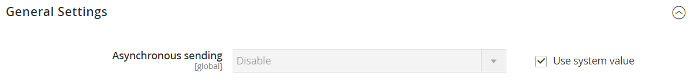

# E-mailcommunicatie configureren

De _Post die Montages_ verzendt geeft u de capaciteit om teruggekeerde e-mail of antwoorden aan e-mail naar een specifiek adres te leiden. Als uw opslag op een server SMTP of van Vensters loopt, kunt u de gastheer en havenmontages verifiëren.

>[!IMPORTANT]
>
>**Bericht van de Veiligheid** Alle handelaren zouden hun post onmiddellijk plaatsen verzendende configuratie tegen onlangs geïdentificeerde potentiële verre codeuitvoering te beschermen uitbuiten. Zolang dit probleem niet is opgelost, wordt u aangeraden [!DNL Sendmail] niet te gebruiken voor e-mailcommunicatie. Controleer in het _[!UICONTROL Mail Sending Settings]_of_[!UICONTROL Set Return Path]_ is ingesteld op `No` .

Voor een gedetailleerde lijst van de configuratiemontages, zie [_[!UICONTROL Mail Sending Settings]_](../configuration-reference/advanced/system.md) in de _Verwijzing van de Configuratie_.

## E-mailcommunicatie configureren

1. Voor _Admin_ sidebar, ga **[!UICONTROL Stores]** > _[!UICONTROL Settings]_>**[!UICONTROL Configuration]**.

1. Vouw in het linkerdeelvenster **[!UICONTROL Advanced]** uit en kies **[!UICONTROL System]** .

1. Breid  de **[!UICONTROL Mail Sending Settings]** sectie uit en doe het volgende:

   {width="600" zoomable="yes"}

   - Indien nodig, stelt u **[!UICONTROL Disable Email Communications]** in op `No` .

   - Kies bij **[!UICONTROL Transport]** het transporttype voor e-mailcommunicatie in de winkel: `Sendmail` of `SMTP`

   - Als het lopen op een server SMTP of van Vensters, verifieer de volgende montages:

      - **[!UICONTROL Host]** - `localhost` of andere

      - **[!UICONTROL Port (25)]** - `25` of andere

   - Kies bij **[!UICONTROL Set Return Path]** een van de volgende opties:

      - `No` - (Aanbevolen beveiligingsmaatregel) Routes hebben een e-mail naar het standaard e-mailadres van de winkel geretourneerd.
      - `Yes` - Routes keerde e-mail naar het standaard e-mailadres van de winkel terug.
      - `Specified` - Routes keerde e-mail terug naar het e-mailadres dat in **[!UICONTROL Return Path Email]** wordt gespecificeerd.

   - Als het lopen op een server SMTP, vorm de verbinding:

      - **[!UICONTROL Username]** - Ga de login gebruikersnaam voor de server SMTP in.
      - **[!UICONTROL Password]** - Voer het wachtwoord voor de SMTP-serveraanmelding in.
      - **[!UICONTROL Auth]** - Kies het verificatietype voor de SMTP-serververbinding: `NONE` , `PLAIN` of `LOGIN`
      - **[!UICONTROL SSL]** - Kies het verificatietype voor het serverbeveiligingscertificaat: `SSL` of `TLS`

     {width="600" zoomable="yes"}

1. Vouw in het linkerdeelvenster **[!UICONTROL Sales]** uit en kies **[!UICONTROL Sales Emails]** .

1. Breid  de **[!UICONTROL General Settings]** sectie uit.

1. Stel **[!UICONTROL Asynchronous sending]** in op `Enable` .

   {width="600" zoomable="yes"}

   Voor een gedetailleerde lijst van de configuratiemontages, zie [_Algemene Montages_](../configuration-reference/sales/sales-emails.md) in de _Verwijzing van de Configuratie_.

1. Klik op **[!UICONTROL Save Config]** als de bewerking is voltooid.
