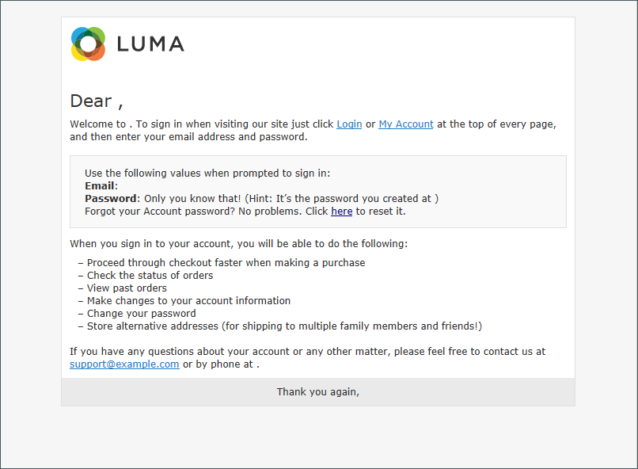

# E-mailsjablonen aanpassen

Commerce bevat een standaard e-mailsjabloon voor de hoofdsectie van elk bericht dat door het systeem wordt verzonden. De sjabloon voor de inhoud van de hoofdtekst wordt gecombineerd met de kop- en voettekstsjablonen om het volledige bericht te maken. De inhoud wordt geformatteerd met HTML en CSS, en kan gemakkelijk worden uitgegeven, en worden aangepast door [ variabelen ](variables-predefined.md) toe te voegen. E-mailsjablonen kunnen worden aangepast voor elke website-, winkel- of winkelweergave. Als het gebruiken van douanesjablonen, zorg ervoor om de [ systeemconfiguratie ](email-templates.md#configure-email-templates) bij te werken om ervoor te zorgen dat het correcte malplaatje wordt gebruikt. Leren hoe u voorwaardelijke verklaringen in het aanpassen van het e-mailmalplaatje kunt gebruiken, zie de [ documentatie van de ontwikkelaar ](https://developer.adobe.com/commerce/frontend-core/guide/templates/email/#theme-based-customizations-1).

{width="500" zoomable="yes"}

De standaardsjablonen bevatten uw logo- en opslaggegevens en kunnen zonder verdere aanpassing worden gebruikt. Nochtans als beste praktijken, zou u elk malplaatje moeten bekijken, en om het even welke noodzakelijke veranderingen aanbrengen alvorens hen naar klanten te verzenden.

- [Koptekstsjabloon](email-template-custom.md#header-template)
- [Sjabloon voor voettekst](email-template-custom.md#footer-template)
- [Berichttemplates](email-template-custom.md#message-templates)

{width="700" zoomable="yes"}

## Sjabloongegevens

| Veld | Beschrijving |
| ----- | ----------- |
| [!UICONTROL Template Name] | De naam van uw aangepaste sjabloon. |
| [!UICONTROL Insert Variable] | Voegt een variabele in het malplaatje bij de cursorplaats in. |
| [!UICONTROL Template Subject] | Het onderwerp van het Malplaatje verschijnt in de Onderwerpkolom, en kan worden gebruikt om de malplaatjes in de lijst te sorteren en te filtreren. |
| [!UICONTROL Template Content] | De inhoud van de sjabloon in HTML. |
| [!UICONTROL Template Styles] | Eventuele CSS-stijldeclaraties die nodig zijn om de sjabloon op te maken, kunnen in het vak _[!UICONTROL Template Styles]_&#x200B;worden ingevoerd. |

{style="table-layout:auto"}

## Koptekstsjabloon

Na de voltooiing van de [ configuratie ](email-templates.md#configure-email-templates), omvat het malplaatje van de e-mailkopbal uw embleem dat met uw opslag wordt verbonden. Als u een basiskennis van HTML hebt, kunt u [ gemakkelijk gebruiken vooraf bepaalde variabelen ](variables-predefined.md) om de informatie van het opslagcontact aan de kopbal toe te voegen.

### Stap 1. De standaardsjabloon laden

1. Voor _Admin_ sidebar, ga **[!UICONTROL Marketing]** > _[!UICONTROL Communications]_>**[!UICONTROL Email Templates]**.

1. Klik op **[!UICONTROL Add New Template]**.

1. Klik in de sectie **[!UICONTROL Load default template]** op de kiezer **[!UICONTROL Template]** en kies `Magento_Email` > `Header` .

   {width="600" zoomable="yes"}

1. Klik op **[!UICONTROL Load Template]**.

   De HTML-code en variabelen uit de sjabloon worden in het formulier weergegeven.

### Stap 2. De sjabloon aanpassen

1. Voer de **[!UICONTROL Template Name]** in voor de aangepaste koptekst.

1. Voer een **[!UICONTROL Template Subject]** in om de sjablonen te ordenen.

   In het raster kan de lijst met sjablonen worden gesorteerd en gefilterd door de kolom _[!UICONTROL Subject]_.

   {width="600" zoomable="yes"}

1. Wijzig in het vak **[!UICONTROL Template Content]** de HTML naar wens.

   >[!NOTE]
   >
   >Als u in de sjablooncode werkt, moet u ervoor zorgen dat u niets overschrijft dat tussen dubbele accolades staat.

1. Om a [ veranderlijke ](variables-reference.md) op te nemen, plaats de curseur in de code waar u de variabele wilt plaatsen en **[!UICONTROL Insert Variable]** klikken.

1. Kies de variabele die u wilt invoegen.

   {width="600" zoomable="yes"}

   Wanneer een variabele wordt geselecteerd, wordt de markering van de a [&#128279;](markup-tags.md) voor de variabele opgenomen in de code.

   Hoewel de variabelen van het Adres van de E-mail van de Opslag het vaakst inbegrepen in de kopbal zijn, kunt u de code voor om het even welk systeem of [ douanevariabele ](variables-custom.md) direct in het malplaatje ingaan.

1. Als u CSS-declaraties wilt maken, voert u de stijlen in het vak **[!UICONTROL Template Styles]** in.

1. Klik op **[!UICONTROL Preview Template]** als u klaar bent om uw werk te bekijken.

   Breng de gewenste wijzigingen in de sjabloon aan.

1. Klik op **[!UICONTROL Save Template]** als de bewerking is voltooid.

   De aangepaste koptekst wordt nu weergegeven in de lijst met beschikbare e-mailsjablonen.

### Stap 3. De configuratie bijwerken

1. Voor _Admin_ sidebar, ga **[!UICONTROL Content]** > _[!UICONTROL Design]_>**[!UICONTROL Configuration]**.

1. Zoek in het raster de winkelweergave die u wilt configureren en klik op **[!UICONTROL Edit]** in de kolom _[!UICONTROL Action]_.

1. De rol neer en breidt  uit de **[!UICONTROL Transactional Emails]** sectie.

1. Kies de **[!UICONTROL Header Template]** die standaard wordt gebruikt voor e-mailberichten.

1. Klik op **[!UICONTROL Save Config]** als de bewerking is voltooid.

{width="600" zoomable="yes"}

## Sjabloon voor voettekst

De voettekst van de e-mailsjabloon bevat de regel voor sluiten en ondertekenen van het e-mailbericht. U kunt de sluiting aanpassen aan uw stijl en aanvullende informatie toevoegen, zoals de bedrijfsnaam en het adres onder uw naam.

### Stap 1. De standaardsjabloon laden

1. Voor _Admin_ sidebar, ga **[!UICONTROL Marketing]** > _[!UICONTROL Communications]_>**[!UICONTROL Email Templates]**.

1. Klik op **[!UICONTROL Add New Template]**.

1. Klik in de sectie **[!UICONTROL Load default template]** op de kiezer **[!UICONTROL Template]** en kies `Magento_Email` > `Footer` .

1. Klik op **[!UICONTROL Load Template]**.

   De HTML-code en variabelen uit de sjabloon worden in het formulier weergegeven.

### Stap 2. De sjabloon aanpassen en voorvertonen

1. Voer de **[!UICONTROL Template Name]** in voor de aangepaste voettekst.

1. Voer een **[!UICONTROL Template Subject]** in om de sjablonen te ordenen.

   In het raster kunnen de sjablonen worden gesorteerd en gefilterd door de kolom _[!UICONTROL Subject]_.

   {width="600" zoomable="yes"}

1. Wijzig in het vak **[!UICONTROL Template Content]** de HTML naar wens.

   >[!NOTE]
   >
   >Als u in de sjablooncode werkt, moet u ervoor zorgen dat u niets overschrijft dat tussen dubbele accolades staat.

1. Om a [ veranderlijke ](variables-reference.md) op te nemen, plaats de curseur in de code waar u de variabele wilt plaatsen en **[!UICONTROL Insert Variable]** klikken.

1. Kies de variabele die u wilt invoegen.

   Wanneer een variabele wordt geselecteerd, wordt de markering van de a [&#128279;](markup-tags.md) voor de variabele opgenomen in de code.

   Hoewel de variabelen van het Contact van de Opslag het vaakst inbegrepen in footer zijn, kunt u de code voor om het even welk systeem of [ douanevariabele ](variables-custom.md) direct in het malplaatje ingaan.

1. Als u CSS-declaraties wilt maken, voert u de stijlen in het vak **[!UICONTROL Template Styles]** in.

### Stap 3. De configuratie bijwerken

1. Voor _Admin_ sidebar, ga **[!UICONTROL Content]** > _[!UICONTROL Design]_>**[!UICONTROL Configuration]**.

1. Zoek in het raster de winkelweergave die u wilt configureren en klik op **[!UICONTROL Edit]** in de kolom _[!UICONTROL Action]_.

1. De rol neer en breidt  uit de **[!UICONTROL Transactional Emails]** sectie.

1. Kies de **[!UICONTROL Footer Template]** die wordt gebruikt als de standaardvoettekst in e-mailberichten.

1. Klik op **[!UICONTROL Save Config]** als de bewerking is voltooid.

{width="600" zoomable="yes"}

## Berichttemplates

Het aanpassen van de hoofdtekst van elk bericht is hetzelfde als het aanpassen van de kop- of voettekst. Het enige verschil is het berichtmalplaatje voor elke activiteit of gebeurtenis die een bericht teweegbrengt. U kunt de sjablonen ongewijzigd gebruiken of ze aanpassen aan uw stem en merk. Naast de malplaatjetekst, is er een brede selectie van toegestane [ vooraf bepaalde ](variables-predefined.md) variabelen en [ douane ](variables-custom.md) variabelen die u in het malplaatje kunt tot stand brengen en opnemen.

### Stap 1. De standaardsjabloon laden

1. Voor _Admin_ sidebar, ga **[!UICONTROL Marketing]** > _[!UICONTROL Communications]_>**[!UICONTROL Email Templates]**.

1. Klik op **[!UICONTROL Add New Template]**.

   {width="600" zoomable="yes"}

1. Ga als volgt te werk:

   - Kies onder **[!UICONTROL Load default template]** de **[!UICONTROL Template]** die u wilt aanpassen.

   - Klik op **[!UICONTROL Load Template]**.

### Stap 2. De sjabloon aanpassen

1. Voer bij **[!UICONTROL Template Name]** een naam in voor de aangepaste sjabloon.

1. Wijzig indien nodig de **[!UICONTROL Template Subject]** .

   Dit is de eerste lijn van het bericht, dat de aanhef door gebrek is. U kunt het zo laten, of u kunt iets beschrijvender ingaan.

1. Neem nota van de **[!UICONTROL Currently Used For]** weg aan het malplaatje, dat de weg is die wordt gebruikt om de configuratie bij te werken.

   {width="600" zoomable="yes"}

1. Wijzig in het vak **[!UICONTROL Template Content]** de HTML naar wens.

   De inhoud bestaat uit een combinatie van HTML-tags, CSS-instructies, variabelen en tekst.

   >[!NOTE]
   >
   >Wanneer u in de sjablooncode werkt, moet u niet per ongeluk de code overschrijven die tussen dubbele accolades staat.

1. Als u een variabele wilt invoegen, plaatst u de cursor in de code op de positie waar u de variabele wilt weergeven.

   De selectie van variabelen varieert door malplaatje en omvat toegestaan [ vooraf bepaalde ](variables-predefined.md) en [ douane ](variables-custom.md) variabelen, als beschikbaar.

1. Klik op **[!UICONTROL Insert Variable]** en kies de variabele die u wilt invoegen.

   Een opdracht voor het invoegen van de variabele wordt ingesloten door accolades en toegevoegd aan de code op de cursorlocatie. Bijvoorbeeld:

   `customVar code=my_custom_variable`

1. Voer de stijlen in **[!UICONTROL Template Styles]** in om CSS-declaraties te maken.

   {width="600" zoomable="yes"} toe

   >[!NOTE]
   >
   >Aangepaste stijlen worden alleen op de e-mail toegepast als `{{template config_path="design/email/header_template"}}` aanwezig is in de _[!UICONTROL Template Styles]_. Als u aangepaste CSS zonder een standaardkoptekstsjabloon wilt gebruiken, moet u deze hier opgeven binnen de tag `<style>` HTML.

### Stap 3. De configuratie bijwerken

Het _[!UICONTROL Currently Used For]_&#x200B;breadcrumb-spoor geeft aan waar de sjabloon wordt gebruikt. In dit voorbeeld bevindt de sjabloonconfiguratie zich op de pagina&#x200B;_[!UICONTROL Customer Configuration]_ , in de sectie _[!UICONTROL Create New Account Options]_&#x200B;en in het veld&#x200B;_[!UICONTROL Default Welcome Email]_ .

- Pagina - [!UICONTROL Customer Configuration]
- Sectie - [!UICONTROL Create New Account Options]
- Veld - [!UICONTROL Default Welcome Email]

1. Klik in het traject **[!UICONTROL Currently Used For]** breadcrumb op de koppeling om de sjabloonconfiguratiepagina te openen.

   {width="600" zoomable="yes"}

1. Breid  de sectie uit, en vind het gebied voor het e-mailmalplaatje dat u aanpast.

1. Schakel het selectievakje **[!UICONTROL Use system value]** uit en klik op de naam van de aangepaste sjabloon.

   {width="600" zoomable="yes"}

1. Klik op **[!UICONTROL Save Config]** als de bewerking is voltooid.

1. Klik in het bericht boven aan de werkruimte op **[!UICONTROL Cache Management]** en wis eventuele ongeldige cache.

### Stap 4. De sjabloon voorvertonen en opslaan

1. Klik op **[!UICONTROL Preview Template]** als u klaar bent om uw werk te bekijken.

1. Werk de sjabloon naar wens bij.

1. Klik op **[!UICONTROL Save Template]** als de bewerking is voltooid.

   Uw aangepaste sjabloon is nu beschikbaar in de lijst met e-mailsjablonen.
