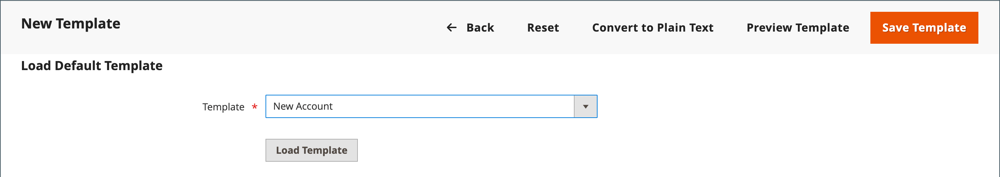

# E-mailsjablonen aanpassen

De handel omvat een standaard e-mailmalplaatje voor de lichaamssectie van elk bericht dat door het systeem wordt verzonden. De sjabloon voor de inhoud van de hoofdtekst wordt gecombineerd met de kop- en voettekstsjablonen om het volledige bericht te maken. De inhoud is opgemaakt met HTML en CSS en kan eenvoudig worden bewerkt en aangepast door [variabelen](variables-predefined.md) en [widgets](../content-design/widgets.md). E-mailsjablonen kunnen worden aangepast voor elke website-, winkel- of winkelweergave. Als u aangepaste sjablonen gebruikt, moet u de [systeemconfiguratie](email-templates.md#configure-email-templates) om ervoor te zorgen dat de juiste template wordt gebruikt.

{width="500" zoomable="yes"}

De standaardsjablonen bevatten uw logo- en opslaggegevens en kunnen zonder verdere aanpassing worden gebruikt. Nochtans als beste praktijken, zou u elk malplaatje moeten bekijken, en om het even welke noodzakelijke veranderingen aanbrengen alvorens hen naar klanten te verzenden.

- [Koptekstsjabloon](email-template-custom.md#header-template)
- [Sjabloon voor voettekst](email-template-custom.md#footer-template)
- [Berichttemplates](email-template-custom.md#message-templates)

{width="700" zoomable="yes"}

## Sjabloongegevens

| Veld | Beschrijving |
| ----- | ----------- |
| [!UICONTROL Template Name] | De naam van uw aangepaste sjabloon. |
| [!UICONTROL Insert Variable] | Voegt een variabele in het malplaatje bij de cursorplaats in. |
| [!UICONTROL Template Subject] | Het onderwerp van het Malplaatje verschijnt in de Onderwerpkolom, en kan worden gebruikt om de malplaatjes in de lijst te sorteren en te filtreren. |
| [!UICONTROL Template Content] | De inhoud van de sjabloon in HTML. |
| [!UICONTROL Template Styles] | Eventuele CSS-stijldeclaraties die nodig zijn om de sjabloon op te maken, kunnen worden ingevoerd in het dialoogvenster _[!UICONTROL Template Styles]_doos. |

{style="table-layout:auto"}

## Koptekstsjabloon

Na het voltooien van de [configuratie](email-templates.md#configure-email-templates)De koptekstsjabloon voor e-mail bevat uw logo dat aan uw winkel is gekoppeld. Als u een basiskennis van HTML hebt, kunt u gemakkelijk gebruiken [vooraf gedefinieerde variabelen](variables-predefined.md) om contactgegevens van de winkel aan de koptekst toe te voegen.

### Stap 1. De standaardsjabloon laden

1. Op de _Beheerder_ zijbalk, ga naar **[!UICONTROL Marketing]** > _[!UICONTROL Communications]_>**[!UICONTROL Email Templates]**.

1. Klik op **[!UICONTROL Add New Template]**.

1. In de **[!UICONTROL Load default template]** klikt u op de **[!UICONTROL Template]** selector en kies `Magento_Email` > `Header`.

   {width="600" zoomable="yes"}

1. Klik op **[!UICONTROL Load Template]**.

   De HTML-code en variabelen uit de sjabloon worden in het formulier weergegeven.

### Stap 2. De sjabloon aanpassen

1. Voer de **[!UICONTROL Template Name]** voor uw aangepaste koptekst.

1. Voer een **[!UICONTROL Template Subject]** om de sjablonen beter in te delen.

   In het raster kunt u de sjabloonlijst sorteren en filteren op de _[!UICONTROL Subject]_kolom.

   {width="600" zoomable="yes"}

1. In de **[!UICONTROL Template Content]** wijzigt u zo nodig de HTML.

   >[!NOTE]
   >
   >Als u in de sjablooncode werkt, moet u ervoor zorgen dat u niets overschrijft dat tussen dubbele accolades staat.

1. Om een [variabel](variables-reference.md)Plaats de cursor in de code op de positie waar u de variabele wilt plaatsen en klik op **[!UICONTROL Insert Variable]**.

1. Kies de variabele die u wilt invoegen.

   {width="600" zoomable="yes"}

   Wanneer een variabele wordt geselecteerd, [markeringstag](markup-tags.md) voor de variabele wordt in de code ingevoegd.

   Hoewel de variabelen van het E-mailadres van de Opslag het vaakst inbegrepen in de kopbal zijn, kunt u de code voor om het even welk systeem ingaan of [aangepaste variabele](variables-custom.md) rechtstreeks in de sjabloon.

1. Als u CSS-declaraties wilt maken, voert u de stijlen in het dialoogvenster **[!UICONTROL Template Styles]** doos.

1. Als u klaar bent om uw werk te bekijken, klikt u op **[!UICONTROL Preview Template]**.

   Breng de gewenste wijzigingen in de sjabloon aan.

1. Klik op **[!UICONTROL Save Template]**.

   De aangepaste koptekst wordt nu weergegeven in de lijst met beschikbare e-mailsjablonen.

### Stap 3. De configuratie bijwerken

1. Op de _Beheerder_ zijbalk, ga naar **[!UICONTROL Content]** > _[!UICONTROL Design]_>**[!UICONTROL Configuration]**.

1. Zoek in het raster de winkelweergave die u wilt configureren en klik op **[!UICONTROL Edit]** in de _[!UICONTROL Action]_kolom.

1. Omlaag schuiven en uitbreiden  de **[!UICONTROL Transactional Emails]** sectie.

1. Kies de optie **[!UICONTROL Header Template]** die wordt gebruikt als standaard voor e-mailberichten.

1. Klik op **[!UICONTROL Save Config]**.

{width="600" zoomable="yes"}

## Sjabloon voor voettekst

De voettekst van de e-mailsjabloon bevat de regel voor sluiten en ondertekenen van het e-mailbericht. U kunt de sluiting aanpassen aan uw stijl en aanvullende informatie toevoegen, zoals de bedrijfsnaam en het adres onder uw naam.

### Stap 1. De standaardsjabloon laden

1. Op de _Beheerder_ zijbalk, ga naar **[!UICONTROL Marketing]** > _[!UICONTROL Communications]_>**[!UICONTROL Email Templates]**.

1. Klik op **[!UICONTROL Add New Template]**.

1. In de **[!UICONTROL Load default template]** klikt u op de **[!UICONTROL Template]** selector en kies `Magento_Email` > `Footer`.

1. Klik op **[!UICONTROL Load Template]**.

   De HTML-code en variabelen uit de sjabloon worden in het formulier weergegeven.

### Stap 2. De sjabloon aanpassen en voorvertonen

1. Voer de **[!UICONTROL Template Name]** voor uw aangepaste voettekst.

1. Voer een **[!UICONTROL Template Subject]** om de sjablonen beter in te delen.

   In het raster kunnen de sjablonen worden gesorteerd en gefilterd door de _[!UICONTROL Subject]_kolom.

   {width="600" zoomable="yes"}

1. In de **[!UICONTROL Template Content]** wijzigt u zo nodig de HTML.

   >[!NOTE]
   >
   >Als u in de sjablooncode werkt, moet u ervoor zorgen dat u niets overschrijft dat tussen dubbele accolades staat.

1. Om een [variabel](variables-reference.md)Plaats de cursor in de code op de positie waar u de variabele wilt plaatsen en klik op **[!UICONTROL Insert Variable]**.

1. Kies de variabele die u wilt invoegen.

   Wanneer een variabele wordt geselecteerd, [markeringstag](markup-tags.md) voor de variabele wordt in de code ingevoegd.

   Hoewel de variabelen van het Contact van de Opslag het vaakst inbegrepen in footer zijn, kunt u de code voor om het even welk systeem ingaan of [aangepaste variabele](variables-custom.md) rechtstreeks in de sjabloon.

1. Als u CSS-declaraties wilt maken, voert u de stijlen in het dialoogvenster **[!UICONTROL Template Styles]** doos.

### Stap 3. De configuratie bijwerken

1. Op de _Beheerder_ zijbalk, ga naar **[!UICONTROL Content]** > _[!UICONTROL Design]_>**[!UICONTROL Configuration]**.

1. Zoek in het raster de winkelweergave die u wilt configureren en klik op **[!UICONTROL Edit]** in de _[!UICONTROL Action]_kolom.

1. Omlaag schuiven en uitbreiden  de **[!UICONTROL Transactional Emails]** sectie.

1. Kies de optie **[!UICONTROL Footer Template]** die wordt gebruikt als standaardvoettekst in e-mailberichten.

1. Klik op **[!UICONTROL Save Config]**.

{width="600" zoomable="yes"}

## Berichttemplates

Het aanpassen van de hoofdtekst van elk bericht is hetzelfde als het aanpassen van de kop- of voettekst. Het enige verschil is het berichtmalplaatje voor elke activiteit of gebeurtenis die een bericht teweegbrengt. U kunt de sjablonen ongewijzigd gebruiken of ze aanpassen aan uw stem en merk. Naast de sjabloontekst is er een ruime keuze van toegestane [vooraf gedefinieerd](variables-predefined.md) variabelen en [aangepast](variables-custom.md) variabelen die u kunt maken en opnemen in de sjabloon.

### Stap 1. De standaardsjabloon laden

1. Op de _Beheerder_ zijbalk, ga naar **[!UICONTROL Marketing]** > _[!UICONTROL Communications]_>**[!UICONTROL Email Templates]**.

1. Klik op **[!UICONTROL Add New Template]**.

   {width="600" zoomable="yes"}

1. Ga als volgt te werk:

   - Onder **[!UICONTROL Load default template]**, kiest u de **[!UICONTROL Template]** die u wilt aanpassen.

   - Klik op **[!UICONTROL Load Template]**.

### Stap 2. De sjabloon aanpassen

1. Voor **[!UICONTROL Template Name]**, voert u een naam in voor uw aangepaste sjabloon.

1. Wijzig, indien nodig, de **[!UICONTROL Template Subject]**.

   Dit is de eerste lijn van het bericht, dat de aanhef door gebrek is. U kunt het zo laten, of u kunt iets beschrijvender ingaan.

1. Neem nota van het **[!UICONTROL Currently Used For]** pad naar de sjabloon. Dit is het pad waarmee de configuratie wordt bijgewerkt.

   {width="600" zoomable="yes"}

1. In de **[!UICONTROL Template Content]** wijzigt u zo nodig de HTML.

   De inhoud bestaat uit een combinatie van HTML-tags, CSS-instructies, variabelen en tekst.

   >[!NOTE]
   >
   >Wanneer u in de sjablooncode werkt, moet u niet per ongeluk de code overschrijven die tussen dubbele accolades staat.

1. Als u een variabele wilt invoegen, plaatst u de cursor in de code op de positie waar u de variabele wilt weergeven.

   De selectie van variabelen varieert per sjabloon en bevat toegestane [vooraf gedefinieerd](variables-predefined.md) en [aangepast](variables-custom.md) indien beschikbaar.

1. Klikken **[!UICONTROL Insert Variable]** en kiest u de variabele die u wilt invoegen.

   Een opdracht voor het invoegen van de variabele wordt ingesloten door accolades en toegevoegd aan de code op de cursorlocatie. Bijvoorbeeld:

   `customVar code=my_custom_variable`

1. Voer de stijlen in in om CSS-declaraties te maken **[!UICONTROL Template Styles]**.

   {width="600" zoomable="yes"}

   >[!NOTE]
   >
   >Aangepaste stijlen worden alleen op de e-mail toegepast als `{{template config_path="design/email/header_template"}}` aanwezig is in het dialoogvenster _[!UICONTROL Template Styles]_. Als u aangepaste CSS zonder een standaardkoptekstsjabloon wilt gebruiken, moet u deze hier opgeven in het dialoogvenster `<style>` HTML-tag.

### Stap 3. De configuratie bijwerken

De _[!UICONTROL Currently Used For]_met behulp van het broodkruimelspoor wordt aangegeven waar de sjabloon wordt gebruikt. In dit voorbeeld bevindt de sjabloonconfiguratie zich op het tabblad_[!UICONTROL Customer Configuration]_ pagina, in de _[!UICONTROL Create New Account Options]_en in de_[!UICONTROL Default Welcome Email]_ veld.

- Pagina - [!UICONTROL Customer Configuration]
- Sectie - [!UICONTROL Create New Account Options]
- Veld - [!UICONTROL Default Welcome Email]

1. In de **[!UICONTROL Currently Used For]** broodkruimelspoor, klik de verbinding om de pagina van de malplaatjeconfiguratie te openen.

   {width="600" zoomable="yes"}

1. Uitbreiden  de sectie en zoek het veld voor de e-mailsjabloon die u hebt aangepast.

1. Wis de **[!UICONTROL Use system value]** en klik op de naam van uw aangepaste sjabloon.

   {width="600" zoomable="yes"}

1. Klik op **[!UICONTROL Save Config]**.

1. Klik in het bericht boven aan de werkruimte op **[!UICONTROL Cache Management]** en wis een ongeldige cache.

### Stap 4. De sjabloon voorvertonen en opslaan

1. Als u klaar bent om uw werk te bekijken, klikt u op **[!UICONTROL Preview Template]**.

1. Werk de sjabloon naar wens bij.

1. Klik op **[!UICONTROL Save Template]**.

   Uw aangepaste sjabloon is nu beschikbaar in de lijst met e-mailsjablonen.
