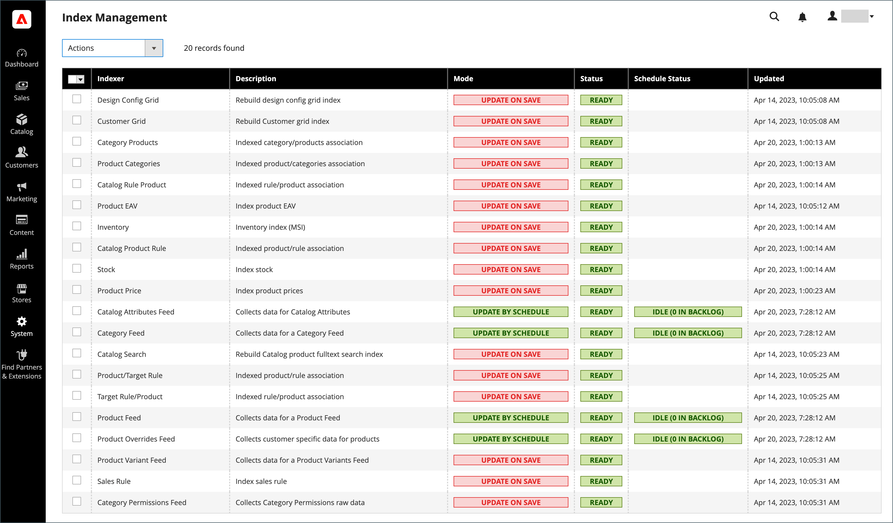

# Indexbeheer

Adobe Commerce en Magento Open Source worden automatisch opnieuw geindexeerd wanneer een of meer items worden gewijzigd. Acties die opnieuw indexeren activeren, zijn onder andere prijswijzigingen, het maken van catalogi- of winkelregels voor winkelwagenprijzen, het toevoegen van nieuwe categorieën enzovoort. Commerce slaat gegevens met behulp van indexen op in speciale tabellen om de prestaties te optimaliseren. Als de gegevens veranderen, moeten de geïndexeerde tabellen worden bijgewerkt of opnieuw worden gedesdexeerd. Commerce wordt opnieuw als een achtergrondproces gebruikt en uw winkel blijft tijdens het proces toegankelijk.

Het opnieuw indexeren van gegevens versnelt de verwerking, en vermindert de tijd de klant moet wachten. Als je bijvoorbeeld de prijs van een object wijzigt van $4,99 in $3,99, wijzigt Commerce de gegevens opnieuw om de prijswijziging in de winkel aan te geven. Zonder indexering zou Commerce de prijs van elk product op de vlucht moeten berekenen; regels voor winkelwagenprijzen, prijzen van pakketten, kortingen, prijzen op lagen, enzovoort. Het laden van de prijs voor een product kan langer duren dan de klant bereid is te wachten.

De indexeerders kunnen worden ingesteld op bijwerken tijdens het opslaan of op schema. Alle indexen kunnen beide opties gebruiken, behalve Klantenraster dat alleen ondersteuning biedt voor opslaan. Bij indexering bij opslaan start Commerce een nieuwe index bij het opslaan van handelingen. De pagina van het Beheer van de Index voltooit de update en spoelt het geheime voorgeheugen, met het herindexbericht verschijnen binnen een minuut of twee. Wanneer opnieuw indexeren op een programma, loopt een herindex volgens een programma als bijbaanbaan. Een systeembericht verschijnt als de baan van de a [&#x200B; cron &#x200B;](cron.md) niet beschikbaar is om het even welke indexen bij te werken die ongeldig worden. Uw winkel blijft toegankelijk tijdens herindexeringsprocessen.

>[!NOTE]
> De handelaars van Adobe Commerce die Live Onderzoek, de Dienst van de Catalogus, of de Aanbevelingen van het Product gebruiken hebben de optie om op a [&#x200B; op SaaS-Gebaseerde prijsindexeerder &#x200B;](https://experienceleague.adobe.com/en/docs/commerce/price-indexer/price-indexing) te gebruiken.

Als een nieuwe index nodig is, verschijnt een melding boven aan de pagina. De index en het bericht worden gewist op basis van de herindexmodus en de mogelijke acties die u uitvoert. Voor meer gedetailleerde informatie over het indexeren, zie [&#x200B; hoe de toepassing het indexeren &#x200B;](https://developer.adobe.com/commerce/php/development/components/indexing/#how-the-application-implements-indexing) in de _Gids van de Ontwikkelaar PHP_ uitvoert.

{width="700" zoomable="yes"}

- Index Management heeft een iets andere presentatie voor platte productcatalogi.
- Om problemen te vermijden wanneer de veelvoudige gebruikers Admin voorwerpen bijwerken die automatische het opnieuw indexeren teweegbrengen, wordt het geadviseerd dat u alle indexen plaatst om op programma te lopen als [&#x200B; bouwbanen &#x200B;](cron.md). Anders kunnen objecten met onderlinge afhankelijkheden, telkens wanneer een object wordt opgeslagen, een impasse veroorzaken. Symptomen van een impasse zijn onder andere het hoge CPU-gebruik en MySQL-fouten. Als beste praktijken, adviseert men dat u geplande indexering gebruikt.
-  (Adobe Commerce slechts) door gebrek, worden de beheerderacties, zoals het opnieuw indexeren, geregistreerd door het systeem en kunnen in het [&#x200B; Rapport van de Logboeken van de Actie &#x200B;](action-log-report.md) worden bekeken. Het registreren van de actie kan in het [&#x200B; Loggen van Acties Admin &#x200B;](action-log.md) in geavanceerde adminmontages van uw opslag worden gevormd.

## Aanbevolen werkwijzen voor herindexering

Het opnieuw indexeren en in cache plaatsen heeft verschillende doeleinden in Commerce. De indexen volgen gegevensbestandinformatie voor verhoogde onderzoeksprestaties, snellere gegevensherwinning voor opslagmilieu&#39;s, en meer. [&#x200B; sparen de Caches van 0&rbrace; geladen gegevens, beelden, formaten, en als voor verhoogde prestaties die en tot de storefront toegang hebben laden.](cache-management.md)

- Doorgaans wilt u opnieuw indexeren bij het bijwerken van gegevens in Commerce.
- Als u een grote winkel of meerdere winkels hebt, kunt u indexeerders zoals categorie en producten instellen op geplande snijtaken vanwege de mogelijkheid van herindexering. U kunt de herdex instellen volgens een schema gedurende niet-piekuren.
- Wanneer u opnieuw indexeert, hoeft u niet ook een uitlijncache uit te voeren.
- Voor nieuwe Commerce-installaties moet u het cachegeheugen leegmaken en opnieuw indexeren.
- Door het leegmaken van caches en het opnieuw indexeren wordt de webbrowsercache van uw computer niet leeggemaakt. Wis de browsercache nadat u de updates voor uw winkel hebt voltooid.

## De indexmodus wijzigen

>[!IMPORTANT]
>
>Voor opslag die [&#x200B; Adobe Commerce B2B &#x200B;](https://experienceleague.adobe.com/docs/commerce-admin/b2b/introduction.html) gebruiken en Elasticsearch als fulltext (`catalogsearch_fulltext`) indexeerder hebben geplaatst: De fulltext index moet na om het even welke bulktoestemmingenverandering opnieuw worden uitgevoerd of wanneer de &quot;toestemmingen&quot;indexer op &quot;Geplande&quot;wijze is.

1. Voor _Admin_ sidebar, ga **[!UICONTROL System]** > _[!UICONTROL Tools]_>**[!UICONTROL Index Management]**.

1. Schakel het selectievakje in voor elke index die u wilt wijzigen.

1. Stel **[!UICONTROL Actions]** in op een van de volgende opties:

   - `Update on Save`
   - `Update by Schedule`
   - `Invalidate index`

     >[!IMPORTANT]
     >
     >Het gedrag van de [!DNL Customer Grid] -index is in 2.4.8 gewijzigd:
     >
     >- **Voorafgaand aan 2.4.8**: [!DNL Customer Grid] indexeer kan slechts opnieuw worden gefixeerd gebruikend de [!UICONTROL Update on Save] optie en steunt niet de [!UICONTROL Update by Schedule] optie.
     >- **2.4.8 en later**: [!DNL Customer Grid] de indexer steunt zowel [!UICONTROL Update on Save] als [!UICONTROL Update by Schedule] wijzen, en gebreken aan [!UICONTROL Update by Schedule].

1. Klik op **[!UICONTROL Submit]** om de wijziging toe te passen op elke geselecteerde index.

   **de kolommen van het Beheer van de Index**

   | Kolom | Beschrijving |
   | ------ |---------------------------------------------------------------------------------------------------------------------------------------------------------------------------------------------------------------------------------------------------------------------------------------------------------------------------------------------------------------------------------------------------------------------------------------------------------------------------------------------------------------------------------------------------------------------------------------------------------------------------------------------------------|
   | [!UICONTROL Indexer] | De naam van de index. |
   | [!UICONTROL Description] | Een beschrijving van de index. |
   | [!UICONTROL Mode] | Hiermee wordt de huidige updatemodus voor elke index aangegeven. Opties:  **[!UICONTROL Update on Save]**- De index wordt ingesteld om bij te werken wanneer een entiteitswijziging wordt opgeslagen. Deze entiteiten omvatten producten, categorieën, en klanten. Wanneer de opslagactie is voltooid, wordt een reeks stappen uitgevoerd om de wijzigingen vast te leggen en de index bij te werken. De pagina van het Beheer van de Index werkt en spoelt het herindexbericht binnen een minuut of twee bij. **[!UICONTROL Update on Schedule]** - de index wordt geplaatst om op programma volgens de baan van de a [&#x200B; cron &#x200B;](cron.md) bij te werken. De bouwbaan omvat het planningsinterval voor het opnieuw indexeren, schrijvend updates aan de index wanneer looppas. |
   | [!UICONTROL Schedule Status] | Geeft de statusupdates van het schema weer. |
   | [!UICONTROL Status] | Geeft een van de volgende opties weer:  **[!UICONTROL Ready]**— De index is up-to-date. **[!UICONTROL Suspended]** - Opnieuw indexeren is gepauzeerd.  **[!UICONTROL Processing]**- Er wordt momenteel opnieuw geïndexeerd. **[!UICONTROL Reindex Required]** - Er is een wijziging aangebracht die opnieuw indexeren vereist, maar de indexen kunnen niet automatisch worden bijgewerkt. Controle om te zien of is [&#x200B; cron &#x200B;](cron.md) beschikbaar en correct gevormd. |
   | [!UICONTROL Updated] | Geeft de datum en tijd aan waarop een index voor het laatst is bijgewerkt. |

   {style="table-layout:auto"}

## Opnieuw indexeren met de opdrachtregel

Commerce biedt aanvullende opties voor opnieuw indexeren via de opdrachtregel. Voor volledige details en bevelopties, zie [&#x200B; opnieuw indexeren &#x200B;](https://experienceleague.adobe.com/docs/commerce-operations/configuration-guide/cli/manage-indexers.html#reindex){:target="blank"} in de _Gids van de Configuratie_.

## Gebeurtenissen van indextrigger

## Triggers opnieuw indexeren

| Indextype | Gebeurtenis voor opnieuw indexeren |
| ---------- | ---------------- |
| [!UICONTROL Product Prices] | De configuratiemontages van de Verandering van de klantengroep   toevoegen |
| [!UICONTROL Flat catalog product data] | Voeg opslag   toe toevoegt opslaggroep  , geef, of schrap attributen (voor het zoeken en het filtreren) toe |
| [!UICONTROL Flat catalog category data] | Voeg opslag   toe toevoegt opslaggroep  , geef, of schrap attributen (voor het zoeken en het filtreren) toe |
| [!UICONTROL Catalog category/product index] | Voeg toe, geef uit, of schrap producten (enige, massa, en de invoer)   product-aan-categorie relaties van de Verandering   toe, geef, of schrap categorieën uit   voeg of schrap opslag   de groepen van de de opslagplaats van de Schrapping   websites van de Schrapping toe |
| [!UICONTROL Catalog search index] | Voeg toe, geef uit, of schrap producten (enige, massa, en de invoer)   toe of schrap opslag   de groepen van de de opslagplaats van de Schrapping   websites van de Schrapping |
| [!UICONTROL Stock status index] | Wijzig de configuratie-instellingen voor de voorraad. |
| [!UICONTROL Category permissions index] | Voeg opslag   toe toevoegt opslaggroep  , schrapt, of updateattribuut (voor het zoeken en het filtreren) |

{style="table-layout:auto"}

>[!IMPORTANT]
>
>Het gebruik van een platte catalogus wordt niet langer aanbevolen als beste praktijk. Het is bekend dat voortdurend gebruik van deze functie prestatievermindering en andere indexeringsproblemen kan veroorzaken. Zie [&#x200B; het Platte Product van de Catalogus van het Gebruik &#x200B;](../catalog/catalog-flat.md) voor meer informatie.

## Indexhandelingen en -besturingselementen

| Handeling | Resultaat | Besturingselementen |
| ------ | ------ | -------- |
| Een winkel, nieuwe klantengroep of een handeling maken die wordt vermeld in `Actions that Cause a Full Reindex` | Volledige herclassificatie | De volledige herindexering wordt uitgevoerd volgens het schema dat door uw Adobe Commerce- of Magento Open Source-cron-taak wordt bepaald. |
| Bulksgewijs laden van items (Commerce importeren/exporteren, Direct SQL-query en elke andere methode die gegevens rechtstreeks toevoegt, wijzigt of verwijdert) | Gedeeltelijke herindex (alleen gewijzigde items worden opnieuw gedesdexeerd) | Met de frequentie die wordt bepaald door uw Commerce-bouwtaak. |
| Bereik wijzigen (bijvoorbeeld van algemeen naar website) | Gedeeltelijke herindex (alleen gewijzigde items worden opnieuw gedesdexeerd) | Met de frequentie die wordt bepaald door uw Commerce-bouwtaak. |

{style="table-layout:auto"}

## Gebeurtenissen die volledige redexering activeren

| Indexer | Gebeurtenis |
| ------- | ----- |
| [!UICONTROL Catalog Category Flat Indexer] | Creeer een Webopslag   creeer een mening van de Webopslag  , of schrap een attribuut dat om het even welk volgend is:  - Doorzoekbaar of zichtbaar in geavanceerd onderzoek   - Filterbaar   - Filterbaar in onderzoek   - Gebruikt voor het sorteren   Verandert een bestaand attribuut om het even welk van het voorafgaande te zijn.  toelaten de vlakke opties van de categorieopslag |
| [!UICONTROL Catalog Product Flat Indexer] | Creeer een Webopslag   creeer een mening van de Webopslag  , of schrap een attribuut dat om het even welk volgend is:  - Doorzoekbaar of zichtbaar in geavanceerd onderzoek   - Filterbaar   - Filterbaar in onderzoek   - Gebruikt voor het sorteren   Verandert een bestaand attribuut om het even welk van het voorafgaande te zijn.  toelaten de vlakke opties van de categorieopslag |
| [!UICONTROL Stock status indexer] | Wanneer de volgende _opties van de Inventaris van de Catalogus_ verandering in de systeemconfiguratie: `Stock Options` - de Vertoning uit Producten van de Voorraad  `Product Stock Options` - beheert Voorraad |
| [!UICONTROL Price Indexer] | Een klantengroep toevoegen.  wanneer om het even welke volgende opties van de Inventaris van de Catalogus in de systeemconfiguratie veranderen: `Stock Options` - de Vertoning uit Producten van de Voorraad  `Product Stock Options` - beheert Voorraad  `Price` - de Reikwijdte van de Prijs van de Catalogus |
| [!UICONTROL Category or Product Indexer] | Creeer of schrap een opslagmening   Schrap een opslag   een website schrap |

{style="table-layout:auto"}
