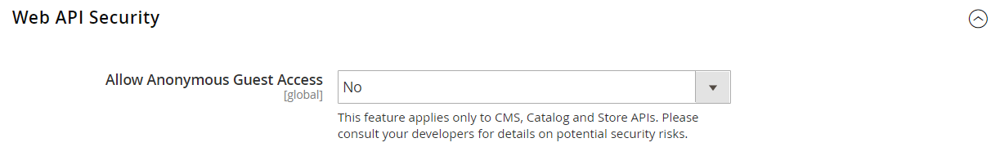

# Integraties

Als u een integratie in Commerce Admin definieert, wordt de locatie van OAuth-referenties vastgesteld en wordt de URL omgeleid voor integratie van derden, en worden de beschikbare API-bronnen aangegeven die nodig zijn voor de integratie. Zie voor meer informatie over het registratieproces van de integratie [Verificatie op basis van OAuth](https://developer.adobe.com/commerce/webapi/get-started/authentication/gs-authentication-oauth/) in de documentatie voor de ontwikkeling van de handel.

{width="700" zoomable="yes"}

## Workflow voor onboarding

1. **Integratie autoriseren** - Ga naar de **[!UICONTROL System]** > _[!UICONTROL Extensions]_>**[!UICONTROL Integrations]**pagina, de relevante integratie zoeken en autoriseren.
1. **Aanmelding controleren en instellen** - Accepteer de gevraagde toegang wanneer daarom wordt gevraagd. Als u een account hebt omgeleid naar een derde, meldt u zich aan bij het systeem of maakt u een account. Na een geslaagde aanmelding keert u terug naar de integratiepagina.
1. **Bevestiging ontvangen van toegestane integratie** - Het systeem stuurt een melding dat de integratie met succes is geautoriseerd. Na vestiging is een integratie en het ontvangen van de geloofsbrieven, het niet meer noodzakelijk om vraag aan toegang of verzoektekenen te maken.

## Integratie toevoegen

1. Op de _Beheerder_ zijbalk, ga naar **[!UICONTROL System]** > _[!UICONTROL Extensions]_>**[!UICONTROL Integrations]**.

   {width="600" zoomable="yes"}

1. Voer de volgende integratiegegevens in:

   - Voer de **[!UICONTROL Name]** van de integratie en het contact **[!UICONTROL Email]** adres.

   - Voer de **[!UICONTROL Callback URL]** waar OAuth geloofsbrieven kunnen worden verzonden wanneer het gebruiken van OAuth voor symbolenuitwisseling. Gebruiken `https://` wordt sterk aanbevolen.

   - Voer de **[!UICONTROL Identity Link URL]** om de gebruikers om te leiden naar een externe account met deze Adobe Commerce- of Magento Open Source-integratiegegevens.

   >[!NOTE]
   >
   > De `Integration not secure` waarschuwingslabel wordt bij elke integratienaam weergegeven op het tabblad [!UICONTROL Integrations] raster als herinnering, totdat HTTPS-URL&#39;s worden opgeslagen in [!UICONTROL Callback URL] en [!UICONTROL Identity Link URL] velden.

   - Voer desgevraagd uw wachtwoord in om uw identiteit te bevestigen.

1. Kies in het linkerdeelvenster de optie **[!UICONTROL API]** en voer de volgende handelingen uit:

   - Set **[!UICONTROL Resource Access]** op een van de volgende wijzen:

      - `All`
      - `Custom`

   - Voor douanetoegang, selecteer checkbox van elk middel dat nodig is.

     {width="600" zoomable="yes"}

1. Klik op **[!UICONTROL Save]**.

## Integratie activeren

Standaard wordt op het raster een opgeslagen integratie weergegeven met een `Inactive` status. Voer de volgende stappen uit om het te activeren:

1. Op de _Beheerder_ zijbalk, ga naar **[!UICONTROL System]** > _[!UICONTROL Extensions]_>**[!UICONTROL Integrations]**.

1. Zoek de nieuwe integratie en klik op de knop **[!UICONTROL Activate]** koppeling.

1. Klik in de rechterbovenhoek op **[!UICONTROL Allow]**.

   Deze actie toont de Tokens van de Integratie voor Uitbreidingen. Kopieer deze gegevens naar een veilige, gecodeerde locatie voor gebruik met uw integratie.

   {width="600" zoomable="yes"}

1. Klik in de rechterbovenhoek op **[!UICONTROL Done]**.

## Integratie opnieuw autoriseren

Om een nieuwe Token van de Toegang van de Integratie en het Geheime Geheim van de Toegang te produceren, verkondigde de integratie van Admin opnieuw:

1. Op de _Beheerder_ zijbalk, ga naar **[!UICONTROL System]** > _[!UICONTROL Extensions]_>**[!UICONTROL Integrations]**.

1. De integratie met de **[!UICONTROL Active]** status.

1. In _[!UICONTROL Activate]_kolom, klikt u op de **[!UICONTROL Reauthorize]**.

1. Klikken **[!UICONTROL Reauthorize]** de toegang tot de API-bronnen goedkeuren.

1. Sla de nieuwe integratie-tokens voor extensies op en klik op **[!UICONTROL Done]**.

## De beveiligingsinstelling voor de API-gasttoegang wijzigen

Door gebrek, laat het systeem anonieme gasttoegang tot CMS, catalogus, en andere opslagmiddelen niet toe. Ga als volgt te werk als u de instelling moet wijzigen:

1. Op de _Beheerder_ zijbalk, ga naar **[!UICONTROL Stores]** > _[!UICONTROL Settings]_>**[!UICONTROL Configuration]**.

1. Vouw in het linkerdeelvenster uit **[!UICONTROL Services]** en kiest u **[!UICONTROL Magento Web API]**.

1. Uitbreiden  de **[!UICONTROL Web API Security Setting]** sectie.

   {width="600" zoomable="yes"}

1. Set **[!UICONTROL Allow Anonymous Guest Access]** tot `Yes`.

1. Klik op **[!UICONTROL Save Config]**.

Zie voor meer informatie [Toegang tot anonieme web-API&#39;s beperken](https://developer.adobe.com/commerce/webapi/rest/use-rest/anonymous-api-security/) in de documentatie voor de ontwikkeling van de handel.

## Integratie verwijderen

1. Op de _Beheerder_ zijbalk, ga naar **[!UICONTROL System]** > _[!UICONTROL Extensions]_>**[!UICONTROL Integrations]**.

1. De bestaande integratie zoeken en op het pictogram klikken (  ) in de **[!UICONTROL Delete]** kolom.

1. Klik op **[!UICONTROL OK]**.
