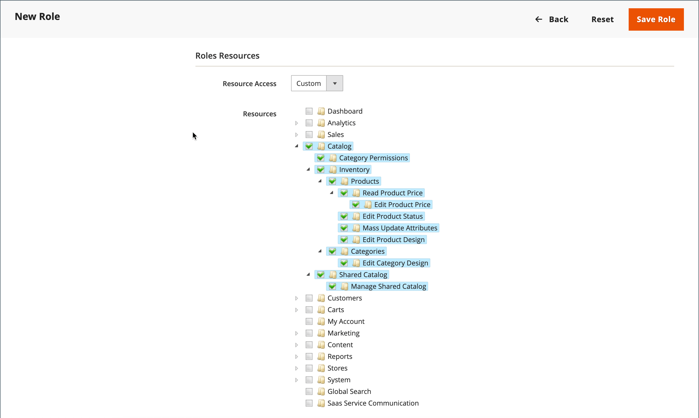

# Gebruikersrollen

Om iemand beperkte toegang tot Admin te geven, moet de eerste stap een rol tot stand brengen die het aangewezen niveau van toestemmingen heeft. Nadat de rol wordt bewaard, kunt u nieuwe gebruikers toevoegen en de beperkte rol toewijzen om hen beperkte toegang tot Admin te verlenen.

{width="600" zoomable="yes"}

## Een rol definiëren

1. Voor _Admin_ sidebar, ga **[!UICONTROL System]** > _[!UICONTROL Permissions]_>**[!UICONTROL User Roles]**.

1. Klik in de rechterbovenhoek op **[!UICONTROL Add New Role]** .

1. Voer de stappen uit om de rol te definiëren:

### Stap 1: Voeg de rolnaam toe

1. Voer onder _[!UICONTROL Role Information]_&#x200B;een beschrijvende **[!UICONTROL Role Name]**&#x200B;in.

1. Voer onder _[!UICONTROL Current User Identity Verification]_&#x200B;uw wachtwoord in.

   {width="600" zoomable="yes"}

### Stap 2: Bronnen toewijzen

>[!IMPORTANT]
>
>Wanneer het toewijzen van middelen, ben zeker om toegang tot het hulpmiddel van Toestemmingen onbruikbaar te maken als u toegang voor een bepaalde rol beperkt. Anders kunnen gebruikers hun eigen machtigingen wijzigen.

1. Stel **[!UICONTROL Role Scopes]** in op een van de volgende opties:

   - `All`
   - `Custom`

   Als deze optie is ingesteld op `Custom` voor een installatie op meerdere sites, schakelt u het selectievakje van de website in en slaat u de locatie op waar de rol moet worden gebruikt.

   {width="600" zoomable="yes"}

   >[!NOTE]
   >
   >Gebruikers met een rolbereik van `Custom` kunnen geen websites en categorieën maken, producten aan categorieën toewijzen of producten in het bereik van _[!UICONTROL All Store Views]_&#x200B;bewerken wanneer ze worden toegewezen aan winkels met beperkingen. Deze gebruikers kunnen ook andere_ globale _acties uitvoeren die werkingsgebied beïnvloeden waar zij geen toegang hebben.

1. Stel onder _[!UICONTROL Roles Resources]_&#x200B;de waarde **[!UICONTROL Resource Access]**&#x200B;in op `Custom` .

1. Selecteer in de boomstructuur van **[!UICONTROL Resource]** het selectievakje van elke beheerfunctie waartoe de rol toegang heeft.

   Als u een beheerdersrol wilt maken met toegang tot belastinginstellingen, kiest u zowel de BTW- als de systeembronnen. Als vestiging een website voor een gebied dat van uw standaard [&#x200B; verschepend punt van oorsprong &#x200B;](../stores-purchase/shipping-settings.md#point-of-origin) verschilt, moet u toegang tot de middelen van het Systeem/van de Scheepvaart voor de rol toestaan. De verzendinstellingen bepalen het BTW-tarief voor de winkel dat wordt gebruikt voor catalogusprijzen.

   {width="600" zoomable="yes"}

   De lijst met beschikbare machtigingen kan aanvullende opties voor gebundelde en geïnstalleerde extensies bevatten. Door de hoogste toestemming voor elke eigenschap te selecteren, wijst u alle toestemmingen toe beschikbaar voor de gebruiker.

   >[!NOTE]
   >
   >Een gebruiker Admin moet **[!UICONTROL Sales / Archive]** toestemmingen voor hun rolwerkingsgebied hebben om _[!UICONTROL Invoices]_,_[!UICONTROL Credit Memos]_, en _[!UICONTROL Shipments]_&#x200B;orde [&#x200B; lusjes &#x200B;](../stores-purchase/order-processing.md) te zien.

1. Klik op **[!UICONTROL Save Role]** als de bewerking is voltooid.

   De rol wordt nu weergegeven in het raster en kan worden toegewezen aan gebruikersaccounts.

## Rollen toewijzen aan gebruikers

1. Open vanuit het _[!UICONTROL Roles]_-raster de record in de bewerkingsmodus.

1. Voer onder _[!UICONTROL Current User Identity Verification]_&#x200B;het wachtwoord voor uw gebruikersaccount in.

1. Kies **[!UICONTROL Role Users]** in het linkerdeelvenster.

   De optie _[!UICONTROL Role Users]_&#x200B;wordt alleen weergegeven nadat een nieuwe rol is opgeslagen.

   {width="600" zoomable="yes"} worden toegewezen

1. Ga als volgt te werk om te zoeken naar een specifieke gebruikersrecord:

   - Ga de waarde in de onderzoeksfilter bij de bovenkant van een kolom in en druk **gaat** binnen.

   - Klik op **[!UICONTROL Reset Filter]** als u wilt terugkeren naar de volledige lijst.

1. Schakel het selectievakje in van de gebruikers die aan de rol moeten worden toegewezen.

1. Klik op **[!UICONTROL Save Role]**.

## Een rol bewerken

1. Voor _Admin_ sidebar, ga **[!UICONTROL System]** > _[!UICONTROL Permissions]_>**[!UICONTROL User Roles]**.

1. Zoek de rol met filters boven het raster en klik op de naam van de rol.

1. Breng de gewenste wijzigingen aan.

   Controleer de stappen voor het maken van een gebruikersrol voor informatie over de rolinstellingen.

1. Voer desgevraagd uw wachtwoord in om uw identiteit te bevestigen.

1. Klik op **[!UICONTROL Save Role]** .

## Een rol verwijderen

1. Voor _Admin_ sidebar, ga **[!UICONTROL System]** > _[!UICONTROL Permissions]_>**[!UICONTROL User Roles]**.

1. Zoek de rol met behulp van filters boven het raster en open de bewerkingsmodus.

1. Klik in de rechterbovenhoek op **[!UICONTROL Delete Role]** .

1. Klik op **[!UICONTROL OK]** om de handeling te bevestigen.

## demo gebruikersrollen

Bekijk deze video voor meer informatie over het beheren van gebruikersrollen:

>[!VIDEO](https://video.tv.adobe.com/v/3443513?quality=12&learn=on&captions=dut)

## Rolresources

De toegang tot de volgende middelen kan aan een douanerol worden toegewezen. Zie de gekoppelde pagina voor meer informatie over de mogelijkheden die aan elke bron zijn gekoppeld.

 - slechts Adobe Commerce

 - Beschikbaar met slechts Adobe Commerce B2B

| Bron |   |   |
| --- | --- | --- |
| [`Dashboard`](../getting-started/admin-dashboard.md) |  |  |
| [`Sales`](../stores-purchase/sales-menu.md) | [`Operations`](../stores-purchase/orders.md) |  |
|  | [`Quotes`](../b2b/quotes.md)   [`Orders`](../stores-purchase/orders.md) [`Invoices`](../stores-purchase/invoices.md) [`Shipments`](../stores-purchase/shipments.md) [`Credit Memos`](../stores-purchase/credit-memos.md) [`Billing Agreements`](../stores-purchase/paypal-billing-agreements.md) [`Returns`](../stores-purchase/returns.md)  [`Transactions`](../stores-purchase/transactions.md) |
|  | [`Archive`](action-log-archive.md)![Adobe Commerce] |  |
|  | [`Shopping Cart Management`](../stores-purchase/cart.md) |  |
| [`Catalog`](../catalog/catalog-menu.md) | [`Category Permissions`](../catalog/categories.md)  |  |
|  | [`Inventory`](../inventory-management/introduction.md) | [`Products`](../catalog/products-list.md) [`Categories`](../catalog/categories.md) |
|  | [`Shared Catalog`](../b2b/catalog-shared-create.md)  | [`Manage Shared Catalog`](../b2b/catalog-shared-manage.md) |
| [`Customers`](../customers/guide-overview.md) | [`All Customers`](../customers/customers-all.md) [`Now Online`](../customers/now-online.md) [`Customer Groups`](../customers/customer-groups.md) [`Segments`](../customers/customer-segments.md)  |  |
|  | [`Login as Customer`](../customers/login-as-customer.md) | `Allow Login as Customer Button` `View Login as Customer Log`  |
|  | [`Companies`](../b2b/account-companies.md)  | [`Manage Companies`](../b2b/account-company-manage.md)  `Add New Company`  `Delete Company`  `Reimburse Balance` |
| [`Carts`](../stores-purchase/shopping-assisted-cart-manage.md) | [`Manage carts`](../stores-purchase/shopping-assisted-cart-manage.md) |  |
| [`My Account`](../customers/account-dashboard-my-account.md) |  |  |
| [`Marketing`](../merchandising-promotions/marketing-menu.md) | [`Promotions`](../merchandising-promotions/marketing-menu.md#uicontrol-promotions) | [`Catalog Price Rule`](../merchandising-promotions/price-rules-catalog.md)  [`Cart Price Rules`](../merchandising-promotions/price-rules-cart.md)  [`Related Products Rules`](../merchandising-promotions/product-related-rules.md) [`Gift Card Accounts`](../stores-purchase/product-gift-card-accounts.md)  |
|  | [`Private Sales`](../merchandising-promotions/events-private-sales.md)  | [`Events`](../merchandising-promotions/event-create.md)  [`Invitations`](../merchandising-promotions/invitations.md) |
|  | `Communications` | [`Email Templates`](email-templates.md)  [`Newsletter Template`](../merchandising-promotions/newsletter-template.md)  [`Newsletter Queue`](../merchandising-promotions/newsletter-queue.md)  [`Newsletter Subscribers`](../merchandising-promotions/newsletter-subscribers.md)  [`Email Reminders`](../merchandising-promotions/email-reminder-rules.md) |
|  | `Sales Channel` | [`Amazon Sales Channel`](https://experienceleague.adobe.com/docs/commerce-channels/amazon/overview.html?lang=nl-NL) |
|  | [`SEO & Search`](../merchandising-promotions/marketing-menu.md#uicontrol-seo--search) | [`Search Terms`](../catalog/search-terms.md)  [`Search Synonyms`](../catalog/search-terms.md#search-synonyms)  [`URL Rewrites`](../merchandising-promotions/url-rewrite-custom.md)  [`Site Map`](../merchandising-promotions/sitemap-xml.md) |
|  | [`User Content`](../merchandising-promotions/product-reviews-moderate.md) | [`All Reviews`](../merchandising-promotions/product-reviews.md)  [`Pending Reviews`](../merchandising-promotions/product-reviews-moderate.md)   |  |
| [`Content`](../content-design/content-menu.md) | [`Elements`](../content-design/content-menu.md#uicontrol-elements)) | [`Pages`](../content-design/pages.md) [`Hierarchy`](../content-design/page-hierarchy.md)  [`Blocks`](../content-design/blocks.md) [`Dynamic Blocks`](../content-design/dynamic-blocks.md)  [`Widgets`](../content-design/widgets.md) [`Media Gallery`](../content-design/media-gallery.md) |  |
|  | [`Design`](../content-design/introduction.md#design) | [`Themes`](../content-design/themes.md) [`Schedule`](../content-design/schedule.md) |  |
|  | [&#x200B; Inhoud die &#x200B;](../content-design/content-staging.md)   opneemt |  |
| [`Reports`](../getting-started/reports-menu.md) | [`Marketing`](../getting-started/marketing-reports.md) | `Shopping Cart` [`Search Terms`](../catalog/search-terms.md#search-terms-report) `Newsletter Problem Reports` |  |
|  | [`Reviews`](../getting-started/review-reports.md)  |  |
|  | [`Sales`](../getting-started/sales-reports.md) |  |
|  | `System Insights`  | [`Site-Wide Analysis Tool`](https://experienceleague.adobe.com/docs/commerce-operations/tools/site-wide-analysis-tool/access.html?lang=nl-NL) |
|  | [`Customers`](../getting-started/customer-reports.md) [`Products`](../getting-started/product-reports.md) [`Private Sales`](../getting-started/private-sales-reports.md)  [`Statistics`](../getting-started/reports-menu.md#uicontrol-statistics) [`Business Intelligence`](../getting-started/business-intelligence.md) |  |
| [`Stores`](../stores-purchase/stores.md) | [`Settings`](../stores-purchase/stores-menu.md) | [`All Stores`](../stores-purchase/stores.md) [`Configuration`](../configuration-reference/guide-overview.md) [`Terms and Conditions`](../stores-purchase/terms-and-conditions.md) [`Order Status`](../stores-purchase/order-status.md) |  |
|  | [`Inventory`](../inventory-management/sources-stocks.md) | [`Sources`](../inventory-management/sources-manage.md) [`Stocks`](../inventory-management/stocks-manage.md) |  |
|  | [`Taxes`](../stores-purchase/taxes.md) |  |  |
|  | [`Currency`](../stores-purchase/currency.md) | [`Currency Rates`](../stores-purchase/currency-update.md) [`Currency Symbols`](../stores-purchase/currency-configuration.md#step-5-customize-currency-symbols-optional) |  |
|  | [`Attributes`](../catalog/product-attributes.md) | [`Product`](../catalog/attribute-product-create.md) [`Update Attributes`](../catalog/attribute-product-create.md) [`Attribute Set`](../catalog/attribute-sets.md) [`Ratings`](../merchandising-promotions/product-reviews.md#create-custom-ratings) |
|  | [`Other Settings`](../stores-purchase/stores-menu.md) | [`Customer Groups`](../customers/customer-groups.md) |
| [`System`](system-menu.md) | [`Data Transfer`](data-transfer.md) | [`Import`](data-import.md) [`Export`](data-export.md) [`Import/Export Tax Rates`](data-transfer-tax-rates.md) [`Import History`](data-import.md#import-history) |  |
|  | [`Magento Connect`](../getting-started/commerce-marketplace.md) | `Connect Manager` `Package Extensions` |  |
|  | [`Tools`](system-menu.md#tools) | [`Cache Management`](cache-management.md) [`Backups`](backups.md) [`Index Management`](index-management.md) [`Change Indexer Mode`](index-management.md) |  |
|  | [`Permissions`](permissions.md) | [`All Users`](permissions-users-all.md) [`Locked Users`](permissions-users-all.md#locked-users) [`User Roles`](permissions-user-roles.md) |
| [`Action Log`](action-log.md) | [`Report`](action-log.md) [`Archive`](action-log-archive.md) |
|  | [`Other Settings`](system-menu.md) | [`Notifications`](notifications.md) [`Custom Variables`](variables-custom.md) [`Manage Encryption Key`](encryption-key.md) |  |
| [`Global Search`](../getting-started/admin-workspace.md#workspace-search) |  |  |

{style="table-layout:auto"}
