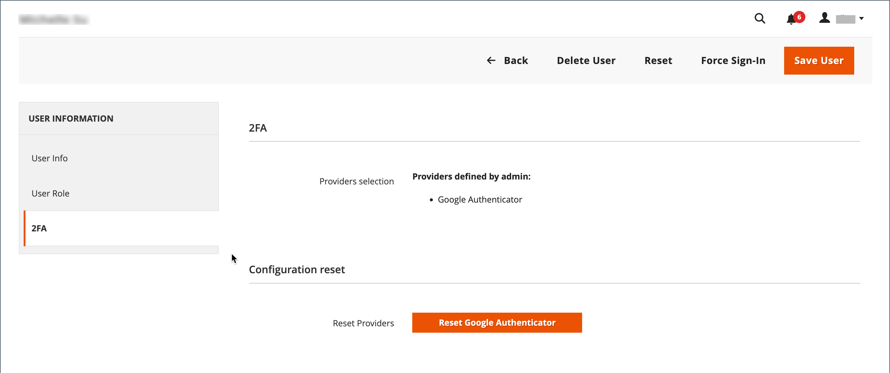

# Beheerdersaccounts beheren

Wanneer uw winkel voor het eerst wordt geïnstalleerd, wordt een standaard beheerdersaccount gemaakt met aanmeldingsgegevens die u volledige beheerrechten geven. Als beste praktijken, zou u een andere gebruikersrekening met volledige toegang van de Beheerder moeten tot stand brengen. Op die manier kunt u één account gebruiken voor uw dagelijkse beheeractiviteiten en de andere reserveren als een &quot;Super Admin&quot;-account. Dit kan nuttig zijn als u uw regelmatige geloofsbrieven vergeet, of zij op één of andere manier onbruikbaar worden.

Als andere teamleden of dienstverleners toegang nodig hebben, kunt u individuele gebruikersrekeningen voor hen tot stand brengen en beperkte toegang toewijzen die op hun specifieke bedrijfsbehoeften wordt gebaseerd. Om de websites of de opslag te beperken die de gebruikers in Admin kunnen toegang hebben, moet u eerst [&#x200B; een rol &#x200B;](permissions-user-roles.md) met beperkt werkingsgebied en slechts de noodzakelijke geselecteerde middelen tot stand brengen. Vervolgens kunt u de rol toewijzen aan een specifieke gebruikersaccount. Admin-gebruikers die zijn toegewezen aan een beperkte rol, kunnen alleen gegevens zien en wijzigen voor websites of winkels die zijn gekoppeld aan de rol, maar kunnen geen algemene instellingen of gegevens wijzigen.

>[!NOTE]
>
>Adobe Commerce-handelaren die een Adobe ID hebben en een gestroomlijnde aanmelding bij Adobe Commerce en Adobe Business-producten willen, kunnen Commerce-verificatie integreren met de Adobe IMS-verificatieworkflow. Nadat deze integratie is ingeschakeld voor uw Commerce-winkel, moet elke Admin-gebruiker zijn of haar Adobe-gegevens gebruiken, niet zijn of haar Commerce-gegevens. Zie [&#x200B; het Overzicht van de Integratie van Adobe Identity Management van de Dienst (IMS) &#x200B;](https://experienceleague.adobe.com/docs/commerce-admin/start/admin/ims/adobe-ims-integration-overview.html?lang=nl-NL).

Voor gebruikers of rollen die tijdelijk zijn, kunt u een vervaldatum voor de gebruikersrekening ook plaatsen.

<!--  update this to a better info-graphic  -->

## Een gebruiker maken

1. Voor _Admin_ sidebar, ga **[!UICONTROL System]** > _[!UICONTROL Permissions]_>**[!UICONTROL All Users]**.

1. Klik in de rechterbovenhoek op **[!UICONTROL Add New User]** .

   Klik op een gebruikersnaam in het raster om een bestaande gebruiker te bewerken. U kunt de secties _[!UICONTROL User Info]_&#x200B;en&#x200B;_[!UICONTROL User Role]_ naar wens wijzigen.

1. Ga als volgt te werk in de sectie _[!UICONTROL Account Information]_:

   {width="600" zoomable="yes"}

   - Voer de **[!UICONTROL User Name]** in voor account.

     De gebruikersnaam moet gemakkelijk te onthouden zijn. Het is niet hoofdlettergevoelig. Als de gebruikersnaam bijvoorbeeld `John` is, kunnen ze zich ook aanmelden als `john` .

   - Voer de volgende gegevens in:

      - **[!UICONTROL First Name]**
      - **[!UICONTROL Last Name]**
      - **[!UICONTROL Email address]**

     Elk gebruikersaccount moet een uniek e-mailadres hebben.

   - Voer een **[!UICONTROL Password]** in voor de account.

     >[!NOTE]
     >
     >Een beheerderswachtwoord moet uit minimaal zeven tekens bestaan en zowel letters als cijfers bevatten. Voor extra wachtwoordopties, zie [&#x200B; Vormend Veiligheid Admin &#x200B;](security-admin.md).

   - Voer bij **[!UICONTROL Password Confirmation]** het wachtwoord opnieuw in om er zeker van te zijn dat het correct is ingevoerd.

   - Als uw winkel meerdere talen heeft, stelt u **[!UICONTROL Interface Locale]** in op de taal die voor de beheerinterface moet worden gebruikt.

1. Stel **[!UICONTROL This Account is]** in op `Active` .

1. Klik op het kalenderpictogram om de **[!UICONTROL Expiration Date]** voor de gebruikersaccount in te stellen.

   Het definiëren van een vervaldatum is handig wanneer een gebruiker of rol tijdelijk is. Na de vervaldatum verandert de status van de gebruikersaccount in `Inactive` en kan deze, indien nodig, worden bijgewerkt.

1. Voer onder _[!UICONTROL Current User Identity Verification]_&#x200B;het wachtwoord voor uw gebruikersaccount in.

>[!IMPORTANT]
>
>Als de sectie _[!UICONTROL Account Information]_&#x200B;is voltooid, kunt u de gebruiker opslaan. De nieuwe gebruiker wordt weergegeven in het raster van&#x200B;_[!UICONTROL Users]_ , maar de gebruikersnaam kan zich pas aanmelden wanneer een rol is toegewezen.

## Een gebruikersrol toewijzen

1. Klik in het linkerdeelvenster op **[!UICONTROL User Role]** .

   In het raster worden alle bestaande gebruikersrollen weergegeven. Voor een nieuwe winkel is _[!UICONTROL Administrators]_&#x200B;de enige beschikbare rol.

   {width="600" zoomable="yes"} toe

1. Selecteer een gebruikersrol in de kolom _[!UICONTROL Assigned]_.

   U kunt [&#x200B; bestaande bekijken of extra gebruikersrollen &#x200B;](permissions-user-roles.md) bepalen. Nadat een rol is gedefinieerd, moet u de gebruikersaccount bewerken om de nieuwe rol toe te wijzen.

## 2FA-providers controleren of opnieuw instellen

1. Open de Admin-gebruikersaccount.

1. Klik in het linkerdeelvenster op **[!UICONTROL 2FA]** .

   {width="600" zoomable="yes"} toe

1. Verifieer de oplossingen 2FA die aan _Admin_ gebruikers beschikbaar zijn en adviseer elke gebruiker om de oplossingen te installeren zij alvorens zij binnen willen gebruiken.

   De authentificatie door slechts één oplossing 2FA wordt vereist om binnen aan _Admin_ te ondertekenen.

1. Als de gebruiker de 2FA-oplossing opnieuw moet installeren, kunt u de huidige 2FA-configuratie opnieuw instellen.

   Hiervoor moet de gebruiker het installatieproces herhalen voordat hij of zij zich opnieuw kan aanmelden. De gebruiker kan bijvoorbeeld een nieuwe smartphone hebben en moet Google Authenticator opnieuw installeren. Als u de huidige 2FA-instelling van de gebruiker wilt wissen, klikt u op **[!UICONTROL Reset (Provider)]** voor elke oplossing die u wilt wissen. Klik op **[!UICONTROL OK]** om te bevestigen wanneer hierom wordt gevraagd.

   De gebruiker ontvangt een e-mail met een verbinding aan [&#x200B; vormt 2FA &#x200B;](security-two-factor-authentication.md). De koppeling kan slechts eenmaal worden gebruikt. Als de gebruiker meerdere keren inlogt, wordt na elke poging een nieuwe koppeling verzonden.

1. Klik op **[!UICONTROL Save User]**.

1. Voer desgevraagd uw wachtwoord in om uw identiteit te bevestigen en klik nogmaals op **[!UICONTROL Save User]** .

   Het raster _[!UICONTROL Users]_&#x200B;wordt geopend en bevat een lijst met alle gebruikers.

## Een Admin-gebruiker verwijderen

1. Voor _Admin_ sidebar, ga **[!UICONTROL System]** > _[!UICONTROL Permissions]_>**[!UICONTROL All Users]**.

1. Zoek de gebruikersaccount met behulp van filters boven het raster en klik op de gebruikersnaam.

1. Voer desgevraagd uw wachtwoord in om uw identiteit te bevestigen.

1. Klik in de rechterbovenhoek op **[!UICONTROL Delete User]** .

1. Klik op **[!UICONTROL OK]** om de handeling te bevestigen.

## Wachtwoord vergeten en e-mails opnieuw instellen

De sjabloonconfiguratie voor e-mailberichten van Admin bepaalt welke e-mailberichten worden verzonden wanneer gebruikers hun wachtwoorden vergeten en opnieuw instellen. Deze configuratie specificeert het opslagcontact dat als afzender van het bericht verschijnt en hoe lang de verbinding van de wachtwoordterugwinning geldig blijft.

**_om de Admin e-mailmalplaatjes te vormen:_**

1. Voor _Admin_ sidebar, ga **[!UICONTROL Stores]** > _[!UICONTROL Setting]_>**[!UICONTROL Configuration]**.

1. Vouw in het linkerdeelvenster **[!UICONTROL Advanced]** uit en kies **[!UICONTROL Admin]** .

1. Breid  uit de **[!UICONTROL Admin User Emails]** sectie.

   {width="600" zoomable="yes"}

1. Stel **[!UICONTROL Forgot Password Email Template]** in op de sjabloon die wordt verzonden wanneer een Admin-gebruiker zijn wachtwoorden vergeet.

1. Stel **[!UICONTROL Forgot and Reset Email Sender]** in op de opslagcontactpersoon die wordt weergegeven als de afzender van het bericht.

1. Stel **[!UICONTROL User Notification Template]** in op de e-mailsjabloon die als standaard wordt gebruikt voor beheerberichten.

1. Klik op **[!UICONTROL Save Config]** als de bewerking is voltooid.

## Vergrendelde gebruikers

Voor de veiligheid van uw zaken, worden de gebruikersrekeningen gesloten door gebrek na zes ontbroken pogingen aan [&#x200B; login &#x200B;](../getting-started/admin-signin.md) aan Admin. Alle gebruikersaccounts die momenteel zijn vergrendeld, worden weergegeven in het raster Vergrendelde gebruikers. Een account kan worden ontgrendeld door elke andere gebruiker met volledige beheerdersrechten.

De extra maatregelen van de wachtwoordveiligheid kunnen in de [&#x200B; Geavanceerde Admin &#x200B;](../configuration-reference/advanced/admin.md#security) configuratie worden uitgevoerd. Zie [&#128279;](security-admin.md) Veiligheid Admin.

{width="300"}

**_om een rekening te ontgrendelen Admin:_**

1. Voor _Admin_ sidebar, ga **[!UICONTROL System]** > _[!UICONTROL Permissions]_>**[!UICONTROL Locked Users]**.

1. Schakel in het raster het selectievakje van het vergrendelde account in.

   {width="600" zoomable="yes"}

1. Stel in de linkerbovenhoek **[!UICONTROL Actions]** in op `Unlock` .

1. Klik op **[!UICONTROL Submit]** om het account te ontgrendelen.
