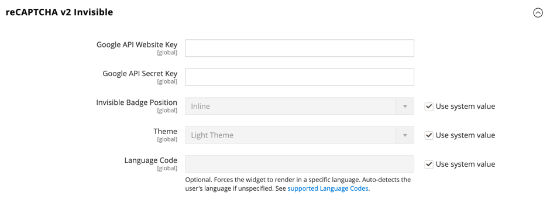

# Google reCAPTCHA

[Google reCAPTCHA](https://developers.google.com/recaptcha) zorgt ervoor dat een mens, in plaats van een computer (of &#39;bot&#39;), communiceert met uw website. In tegenstelling tot de standaard Adobe Commerce en Magento Open Source [CAPTCHA](security-captcha.md), biedt Google reCAPTCHA uitgebreide beveiliging met een selectie van verschillende weergaveopties en -methoden. Extra informatie over websiteverkeer is beschikbaar op het dashboard van uw Google reCAPTCHA-account.

Google reCAPTCHA wordt afzonderlijk geconfigureerd voor Admin en storefront.

- Voor de Admin, kan Google reCAPTCHA op [Aanmelden](../getting-started/admin-signin.md) en wanneer een gebruiker om het opnieuw instellen van het wachtwoord vraagt. Als de standaard Commerce [CAPTCHA](security-captcha.md) is ook ingeschakeld, kan Google reCAPTCHA tegelijkertijd zonder problemen worden gebruikt.

- Voor de winkel kunt u Google reCAPTCHA gebruiken om u aan te melden bij een [klantenaccount](../customers/customer-sign-in.md), stuurt u een bericht van de [Contact opnemen](../getting-started/store-details.md#contact-us-form) en in vele andere winkellocaties.

  {width="700" zoomable="yes"}

Google reCAPTCHA kan op verschillende manieren worden geïmplementeerd:

- _reCAPTCHA v3 Invisible_ — Gebruikt een algoritme om gebruikersinteractie te schatten en bepaalt de waarschijnlijkheid dat de gebruiker menselijk gebaseerd op een score is.

- _reCAPTCHA v2 Invisible_ — Voert achtergrondverificatie uit zonder gebruikersinteractie. Gebruikers en klanten worden automatisch geverifieerd, maar moeten mogelijk specifieke afbeeldingen selecteren om een probleem te verhelpen.

- _reCAPTCHA v2 (&quot;Ik ben geen robot&quot;)_ — Valideert aanvragen bij de _&quot;Ik ben geen robot&quot;_ selectievakje.

>[!IMPORTANT]
>
>Voordat Google reCAPTCHA kan worden geconfigureerd, controleert u of uw `PHP.ini` Het bestand bevat de volgende instelling: `allow_url_fopen = 1`. Hiervoor kan hulp van ontwikkelaars nodig zijn. Zie [Vereiste PHP-instellingen](https://experienceleague.adobe.com/docs/commerce-operations/installation-guide/prerequisites/php-settings.html){:target=&quot;_blank&quot;} in de installatiehandleiding.

## Stap 1: Google reCAPTCHA-toetsen genereren

Google reCAPTCHA vereist twee API-sleutels om in te schakelen. U kunt deze toetsen gratis aanschaffen via de reCAPTCHA-site. Voordat u de sleutels genereert, moet u weten welk type reCAPTCHA u wilt gebruiken.

1. Open de Google reCAPTCHA-pagina en meld u aan bij uw account.

1. Voor **[!UICONTROL Label]** voert u een naam in om de sleutels voor interne referentie te identificeren.

   U hebt één set sleutels nodig voor elk reCAPTCHA-type dat wordt gebruikt in uw Adobe Commerce- of Magento Open Source-installatie. Bijvoorbeeld: `Commerce Invisible`

1. Voor **[!UICONTROL reCAPTCHA type]** kiest u de methode die u wilt gebruiken.

   - _reCAPTCHA v3 Invisible_
   - _reCAPTCHA v2 Invisible_
   - _reCAPTCHA v2 (&quot;Ik ben geen robot&quot;)_

1. Voor **[!UICONTROL Domain]**, voer het domein van je winkel in. Bijvoorbeeld: mystore.com

   Als u meerdere opslagruimten met verschillende domeinen hebt, voert u elk domein op een aparte regel in.

   - Voeg uw archiefdomein en om het even welke subdomeinen toe.
   - U kunt `localhost`, andere lokale VM-domeinen en testdomeinen.

1. Selecteren in het selectievakje **[!UICONTROL Accept the reCAPTCHA Terms of Service]**.

1. (Optioneel) Selecteer de optie **[!UICONTROL Send alerts to owners]** Schakel het selectievakje in om meldingen te verzenden als Google problemen of verdacht verkeer detecteert.

1. Klikken **[!UICONTROL Submit]** om de registratie te voltooien en sleutels te ontvangen.

   >[!IMPORTANT]
   >
   >Niet alle sleutels zijn van toepassing op alle types van reCAPTCHA, en het verkeerd toepassen van hen kon tot onverwacht gedrag leiden. Google reCAPTCHA-sleutels die zijn gegenereerd voor reCAPTCHA v2 &quot;Ik ben geen robot&quot; werken bijvoorbeeld niet met _reCAPTCHA v2 Invisible_ en kan functionaliteit blokkeren waar reCAPTCHA is ingeschakeld.

## Stap 2: Google reCAPTCHA voor de beheerder configureren

1. Meld u aan bij uw beheerdersaccount.

1. Ga op de zijbalk Beheerder naar **[!UICONTROL Stores]** > _[!UICONTROL Settings]_>**[!UICONTROL Configuration]**.

1. In de rechterbovenhoek stelt u **[!UICONTROL Store View]** tot `Default Config`.

1. Vouw in het linkerdeelvenster uit **[!UICONTROL Security]** en klik op **[!UICONTROL Google reCAPTCHA Admin Panel]**.

   >[!NOTE]
   >
   >Wis de **[!UICONTROL Use system value]** checkbox voor elk gebied dat u wilt vormen.

1. Te gebruiken _[!DNL reCAPTCHA v2 ("I am not a robot")]_, breid de **[!UICONTROL reCAPTCHA v2 ("I am not a robot")]**en voer de volgende handelingen uit:

   - Voor **[!UICONTROL Google API Website Key]**, voert u de websitesleutel in die voor dit reCAPTCHA-type is gemaakt toen u uw Google reCAPTCHA-account hebt geregistreerd.

   - Voor **[!UICONTROL Google API Secret Key]**, voert u de geheime sleutel in die aan uw Google reCAPTCHA-account is gekoppeld.

   - Voor **[!UICONTROL Size]** kiest u de grootte van het Google reCAPTCHA-vak dat u wilt weergeven. Opties: `Normal (default)` / `Compact`

   - Voor **[!UICONTROL Theme]** kiest u het thema dat u wilt gebruiken om het Google reCAPTCHA-vak op te maken. Opties: `Light Theme (default)` / `Dark Theme`

   - Voor **[!UICONTROL Language Code]** voert u de code van twee tekens in om de [taal die wordt gebruikt voor Google reCAPTCHA-tekst en -berichten](https://developers.google.com/recaptcha/docs/language).

   {width="600" zoomable="yes"}

1. Te gebruiken _[!DNL reCAPTCHA v2 Invisible]_, breid de **[!UICONTROL reCAPTCHA v2 Invisible]**en voer de volgende handelingen uit:

   - Voor **[!UICONTROL Google API Website Key]**, voert u de websitesleutel in die voor dit reCAPTCHA-type is gemaakt toen u uw Google reCAPTCHA-account hebt geregistreerd.

   - Voor **[!UICONTROL Google API Secret Key]**, voert u de geheime sleutel in die aan uw Google reCAPTCHA-account is gekoppeld.

   - Voor **[!UICONTROL Invisible Badge Position]** kiest u de badge-positie die op elke pagina moet worden gebruikt. Opties: `Inline` / `Bottom Right` / `Bottom Left`

   - Voor **[!UICONTROL Theme]** kiest u het thema dat u wilt gebruiken om het Google reCAPTCHA-vak op te maken. Opties: `Light Theme (default)` / `Dark Theme`

   - Voor **[!UICONTROL Language Code]** voert u een code in van twee tekens die de [taal die wordt gebruikt voor Google reCAPTCHA-tekst en -berichten](https://developers.google.com/recaptcha/docs/language).

   {width="600" zoomable="yes"}

1. Te gebruiken _[!DNL reCAPTCHA v3 Invisible]_, breid de **[!UICONTROL reCAPTCHA v3 Invisible]**en voer de volgende handelingen uit:

   - Voor **[!UICONTROL Google API Website Key]**, voert u de websitesleutel in die voor dit reCAPTCHA-type is gemaakt toen u uw Google reCAPTCHA-account hebt geregistreerd.

   - Voor **[!UICONTROL Google API Secret Key]**, voert u de geheime sleutel in die aan uw Google reCAPTCHA-account is gekoppeld.

   - Voer de **[!UICONTROL Minimum Score Threshold]** om te bepalen wanneer een gebruikersinteractie als potentieel risico wordt gemarkeerd; waar 1.0 een typische gebruikersinteractie is, en 0.0 waarschijnlijk een bot is. Standaard: `0.5`

   - Voor **[!UICONTROL Invisible Badge Position]** kiest u de positie die u op elke pagina wilt gebruiken. Opties: `Inline` / `Bottom Right` / `Bottom Left`

   - Voor **[!UICONTROL Theme]** kiest u het thema dat u wilt gebruiken om het Google reCAPTCHA-vak op te maken. Opties: `Light Theme (default)` / `Dark Theme`

   - Voor **[!UICONTROL Language Code]** voert u een code in van twee tekens die de [taal die wordt gebruikt voor Google reCAPTCHA-tekst en -berichten](https://developers.google.com/recaptcha/docs/language).

   {width="600" zoomable="yes"}

1. Uitbreiden **[!UICONTROL reCAPTCHA Validation Failure Messages]** en voer de berichten in die in Admin verschijnen als de bevestiging ontbreekt of niet kan worden voltooid.

   {width="600" zoomable="yes"}

1. Breid uit **[!UICONTROL Admin Panel]** en configureer het volgende naar behoefte:

   - Set **[!UICONTROL Enable for Login]** naar het reCAPTCHA-type dat u wilt gebruiken voor de pagina Aanmelden bij beheerder.

   - Set **[!UICONTROL Enable for Forgot Password]** op het reCAPTCHA-type dat u wilt gebruiken voor verzoeken om het opnieuw instellen van wachtwoorden.

   {width="600" zoomable="yes"}

## Stap 3: Vorm Google reCAPTCHA voor de storefront

1. In het linkerdeelvenster onder _[!UICONTROL Security]_, kiest u **[!UICONTROL Google reCAPTCHA Storefront]**.

1. Vul de sectie in voor elk reCAPTCHA-type dat u wilt gebruiken in de storefront.

   Zie de informatie in _Stap 2: Google reCAPTCHA voor de beheerder configureren_ voor details over de opties voor elk reCAPTCHA type.

1. Uitbreiden **[!UICONTROL reCAPTCHA Validation Failure Messages]** en voer de berichten in die in de storefront verschijnen als de bevestiging ontbreekt of niet kan worden voltooid.

1. Vouw de sectie **[!UICONTROL Storefront]** uit.

   >[!NOTE]
   >
   >Wis de **[!UICONTROL Use system value]** checkbox voor elk gebied dat u wilt vormen.

1. Plaats elk gebied van de storefrontplaats aan het type van reCAPTCHA dat u aan gebruik hebt gevormd.

   - [!UICONTROL Enable for Customer Login]
   - [!UICONTROL Enable for Forgot Password]
   - [!UICONTROL Enable for Create New Customer Account]
   - [!UICONTROL Enable for Edit Customer Account]
   - [!UICONTROL Enable for Create New Company Account]  (Alleen beschikbaar bij Adobe Commerce B2B)
   - [!UICONTROL Enable for Contact Us]
   - [!UICONTROL Enable for Product Review]
   - [!UICONTROL Enable for Newsletter Subscription]
   - [!UICONTROL Enable for Gift Card]  (alleen Adobe Commerce)
   - [!UICONTROL Enable for Invitation Create Account]
   - [!UICONTROL Enable for Send To Friend]
   - [!UICONTROL Enable for Checkout/Placing Order]
   - [!UICONTROL Enable for Wishlist Sharing]
   - [!UICONTROL Enable for Coupon Codes]
   - [!UICONTROL Enable for PayPal PayflowPro payment form]

   {width="600" zoomable="yes"}

## Stap 4: Sparen de configuratie

1. Klik op **[!UICONTROL Save Config]**.

1. Klik in het bericht boven aan de werkruimte op **[!UICONTROL Cache Management]** en vernieuw elke ongeldige cache.
