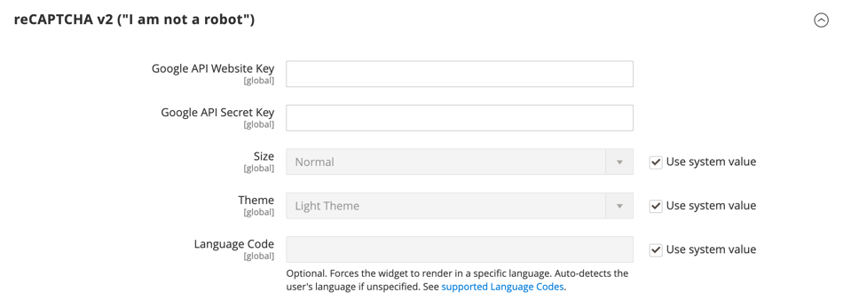

# Google reCAPTCHA V3 en V2

[&#x200B; Google reCAPTCHA &#x200B;](https://developers.google.com/recaptcha) zorgt ervoor dat een mens, eerder dan een computer (of &quot;bot&quot;), met uw website in wisselwerking staat. In tegenstelling tot standaardAdobe Commerce en Magento Open Source [&#x200B; CAPTCHA &#x200B;](security-captcha.md), verstrekt Google reCAPTCHA verbeterde veiligheid van een selectie van verschillende vertoningsopties en methodes. Extra informatie over websiteverkeer is beschikbaar op het dashboard van uw Google reCAPTCHA-account.

Google reCAPTCHA wordt afzonderlijk geconfigureerd voor Admin en storefront.

- Voor Admin, kan Google reCAPTCHA op de [&#x200B; Teken binnen &#x200B;](../getting-started/admin-signin.md) pagina worden gebruikt en wanneer een gebruiker om een wachtwoordteruggestelde verzoekt. Als standaardCommerce [&#x200B; CAPTCHA &#x200B;](security-captcha.md) ook wordt toegelaten, kan Google reCAPTCHA tezelfdertijd zonder enig probleem worden gebruikt.

- Voor de opslag, kan Google reCAPTCHA worden gebruikt om binnen aan a [&#x200B; klantenrekening &#x200B;](../customers/customer-sign-in.md) te ondertekenen, een bericht van de [&#x200B; pagina van het Contact Us &#x200B;](../getting-started/store-details.md#contact-us-form), en in talrijke andere storefront plaatsen te verzenden.

  {width="700" zoomable="yes"}

Google reCAPTCHA kan op verschillende manieren worden geïmplementeerd:

- _reCAPTCHA v3 Onzichtbaar_ - gebruikt een algoritme om gebruikersinteractie te schatten en bepaalt de waarschijnlijkheid dat de gebruiker menselijk gebaseerd op een score is.

- _reCAPTCHA v2 Onzichtbaar_ - voert achtergrondcontrole zonder gebruikersinteractie uit. Gebruikers en klanten worden automatisch geverifieerd, maar moeten mogelijk specifieke afbeeldingen selecteren om een probleem te verhelpen.

- _reCAPTCHA v2 (&quot;ik ben geen robot&quot;)_ — bevestigt verzoeken met _&quot;Ik ben geen robot&quot;_ checkbox.

>[!IMPORTANT]
>
>Voordat Google reCAPTCHA kan worden geconfigureerd, moet u ervoor zorgen dat uw `PHP.ini` -bestand de volgende instelling bevat: `allow_url_fopen = 1` . Hiervoor kan hulp van ontwikkelaars nodig zijn. Zie [&#x200B; Vereiste Montages PHP &#x200B;](https://experienceleague.adobe.com/docs/commerce-operations/installation-guide/prerequisites/php-settings.html?lang=nl-NL){:target="_blank"} in de Gids van de Installatie.

## Stap 1: Google reCAPTCHA-toetsen genereren

Google reCAPTCHA vereist twee API-sleutels om in te schakelen. U kunt deze toetsen gratis aanschaffen via de reCAPTCHA-site. Voordat u de sleutels genereert, moet u weten welk type reCAPTCHA u wilt gebruiken.

1. Open de Google reCAPTCHA-pagina en meld u aan bij uw account.

1. Voer bij **[!UICONTROL Label]** een naam in om de sleutels voor interne verwijzing te identificeren.

   U hebt één set sleutels nodig voor elk reCAPTCHA-type dat wordt gebruikt in uw Adobe Commerce- of Magento Open Source-installatie. Bijvoorbeeld: `Commerce Invisible`

1. Kies bij **[!UICONTROL reCAPTCHA type]** de methode die u wilt gebruiken.

   - _reCAPTCHA v3 Onzichtbaar_
   - _reCAPTCHA v2 Onzichtbaar_
   - _reCAPTCHA v2 (&quot;ik ben geen robot&quot;)_

1. Voer bij **[!UICONTROL Domain]** het domein van uw winkel in. Bijvoorbeeld: mystore.com

   Als u meerdere opslagruimten met verschillende domeinen hebt, voert u elk domein op een aparte regel in.

   - Voeg uw archiefdomein en om het even welke subdomeinen toe.
   - U kunt `localhost` , andere lokale VM-domeinen en testdomeinen toevoegen.

1. Schakel het selectievakje in voor **[!UICONTROL Accept the reCAPTCHA Terms of Service]** .

1. (Optioneel) Schakel het selectievakje **[!UICONTROL Send alerts to owners]** in om meldingen te verzenden als Google problemen of verdacht verkeer detecteert.

1. Klik op **[!UICONTROL Submit]** om de registratie te voltooien en de sleutels te ontvangen.

   >[!IMPORTANT]
   >
   >Niet alle sleutels zijn van toepassing op alle types van reCAPTCHA, en het verkeerd toepassen van hen kon tot onverwacht gedrag leiden. Bijvoorbeeld, Google reCAPTCHA sleutels die voor reCAPTCHA v2 &quot;I zijn geen robot&quot;worden geproduceerd werken niet met _reCAPTCHA v2 Onzichtbaar_ en konden functionaliteit blokkeren waar reCAPTCHA wordt toegelaten.

## Stap 2: Google reCAPTCHA voor de beheerder configureren

[!BADGE &#x200B; slechts PaaS &#x200B;]{type=Informative url="https://experienceleague.adobe.com/nl/docs/commerce/user-guides/product-solutions" tooltip="Is alleen van toepassing op Adobe Commerce op Cloud-projecten (door Adobe beheerde PaaS-infrastructuur) en op projecten in het veld."}

1. Meld u aan bij uw beheerdersaccount.

1. Ga op de zijbalk Beheerder naar **[!UICONTROL Stores]** > _[!UICONTROL Settings]_>**[!UICONTROL Configuration]**.

1. Stel in de rechterbovenhoek **[!UICONTROL Store View]** in op `Default Config` .

1. Vouw **[!UICONTROL Security]** uit in het linkerdeelvenster en klik op **[!UICONTROL Google reCAPTCHA Admin Panel]** .

   >[!NOTE]
   >
   >Schakel het selectievakje **[!UICONTROL Use system value]** uit voor elk veld dat u wilt configureren.

1. Als u _[!DNL reCAPTCHA v2 ("I am not a robot")]_&#x200B;wilt gebruiken, vouwt u de sectie **[!UICONTROL reCAPTCHA v2 ("I am not a robot")]**&#x200B;uit en gaat u als volgt te werk:

   - Voer bij **[!UICONTROL Google API Website Key]** de website-sleutel in die voor dit reCAPTCHA-type is gemaakt toen u uw Google reCAPTCHA-account hebt geregistreerd.

   - Voer bij **[!UICONTROL Google API Secret Key]** de geheime sleutel in die aan uw Google reCAPTCHA-account is gekoppeld.

   - Kies bij **[!UICONTROL Size]** de grootte van het Google reCAPTCHA-vak dat u wilt weergeven. Opties: `Normal (default)` / `Compact`

   - Kies bij **[!UICONTROL Theme]** het thema dat u wilt gebruiken om het vak Google reCAPTCHA op te maken. Opties: `Light Theme (default)` / `Dark Theme`

   - Voor **[!UICONTROL Language Code]**, ga de twee-karaktercode in om de [&#x200B; taal te specificeren die voor de tekst en het overseinen van Google reCAPTCHA &#x200B;](https://developers.google.com/recaptcha/docs/language) wordt gebruikt.

   {width="600" zoomable="yes"}

1. Als u _[!DNL reCAPTCHA v2 Invisible]_&#x200B;wilt gebruiken, vouwt u de sectie **[!UICONTROL reCAPTCHA v2 Invisible]**&#x200B;uit en gaat u als volgt te werk:

   - Voer bij **[!UICONTROL Google API Website Key]** de website-sleutel in die voor dit reCAPTCHA-type is gemaakt toen u uw Google reCAPTCHA-account hebt geregistreerd.

   - Voer bij **[!UICONTROL Google API Secret Key]** de geheime sleutel in die aan uw Google reCAPTCHA-account is gekoppeld.

   - Kies bij **[!UICONTROL Invisible Badge Position]** de positie van de badge die op elke pagina moet worden gebruikt. Opties: `Inline` / `Bottom Right` / `Bottom Left`

   - Kies bij **[!UICONTROL Theme]** het thema dat u wilt gebruiken om het Google reCAPTCHA-vak op te maken. Opties: `Light Theme (default)` / `Dark Theme`

   - Voor **[!UICONTROL Language Code]**, ga een twee-karaktercode in die de [&#x200B; taal specificeert die voor de tekst en het overseinen van Google reCAPTCHA &#x200B;](https://developers.google.com/recaptcha/docs/language) wordt gebruikt.

   {width="600" zoomable="yes"}

1. Als u _[!DNL reCAPTCHA v3 Invisible]_&#x200B;wilt gebruiken, vouwt u de sectie **[!UICONTROL reCAPTCHA v3 Invisible]**&#x200B;uit en gaat u als volgt te werk:

   - Voer bij **[!UICONTROL Google API Website Key]** de website-sleutel in die voor dit reCAPTCHA-type is gemaakt toen u uw Google reCAPTCHA-account hebt geregistreerd.

   - Voer bij **[!UICONTROL Google API Secret Key]** de geheime sleutel in die aan uw Google reCAPTCHA-account is gekoppeld.

   - Voer de **[!UICONTROL Minimum Score Threshold]** in om te bepalen wanneer een gebruikersinteractie wordt gemarkeerd als een potentieel risico; waarbij 1.0 een typische gebruikersinteractie is en 0.0 waarschijnlijk een bot. Standaard: `0.5`

   - Kies bij **[!UICONTROL Invisible Badge Position]** de positie die op elke pagina moet worden gebruikt. Opties: `Inline` / `Bottom Right` / `Bottom Left`

   - Kies bij **[!UICONTROL Theme]** het thema dat u wilt gebruiken om het Google reCAPTCHA-vak op te maken. Opties: `Light Theme (default)` / `Dark Theme`

   - Voor **[!UICONTROL Language Code]**, ga een twee-karaktercode in die de [&#x200B; taal specificeert die voor de tekst en het overseinen van Google reCAPTCHA &#x200B;](https://developers.google.com/recaptcha/docs/language) wordt gebruikt.

   {width="600" zoomable="yes"}

1. Vouw **[!UICONTROL reCAPTCHA Validation Failure Messages]** uit en voer de berichten in die worden weergegeven in Beheer als de validatie mislukt of niet kan worden voltooid.

   {width="600" zoomable="yes"}

1. Vouw de sectie **[!UICONTROL Admin Panel]** uit en configureer indien nodig het volgende:

   - Stel **[!UICONTROL Enable for Login]** in op het reCAPTCHA-type dat u wilt gebruiken voor de pagina Aanmelden bij beheerder.

   - Stel **[!UICONTROL Enable for Forgot Password]** in op het reCAPTCHA-type dat u wilt gebruiken voor aanvragen voor het opnieuw instellen van wachtwoorden.

   {width="600" zoomable="yes"}

## Stap 3: Vorm Google reCAPTCHA voor de storefront

1. Kies in het linkerdeelvenster onder _[!UICONTROL Security]_&#x200B;de optie **[!UICONTROL Google reCAPTCHA Storefront]**.

1. Vul de sectie in voor elk reCAPTCHA-type dat u wilt gebruiken in de storefront.

   Zie de informatie in _Stap 2: Vorm Google reCAPTCHA voor Admin_ voor details over de opties voor elk reCAPTCHA type.

1. Vouw **[!UICONTROL reCAPTCHA Validation Failure Messages]** uit en voer de berichten in die in de winkel verschijnen als de validatie mislukt of niet kan worden voltooid.

1. Vouw de sectie **[!UICONTROL Storefront]** uit.

   >[!NOTE]
   >
   >Schakel het selectievakje **[!UICONTROL Use system value]** uit voor elk veld dat u wilt configureren.

1. Plaats elk gebied van de storefrontplaats aan het type van reCAPTCHA dat u aan gebruik hebt gevormd.

   {{recaptcha-forms-list}}

   {width="600" zoomable="yes"}

## Stap 4: Sparen de configuratie

1. Klik op **[!UICONTROL Save Config]** wanneer de configuratie-instellingen zijn voltooid.

1. Klik in het bericht boven aan de werkruimte op **[!UICONTROL Cache Management]** en vernieuw elke ongeldige cache.
