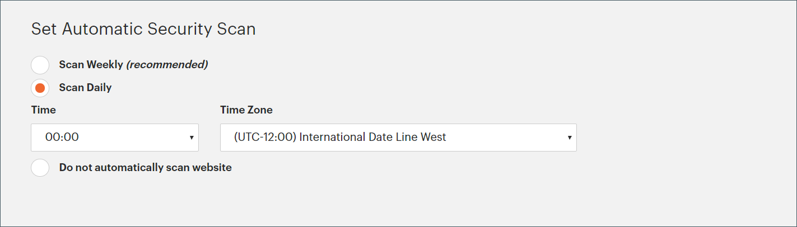

# Beveiligingsscan

Controleer uw Adobe Commerce- en Magento Open Source-sites op beveiligingsrisico&#39;s en malware en ontvang beveiligingsupdates en -meldingen.

- Verbeter insight in de beveiligingsstatus in real-time van je winkel.
- Ontvang suggesties die op beste praktijken worden gebaseerd helpen kwesties oplossen.
- Plan een beveiligingsscan om wekelijks, dagelijks of op verzoek uit te voeren.
- Voer meer dan 21.000 veiligheidstests uit om potentiële malware te helpen identificeren.
- Heb toegang tot historische veiligheidsrapporten die de vooruitgang van uw plaatsen volgen en controleren.
- Open het scanrapport met geslaagde en mislukte controles, met de aanbevolen acties.

Het hulpmiddel van het Scannen van de Veiligheid is vrij van het dashboard van uw [ Commerce/Magento rekening ](../getting-started/commerce-account-create.md). Voor technische informatie, zie [ Opstelling het Hulpmiddel van het Scannen van de Veiligheid ](https://experienceleague.adobe.com/en/docs/commerce-on-cloud/user-guide/launch/overview#set-up-the-security-scan-tool) in _Commerce op de Gids van de Infrastructuur van de Wolk_.

{width="600" zoomable="yes"}

## Een beveiligingsscan uitvoeren

1. Van de homepage van Commerce, teken binnen aan uw [ Commerce/Magento rekening ](../getting-started/commerce-account-create.md).

1. Controleer en accepteer de voorwaarden voor het gebruik van het hulpprogramma Beveiligingsscan.

   1. Kies **[!UICONTROL Security Scan]** in het linkerdeelvenster.
   1. Klik op **[!UICONTROL Go to Security Scan]**.
   1. Lees de **[!UICONTROL Terms and Conditions]** .
   1. Klik op **[!UICONTROL Agree]** om door te gaan.

1. Klik op de pagina _[!UICONTROL Monitored Websites]_&#x200B;op **[!UICONTROL +Add Site]**.

   Als u meerdere sites met verschillende domeinen hebt, configureert u een aparte scan voor elk domein.

   {width="600" zoomable="yes"}

1. Voer een van de volgende handelingen uit om te controleren of u eigenaar bent van het sitedomein door een bevestigingscode toe te voegen:

   **Commerce storefront**:

   1. Voer de **[!UICONTROL Site URL]** en **[!UICONTROL Site Name]** in.
   1. Klik op **[!UICONTROL Generate Confirmation Code]**.
   1. Klik **Exemplaar** om uw bevestigingscode aan het klembord te kopiëren.

      {width="400" zoomable="yes"}

   1. Meld u aan bij de beheerder van uw winkel als een gebruiker met volledige beheerdersrechten en voer de volgende handelingen uit:

      1. In _Admin_ sidebar, ga **[!UICONTROL Content]** > _[!UICONTROL Design]_>**[!UICONTROL Configuration]**.
      1. Zoek uw site in de lijst en klik op **[!UICONTROL Edit]** .
      1. Breid  de **[!UICONTROL HTML Head]** sectie uit.
      1. Schuif omlaag naar **[!UICONTROL Scripts and Style Sheets]** en klik in het tekstvak aan het einde van een bestaande code. Plak de bevestigingscode in het tekstvak.

         {width="600" zoomable="yes"}

      1. Klik op **[!UICONTROL Save Configuration]** als de bewerking is voltooid.

   **PWA storefront**:

   1. Voer de **[!UICONTROL Site URL]** en **[!UICONTROL Site Name]** in.

   1. Kies bij **[!UICONTROL Confirmation Code]** de optie `META Tag` en klik op **[!UICONTROL Generate Code]** .

   1. Klik op **[!UICONTROL Copy]** om de gegenereerde bevestigingscode van de META-tag naar het klembord te kopiëren.

      {width="400" zoomable="yes"}

   1. Ga naar de PWA Studio storefront projectfolder en doe het volgende:

      1. Ga onder de PWA Studio-projectmap naar `packages > venia-concept > template.html` .
      1. Voeg de gekopieerde bevestigingscode (de gegenereerde META-tag) toe aan de HTML-kop en sla de wijzigingen op.

         {width="600" zoomable="yes"}

      1. Ga terug naar PWA Studio CLI, en gebruik garen om projectgebiedsdelen te installeren en het project in werking te stellen bouwt bevel.

         ```sh
         yarn install &&
         yarn build
         ```

      1. *in uw project van de Wolk*, creeer a `pwa` omslag en kopieer de inhoud binnen de omslag van uw storefront project `dist`.

         ```sh
         mkdir pwa && cp -r <path to your storefront project>/dist/* pwa
         ```

      1. Met het gereedschap Git CLI kunt u deze wijzigingen in uw Cloud-project uitvoeren, uitvoeren en uitvoeren.

         ```sh
         git add . &&
         git commit -m "Added storefront file bundles" &&
         git push origin
         ```

         Nadat het bouwstijlproces voltooit, zullen de veranderingen aan uw PWA archieffront worden opgesteld.

1. Ga terug naar de pagina _[!UICONTROL Security Scan]_&#x200B;in uw Commerce-account en klik op **[!UICONTROL Verify Confirmation Code]**&#x200B;om de eigendom van het domein te bepalen.

1. Na een geslaagde bevestiging, vorm de **[!UICONTROL Set Automatic Security Scan]** opties voor één van de volgende types:

   **Scannen Wekelijks (geadviseerd)**:

   Kies de **[!UICONTROL Week Day]** , **[!UICONTROL Time]** en **[!UICONTROL Time Zone]** waar de scan elke week moet plaatsvinden.

   Standaard wordt de scan elke week om middernacht zaterdag, UTC en verder naar begin zondag gepland.

   {width="500" zoomable="yes"}

   **Scannen Dagelijks**:

   Kies de lus **[!UICONTROL Time]** en **[!UICONTROL Time Zone]** dat de scan elke dag moet worden uitgevoerd.

   Standaard wordt de scan elke dag om middernacht (UTC) uitgevoerd.

   {width="500" zoomable="yes"}

1. Voer de **[!UICONTROL Email Address]** in waar u meldingen van voltooide scans en beveiligingsupdates wilt ontvangen.

   {width="400" zoomable="yes"}

1. Klik op **[!UICONTROL Submit]** als de bewerking is voltooid.

   Nadat de eigendom van het domein is gecontroleerd, wordt de site weergegeven in de lijst Gecontroleerde websites van uw Commerce-account.

1. Als u meerdere websites met verschillende domeinen hebt, herhaalt u dit proces om voor elke website een beveiligingsscan in te stellen.

## Scan-fouten beheren

Met het hulpprogramma Beveiligingsscan kunt u scanfouten rechtstreeks vanuit de rapportweergave beheren. U kunt specifieke scanfouten markeren als fout-positieven en deze uitsluiten van uw risicorescore.

### Voordelen van het beheren van scanfouten

Als u scanfouten beheert, kunt u een nauwkeuriger beveiligingsoverzicht van uw winkel bijhouden door:

- Het verminderen van valse positieven in uw veiligheidsrapporten.
- Nadruk op relevante veiligheidskwesties die aandacht vereisen.
- Behoud een duidelijker beeld van de ware veiligheidsstatus van uw winkel.
- Het wegnemen van de noodzaak om contact op te nemen met ondersteuning voor bekende valse positieven.
- U bespaart tijd door zelf scanfouten te beheren die u al hebt onderzocht.

Veelvoorkomende scenario&#39;s waarbij een scanfout als fout positief kan worden gemarkeerd, zijn:

- Wanneer u al een beveiligingspatch hebt aangebracht die het scangereedschap niet heeft gedetecteerd.
- Wanneer een gedetecteerde uitgave niet van toepassing is op uw specifieke opslagconfiguratie.
- Wanneer u een alternatieve veiligheidsmaatregel hebt uitgevoerd die de zorg richt.
- Wanneer de aftastenmislukking op een configuratie gebaseerd is die u opzettelijk voor uw bedrijfsbehoeften hebt geplaatst.

### Fouten met scannen negeren

Voer de volgende stappen uit om scanfouten te beheren die u hebt geïdentificeerd als fout-positieven:

1. Klik op de pagina _[!UICONTROL Monitored Websites]_&#x200B;op **[!UICONTROL View Report]**&#x200B;voor de site die u wilt beheren.

1. Zoek in de rapportweergave de mislukte scan die u als fout-positief wilt markeren.

1. Klik op **[!UICONTROL Ignore]** voor de specifieke scanfout.

   {width="600" zoomable="yes"}

1. Klik op **[!UICONTROL Apply Changes]** om de selectie op te slaan.

De genegeerde scanfout gaat naar de sectie _[!UICONTROL Ignored Results]_&#x200B;en wordt niet opgenomen in uw risicorescore.

### Fouten met scannen stoppen

Voer de volgende stappen uit als u een eerder genegeerde scanfout moet herstellen voor uw actieve controle:

1. Blader in de rapportweergave naar de sectie _[!UICONTROL Ignored Results]_.

1. Klik op **[!UICONTROL Stop Ignoring]** voor de scanfout die u wilt herstellen.

   {width="600" zoomable="yes"}

1. Klik op **[!UICONTROL Apply Changes]** om de selectie op te slaan.

De scanfout gaat terug naar de sectie _[!UICONTROL Failed Scans]_&#x200B;en wordt opgenomen in de risicorescore.

### Genegeerde scanfouten weergeven

Genegeerde resultaten verschijnen in een afzonderlijke sectie van het rapport en de risicorescore wordt automatisch bijgewerkt om alleen actieve scanfouten te weerspiegelen. U kunt meerdere scanfouten tegelijk beheren door meerdere items te selecteren voordat u wijzigingen aanbrengt.

{width="600" zoomable="yes"}
