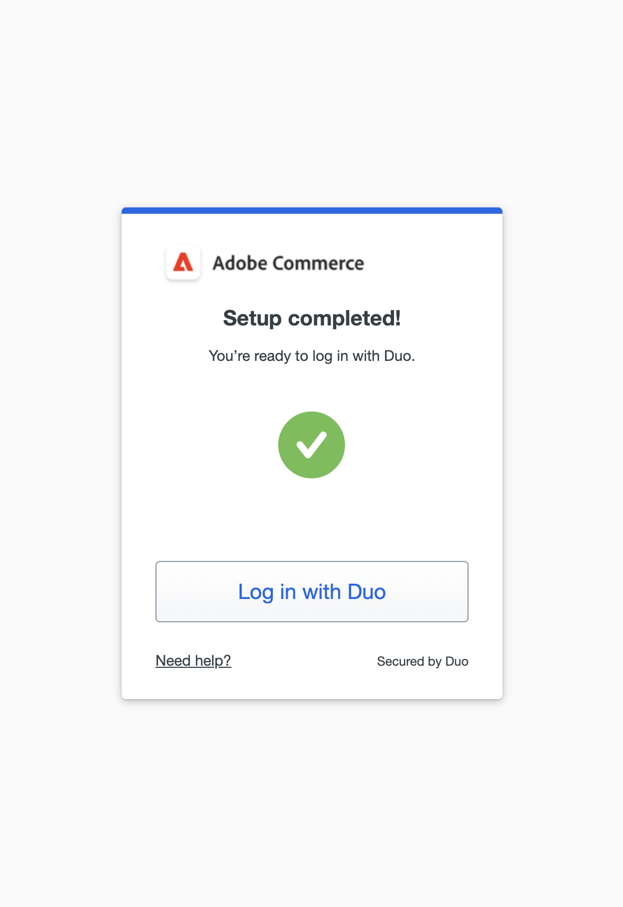

# Twee-factor authentificatie opstelling voor gebruikersrekeningen

In deze instructies ziet u hoe u verificatie met twee factoren instelt tijdens uw eerste aanmelding bij Adobe Commerce of Magento Open Source en hoe u uw identiteit kunt verifiëren met de volgende apps en apparaten.

Voor volledige instructies, zie [ binnen Teken Admin ](../getting-started/admin-signin.md).

>[!NOTE]
>
>Voor opslagruimten die verificatie met [!DNL Adobe Identity Management Services] (IMS) hebben ingeschakeld, zijn Adobe Commerce en Magento Open Source 2FA uitgeschakeld. Admin-gebruikers die zich met hun Adobe-gegevens bij hun Commerce-exemplaar hebben aangemeld, hoeven voor veel beheertaken niet opnieuw te worden geverifieerd. De verificatie wordt uitgevoerd door Adobe IMS wanneer de Admin-gebruiker zich aanmeldt bij de huidige sessie. Zie [[!DNL Adobe Identity Management Service]  (IMS) Overzicht van de Integratie ](../getting-started/adobe-ims-integration-overview.md).

## [!DNL Google Authenticator]

### Stap 1: Instellen [!DNL Google Authenticator]

1. Ga uw rekeningsgeloofsbrieven in en meld binnen aan _Admin_. Er wordt een nieuw verificatiescherm weergegeven met een QR-code.

1. Open de app **[!UICONTROL Google Authenticator]** op uw mobiele apparaat.

1. Klik op het plusteken ( **+** ) om een item toe te voegen en het rode vak in te stellen met de QR-code die u met de camera op uw smartphone wilt scannen.

1. Wanneer uw telefoon de QR code erkent en een ingang toevoegt, ga die code van 6 cijfers op het _Admin_ **[!UICONTROL Authenticator code]** gebied in.

1. Klik op **[!UICONTROL Confirm]** als de bewerking is voltooid.

   {width="300"}

### Stap 2: Aanmelden met [!DNL Google Authenticator]

1. Ga uw rekeningsgeloofsbrieven in en meld binnen aan Commerce _Admin_.

   {width="300"}

1. Open [!DNL Google Authenticator] op uw mobiele apparaat.

1. Voer desgevraagd de 6-cijferige verificatiecode in.

1. Schakel het selectievakje **[!UICONTROL Trust this device, do not ask again]** in om de verificatie voor toekomstige aanmeldingen op te slaan.

1. Klik op **[!UICONTROL Confirm]** als de bewerking is voltooid.

## [!DNL Duo Security]

[!DNL Duo] biedt een gratis proefversie aan en brengt kosten in rekening op basis van het aantal gebruikers dat aan het account is gekoppeld. Volg hun [ instructies aan opstelling uw rekening en download app ](https://duo.com/product/multi-factor-authentication-mfa/duo-mobile-app).

### Stap 1: Instellen [!DNL Duo Security]

1. Ga uw rekeningsgeloofsbrieven in en meld binnen aan _Admin_.

1. Wanneer de pagina [!DNL Duo] Setup wordt weergegeven, klikt u op **[!UICONTROL Get Started]** en voert u de volgende handelingen uit:

   {width="300"}

1. Selecteer uw optie. U kunt Touch ID, Duo Mobile, Beveiligingssleutel of Telefoonnummer kiezen. In dit voorbeeld ziet u de optie Duo Mobiel of Telefoonnummer.

1. Voer desgevraagd uw telefoonnummer in en klik op **[!UICONTROL Continue]** .

   Bevestig de eigendom door het wachtwoord op het telefoonnummer te verzenden en te verifiëren.

1. Klik op **[!UICONTROL I have Duo Mobile]** wanneer u wordt gevraagd om [!DNL Duo Mobile] voor uw type telefoon te installeren.

1. Open [!DNL Duo Mobile] en scan de QR-code om de authenticator te synchroniseren met Adobe Commerce. Wanneer de activering is voltooid, wordt een vinkje weergegeven.

1. U kunt (indien nodig) meer apparaten toevoegen of overslaan. Uw installatie is nu voltooid en u kunt zich aanmelden met Duo.

   {width="300"}

### Stap 2: Aanmelden met [!DNL Duo Security]

In het volgende voorbeeld worden de opties voor `Ask me to choose an authenticator method` getoond:

1. Wanneer ertoe aangezet, ga uw _Admin_ geloofsbrieven in om binnen te ondertekenen.

   {width="300"}

1. Kies Aanmelden met Duo om een pushmelding te krijgen in de Duo Mobile-app, u aan te melden met Touch ID of een andere optie te kiezen die u tijdens de installatie hebt geconfigureerd.

1. Goedkeuren van de aanvraag van het duo app/Touch ID/Text-bericht en u wordt aangemeld.

   {width="300"}

## [!DNL Authy]

[!DNL Authy] biedt gebruikers gratis toegang tot hun app en service. Volg hun instructies om de app voor uw apparaat of browser te downloaden en in te stellen. Meer leren, zie de [[!DNL Authy]  documentatie ](https://authy.com/features/setup/).

### Stap 1: Auteur instellen

1. Ga uw rekeningsgeloofsbrieven in en meld binnen aan _Admin_.

   ![[!DNL Authy] registration ](./assets/storefront-2fa-authy-auth.png){width="300"}

1. Ga als volgt te werk wanneer u wordt gevraagd uzelf te registreren bij Auteur:

   - Selecteer uw land.

   - Voer uw telefoonnummer in.

   - Selecteer **[!UICONTROL Verification method]**: `SMS` of `Call Me`

   Klik op **[!UICONTROL Continue]**. Een bericht wordt verzonden naar uw telefoon door de tekst van SMS of een vraag.

1. Voer de verificatiecode in die u ontvangt en klik op **[!UICONTROL Verify]** .

1. Klik op **[!UICONTROL Confirm]** als de bewerking is voltooid.

   ![[!DNL Authy] verificatiecode ](./assets/storefront-2fa-authy-verify.png){width="300"}

### Stap 2: Aanmelden met [!DNL Authy]

1. Ga uw rekeningsgeloofsbrieven in en meld binnen aan _Admin_.

   ![[!DNL Authy] - sign in ](./assets/storefront-2fa-authy-access.png){width="300"}

1. Kies een van de volgende methoden voor verificatie:

   - `Use one touch` — hiermee wordt een waarschuwing naar uw [!DNL Authy] -app verzonden. Accepteer de toegang in de app.
   - `Use authy token` — Prompts to enter a code from your [!DNL Authy] app.

1. Als u zich niet kunt aanmelden, kiest u de methode die u wilt gebruiken om de code te ontvangen. Dan, ga de code in die u ontvangt om tot _Admin_ toegang te hebben.

   De app bevat deze aanvullende noodmethoden.

   - `Send me a code via SMS` — Een SMS-bericht voor tekst wordt verzonden naar het geconfigureerde mobiele apparaat.
   - `Send me a code via phone call` — De gebruiker ontvangt een telefoongesprek met een code.

   Uw account is geverifieerd en wordt geopend.

## U2F ([!DNL Yubikey] en andere apparaten)

Volg de instructies van de leverancier van de oplossing om uw U2F apparaat te vormen. Zie de documentatie van de leverancier, bijvoorbeeld [[!DNL YubiKey] ](https://support.yubico.com/hc/en-us/articles/360013790339-Getting-Started-with-Your-YubiKey) by [!UICONTROL Yubico] , voor meer informatie.

1. Ga uw rekeningsgeloofsbrieven in en meld binnen aan _Admin_.

   {width="300"}

1. Druk op de toets.

   De authentificatie brengt onmiddellijk teweeg en opent _Admin_.

1. Plaats de **[!UICONTROL U2F key]** in een USB-poort op uw computer.
