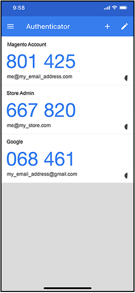

# 2-factor verificatie (2FA)

Commerce _Admin_ voor uw installatie van Adobe Commerce of Magento Open Source verleent toegang tot uw opslag, orden, en klantengegevens. Om onbevoegde toegang tot uw gegevens te verhinderen, moeten alle gebruikers die proberen binnen aan _Admin_ te ondertekenen een authentificatieproces voltooien om hun identiteit te verifiëren.

>[!NOTE]
>
>Deze implementatie van twee-factor authentificatie (2FA) is slechts op _Admin_ van toepassing, en is niet beschikbaar voor klantenrekeningen. Voor de verificatie met twee factoren die uw Commerce-account beveiligt, geldt een aparte instelling. Meer leren, ga [ uw rekening van Commerce beveiligen ](../getting-started/commerce-account-secure.md).

Verificatie met twee factoren wordt op grote schaal gebruikt en het is gebruikelijk om toegangscodes te genereren voor verschillende websites op dezelfde app. Deze extra verificatie zorgt ervoor dat alleen u zich kunt aanmelden bij uw gebruikersaccount. Als je je wachtwoord verliest of als een bot het vermoedt, voegt tweeledige verificatie een extra beveiligingslaag toe. U kunt bijvoorbeeld Google Authenticator gebruiken om codes te genereren voor de beheerder van uw winkel, uw Commerce-account en uw Google-account.

Adobe Commerce ondersteunt 2FA-methoden van meerdere providers. Sommige vereisen de installatie van een app die een eenmalig wachtwoord (OTP) produceert dat de gebruikers bij login ingaan om hun identiteit te verifiëren. De universele apparaten van de tweede factor (U2F) lijken op een zeer belangrijk fob en produceren een unieke sleutel om identiteit te verifiëren. Andere apparaten verifiëren identiteit wanneer zij in een haven van USB worden opgenomen. Als opslagbeheerder, kunt u één of meerdere beschikbare methodes vereisen 2FA om gebruikersidentiteit te verifiëren. Uw 2FA-configuratie is van toepassing op alle websites en winkels die aan de Adobe Commerce-installatie zijn gekoppeld.

De eerste keer een gebruiker ondertekent binnen aan _Admin_, moeten zij opstelling elke [ 2FA ](../configuration-reference/security/2fa.md) methode die u vereist, en hun identiteit verifiëren gebruikend bijbehorende app of apparaat. Na deze aanvankelijke opstelling, moet de gebruiker met één van de gevormde methodes voor authentiek verklaren telkens zij binnen ondertekenen. De informatie van 2FA van elke gebruiker wordt geregistreerd in hun _Admin_ rekening en kan [ terugstellen ](security-two-factor-authentication-manage.md) indien nodig zijn. Om meer over het sign-in proces te leren, ga [_binnen binnen Admin_ Ondertekenen ](../getting-started/admin-signin.md).

>[!NOTE]
>
>In winkels waar verificatie voor Adobe Identity Management Services (IMS) is ingeschakeld, zijn de native Adobe Commerce en Magento Open Source 2FA uitgeschakeld. Admin-gebruikers die zich met hun Adobe-gegevens bij hun Commerce-exemplaar hebben aangemeld, hoeven voor veel beheertaken niet opnieuw te worden geverifieerd. De verificatie wordt uitgevoerd door Adobe IMS wanneer de Admin-gebruiker zich aanmeldt bij de huidige sessie. Zie [ het Overzicht van de Integratie van Adobe Identity Management van de Dienst (IMS) ](https://experienceleague.adobe.com/docs/commerce-admin/start/admin/ims/adobe-ims-integration-overview.html).

U kunt op deze [ videodemo ](https://video.tv.adobe.com/v/339104?quality=12&learn=on) voor een overzicht van twee-factor authentificatie in Admin letten.

## Uw vereiste 2FA-providers configureren

1. Voor _Admin_ sidebar, ga **[!UICONTROL Stores]** > _[!UICONTROL Settings]_>**[!UICONTROL Configuration]**.

1. Vouw in het linkerdeelvenster **[!UICONTROL Security]** uit en kies **[!UICONTROL 2FA]** .

1. Selecteer in de sectie _[!UICONTROL General]_de providers die u wilt gebruiken.

   | Provider | Functie |
   |--- |--- |
   | [!UICONTROL Google Authenticator] | Hiermee genereert u een eenmalig wachtwoord voor gebruikersverificatie in de toepassing. |
   | [!UICONTROL Duo Security] | Verstrekt SMS en dupbericht. |
   | [!UICONTROL Authy] | Genereert een tijd-afhankelijke zes-cijfercode en levert SMS of Vraag 2FA van de Stem bescherming of teken. |
   | [!UICONTROL U2F Devices (Yubikey and others)] | Gebruikt een fysiek apparaat voor authentiek te verklaren, zoals [[!DNL YubiKey] ](https://www.yubico.com/). |

   Houd Ctrl (PC) of Command (Mac) ingedrukt en klik op elk item om meerdere methoden te selecteren.

1. Voltooi de [ montages ](../configuration-reference/security/2fa.md) voor elke vereiste methode 2FA.

   

1. Klik op **[!UICONTROL Save Config]** als de bewerking is voltooid.

   De eerste keer ondertekenen de gebruikers binnen aan _Admin_, moeten zij opstelling elke vereiste methode 2FA. Na deze aanvankelijke opstelling, moeten zij met één van de gevormde methodes voor authentiek verklaren telkens zij binnen ondertekenen.

## Instellingen 2FA-provider

Voer de instellingen in voor elke 2FA-methode die u nodig hebt.

### Google

Als u wilt wijzigen hoe lang het eenmalige wachtwoord (OTP) beschikbaar is tijdens het aanmelden, schakelt u het selectievakje **[!UICONTROL Use system value]** uit. Voer vervolgens het aantal seconden in dat de **[!UICONTROL OTP Window]** geldig moet zijn.

>[!NOTE]
>
>In Adobe Commerce 2.4.7 en later, controleert de OTP het plaatsen van de vensterconfiguratie hoe lang (in seconden) het systeem het éénmalige wachtwoord van een beheerder (OTP) goedkeurt nadat het is verlopen. Deze waarde moet minder dan 30 seconden zijn. De standaardinstelling van het systeem is `29` .   In versie 2.4.6, bepaalt het OTP venster plaatsen het aantal voorbij en toekomstige OTP codes die geldig blijven. De waarde `1` geeft aan dat de huidige OTP-code plus één code in het verleden en één code in de toekomst geldig blijven op een bepaald tijdstip.

### [!DNL Duo Security]

Voer de volgende gegevens in van uw Duo Security-account:

- Client-id
- Clientgeheim
- Integratiesleutel
- Geheime sleutel
- API-hostnaam

### [!DNL Authy]

1. Voer de API-sleutel in vanuit uw [!DNL Authy] -account.

1. Als u het standaardbericht wilt wijzigen dat tijdens de verificatie wordt weergegeven, schakelt u het selectievakje **[!UICONTROL Use system value]** uit. Voer vervolgens de **[!UICONTROL OneTouch Message]** in die u wilt weergeven.

   

### U2F-apparaten ([!DNL Yubikey] en andere)

Het opslagdomein wordt standaard gebruikt tijdens het verificatieproces. Als u een aangepast domein wilt gebruiken voor verificatieproblemen, schakelt u het selectievakje **[!UICONTROL Use system value]** uit. Voer vervolgens de **[!UICONTROL WebAPi Challenge Domain]** in.

