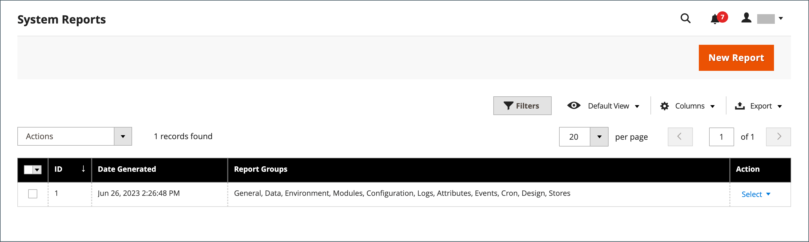

# Ondersteuningsgereedschappen

{{ee-feature}}

De hulpmiddelen van de steun worden ontworpen om bekende kwesties in uw systeem te identificeren. Ze kunnen worden gebruikt als een resource tijdens de ontwikkelings- en optimalisatieprocessen en als een diagnostische tool om ons ondersteuningsteam te helpen problemen te identificeren en op te lossen.

## Dataverzamelaar

De gegevensverzamelaar verzamelt de informatie over uw systeem die ons ondersteuningsteam nodig heeft om problemen met uw Adobe Commerce-installatie op te lossen. De gemaakte back-up duurt enkele minuten en bevat zowel een code- als een databasedump. De gegevens kunnen worden geëxporteerd naar een CSV- of Excel-XML-bestand.

{width="600" zoomable="yes"}

### De dataverzamelaar uitvoeren

1. Ga in de zijbalk _Admin_ naar **[!UICONTROL System]** > _[!UICONTROL Support]_>**[!UICONTROL Data Collector]**.

1. Klik in de rechterbovenhoek op **[!UICONTROL New Backup]**.

   Het genereren van de back-up duurt enkele minuten. U kunt de resultaten van de verwerking controleren door op **[!UICONTROL Refresh Status]** te klikken. Als de back-up is voltooid, wordt deze weergegeven in het raster _[!UICONTROL Data Collector]_.

1. Ga als volgt te werk om een logboek met de back-updetails weer te geven:

   - Selecteer in de kolom _[!UICONTROL Action]_de optie **[!UICONTROL Show Log]**.

   - Klik op **[!UICONTROL Back]** om terug te keren naar het raster.

   {width="600" zoomable="yes"}

### Back-upgegevens exporteren

1. Schakel in de eerste kolom het selectievakje in van de back-up die u wilt exporteren.

1. Gebruik het menu **[!UICONTROL Export]** om de indeling van de exportdata te kiezen.

   {width="600" zoomable="yes"}

1. Open het bestand vanaf de downloadlocatie van de webbrowser en **[!UICONTROL Save]**.

### Back-upgegevens downloaden

Nadat de back-up is gegenereerd, kunt u de kopie van code- en databasegegevens downloaden.

1. Zoek de benodigde back-upeenheid in het raster.

1. Zorg ervoor dat de status `Complete` is.

1. Klik op de entiteitsnaam in de kolommen _[!UICONTROL Code Dump]_of_[!UICONTROL DB Dump]_.

Het downloadproces moet automatisch starten.

## Back-upgegevens verwijderen

1. Ga in de zijbalk _Beheerder_ naar **[!UICONTROL System]** > _[!UICONTROL Support]_>**[!UICONTROL Data Collector]**.

1. Zoek en selecteer de back-upgegevens die u wilt verwijderen.

1. Klik in de kolom _[!UICONTROL Action]_op **[!UICONTROL Delete]**.

1. Klik op **[!UICONTROL OK]** om de actie te bevestigen.

## Systeemrapporten

Met de tool voor systeemrapportage kunt u periodieke volledige of gedeeltelijke momentopnamen van het systeem maken en opslaan voor toekomstig gebruik. U kunt prestatie-instellingen vergelijken voor en na cycli voor codeontwikkeling of wijzigingen in serverinstellingen. Met de systeemrapportagetool kunt u de tijd die nodig is voor het voorbereiden en indienen van de informatie die ondersteuning nodig heeft om een onderzoek te starten, aanzienlijk verkorten.

Vanuit het raster Systeemrapporten kunt u bestaande rapporten bekijken en downloaden, rapporten verwijderen en rapporten maken.

### Systeemrapporten openen

Ga op de zijbalk _Admin_ naar **[!UICONTROL System]** > _[!UICONTROL Support]_>**[!UICONTROL System Report]**.

{width="600" zoomable="yes"}

### Een rapport genereren

1. Klik op **[!UICONTROL New Report]**.

1. Selecteer in de lijst **[!UICONTROL Groups]** elke set informatie die u in het rapport wilt opnemen. Standaard zijn alle groepen geselecteerd.

   {width="600" zoomable="yes"}

1. Klik in de rechterbovenhoek op **[!UICONTROL Create]**.

   Het kan een paar minuten duren voordat het rapport wordt gegenereerd, afhankelijk van het aantal geselecteerde rapporttypen. Wanneer het rapport klaar is, wordt het boven aan het raster weergegeven met de gegenereerde datum en tijd.

### Informatie over module weergeven

U vindt nuttige informatie over geïnstalleerde modules.

**_Rapportinformatie weergeven voor elke geïnstalleerde module:_**

1. Ga in de zijbalk _Beheerder_ naar **[!UICONTROL System]** > _[!UICONTROL Support]_>**[!UICONTROL System Report]**.
1. Klik op **[!UICONTROL New Report]**.
1. Selecteer `Modules` in de lijst **[!UICONTROL Groups]**.
1. Klik op **[!UICONTROL Create]**.
1. Nadat het rapport is gegenereerd, klikt u op **[!UICONTROL Select]** en vervolgens op **[!UICONTROL View]** om alle moduleversies te bekijken.
1. Klik op **[!UICONTROL Download]** om het rapport te downloaden.

### Systeemrapporten beheren

Selecteer in de kolom **[!UICONTROL Action]** van het raster een van de volgende opties:

- `View` - Gebruik deze functie om de details van het rapport te bekijken.
- `Delete` - Gebruik deze functie om het gegenereerde rapport uit de lijst te verwijderen.
- `Download` - Gebruik deze functie om het rapport op te slaan als een HTML-bestand.

### Systeemrapportdetails weergeven

1. Selecteer voor het benodigde rapport **[!UICONTROL View]** in de kolom _[!UICONTROL Actions]_.

1. Vouw in het linkerdeelvenster  elke sectie van het rapport uit om de details weer te geven.

   {width="600" zoomable="yes"}

### Beschikbare systeemrapporten

| Rapportgroep | Inbegrepen informatie |
| ------------ | -------------------- |
| [!UICONTROL General] | Adobe Commerce-versie  Aantal gegevens cachestatus indexstatus |
| [!UICONTROL Environment] | Omgevingsinformatie MySQL-status |
| [!UICONTROL Data] | Categorieën dupliceren op URL-sleutel Producten dupliceren op URL-sleutel Producten dupliceren op SKU Bestellingen dupliceren op increment-id Gebruikers dupliceren op e-mail Beschadigde categoriedata |
| [!UICONTROL Modules] | Aangepaste modules lijst Uitgeschakelde modules lijst Alle modules lijst |
| [!UICONTROL Configuration] | Configuratie data van `app/etc/env.php` verzendmethoden betalingsmethoden functionaliteitsmatrix voor betalingen |
| [!UICONTROL Logs] | Logbestanden Top systeemberichten De beste systeemberichten van vandaag Top foutopsporingsberichten De beste foutopsporingsberichten van vandaag Top uitzonderingsberichten De beste uitzonderingsberichten van vandaag |
| [!UICONTROL Attributes] | Door gebruiker gedefinieerde EAV-kenmerken Nieuwe EAV-kenmerken entiteitstypen Alle EAV-kenmerken Categorie EAV-kenmerken Product EAV-kenmerken Klant EAV-kenmerken Klantadres EAV-kenmerk RMA-item EAV-kenmerken |
| [!UICONTROL Events] | Aangepaste wereldwijde gebeurtenissen Aangepaste beheergebeurtenissen Aangepaste front-end gebeurtenissen Aangepaste doc gebeurtenissen Aangepaste CronTab gebeurtenissen Aangepaste REST gebeurtenissen Aangepaste SOAP SOAP gebeurtenissen Algemene gebeurtenissen Kernbeheerders gebeurtenissen Kernfront-end gebeurtenissen Kerndocgebeurtenissen Kernconcrontabgebeurtenissen Kerngebeurtenissen Alle wereldwijde gebeurtenissen Alle Beheergebeurtenissen Alle front-end gebeurtenissen Alle Doc gebeurtenissen  Alle REST gebeurtenissen Alle SOAP gebeurtenissen Alle CronTab gebeurtenissen |
| [!UICONTROL Cron] | Cron Schedules per statuscode Cron Schedules per taakcode Fouten in Cron Schedules Queue Cron Schedules Lijst Aangepaste globale Cron Taken Aangepaste configureerbare Cron Taken Kernglobale Cron Taken Kernconfigureerbare Cron Taken Alle wereldwijde Cron Taken Alle configureerbare Cron Taken |
| [!UICONTROL Design] | AdminHTML Thema&#39;s Lijst Frontend Thema&#39;s Lijst |
| [!UICONTROL Stores] | Website Boom Websites Lijst Winkellijst Winkelweergaven Lijst |
| OMS-connector  _(zichtbaar met OMS-integratie)_ | Connectorversie Connector controleren Resultaten van berichtverwerking |

{style="table-layout:auto"}
