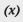

# Aangepaste variabelen toevoegen

Om aan de specifieke behoeften van uw zaken te voldoen, kunt u douanevariabelen creëren en hen opnemen in [pagina&#39;s](../content-design/pages.md), [blokken](../content-design/blocks.md), en [e-mailsjablonen](email-templates.md). De lijst met toegestane variabelen die wordt weergegeven wanneer u op de knop _Variabele invoegen_ knop bevat beide [vooraf gedefinieerd](variables-predefined.md) en aangepaste variabelen. De lijst met beschikbare variabelen voor een specifieke e-mailsjabloon wordt bepaald door de gegevens die aan de sjabloon zijn gekoppeld. Zie de [Referentie variabele](variables-reference.md) voor een lijst met veelgebruikte e-mailsjablonen en de bijbehorende variabelen.

{width="600" zoomable="yes"}

>[!NOTE]
>
>Alleen toegestane vooraf gedefinieerde of aangepaste variabelen kunnen worden gebruikt in sjablonen voor e-mail en nieuwsbrief.

## Stap 1: Een aangepaste variabele maken

1. Op de _Beheerder_ zijbalk, ga naar **[!UICONTROL System]** > _[!UICONTROL Other Settings]_>**[!UICONTROL Custom Variables]**.

1. Klik op **[!UICONTROL Add New Variable]**.

1. Voer een id in voor **[!UICONTROL Variable Code]**, waarbij alleen kleine letters zonder spaties worden gebruikt.

   Indien nodig kunt u een spatie aangeven met een onderstrepingsteken of afbreekstreepje. Bijvoorbeeld: `my_custom_variable`

1. Voer een **[!UICONTROL Variable Name]**, die wordt gebruikt voor interne referentie. Bijvoorbeeld: `My Custom Variable`

1. Voer een van de volgende handelingen uit om de waarde in te voeren die aan de variabele is gekoppeld:

   - Voor **[!UICONTROL Variable HTML Value]** Voer de waarde van de variabele in die is opgemaakt met eenvoudige HTML-tags. Bijvoorbeeld:

     `<b>This formatted content appears in place of the variable.</b>`

   - Voor **[!UICONTROL Variable Plain Value]** voert u de waarde van de variabele in als tekst zonder opmaak. Bijvoorbeeld:

     `This unformatted content appears in place of the variable.`

   >[!TIP]
   >
   >Als u meer ruimte nodig hebt, sleept u de rechterbenedenhoek van het tekstvak.

   {width="600" zoomable="yes"}

1. Klik op **[!UICONTROL Save]**.

## Stap 2: Voeg de aangepaste variabele in uw inhoud in

Gebruiken [!DNL Page Builder] om een aangepaste variabele in te voegen.

1. Open de pagina, het blok, de categorie of het product waar u de variabele aan de inhoud wilt toevoegen.

1. Uitbreiden  de **[!UICONTROL Content]** sectie.

1. Klik op **[!UICONTROL Edit with Page Builder]**.

1. Klik in het linkerdeelvenster op **[!UICONTROL Elements]** en voer een van de volgende handelingen uit:

   - Klik in een bestaand tekstgebied waar u de variabele wilt invoegen.

   - Sleep een nieuwe **[!UICONTROL Text]** naar het werkgebied.

1. Rechtsboven op de editor-werkbalk klikt u op (  ) om een variabele in te voegen.

   ![[!DNL Page Builder] werkgebied en deelvenster](./assets/variable-custom-pagebuilder-stage.png){width="600" zoomable="yes"}

1. Selecteer in de lijst de aangepaste variabele die u wilt invoegen en klik op **[!UICONTROL Insert Variable]**.

   {width="600" zoomable="yes"}

   De variabele-id wordt als tijdelijke aanduiding weergegeven in de editor.

   ![[!DNL Page Builder] werkgebied - variabele plaatsaanduiding](./assets/pagebuilder-variable-inserted.png){width="600" zoomable="yes"}

1. Klik op **[!UICONTROL Save]**.
